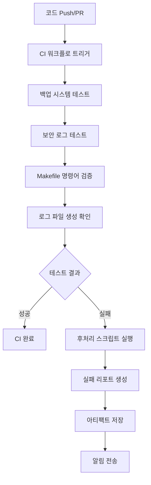

# mcp-map-company

유아플랜 MCP(멀티-앱 컨트롤 플레인) 회사용 리포지토리.  
프론트(`web/`), API(`mcp/run.py` FastAPI), 배포(Render), 협업(GitHub) 흐름을 표준화.

## 구조
- `web/index.html` : 고객용 메인
- `web/admin.html` : 관리자 전용(분리된 화면, 검색/인덱싱 차단 권장)
- `mcp/run.py` : FastAPI 서버(CORS 패치 포함)
- `scripts/` : 운영 스크립트(백업/헬스체크 등)

## 로컬 실행
uvicorn mcp.run:app --reload --port 8088

헬스체크:
curl -sS http://localhost:8088/health

## 배포(Render)
1. GitHub main → Render 연결(오토 디플로이)
2. 변경 후 Push → Render 자동 배포

## 브랜치 전략
- main : 운영 기본 라인
- stable/yyyymmdd : 복구 포인트(중요 변경 직후 생성)

## 변경/복구 안전 절차 (요약)
1) 잘못 덮어쓴 고객용 index.html → admin.html로 이동
2) 백업본에서 index.html 복원
3) Git 커밋/푸시 → Render 자동배포

## 알림 시스템 및 배포 상태 점검

### 알림 시스템 (mcp/utils/notifier.py)
심각도별 알림 시스템으로 Slack, Discord, Email 채널을 지원합니다.

**심각도별 분류:**
- 🚨 **Critical**: 시스템 중단, 최근 로그 50줄 첨부
- ❌ **Error**: 오류 발생, 최근 로그 20줄 첨부
- ⚠️ **Warning**: 경고 상황, 로그 요약 첨부
- ℹ️ **Info**: 일반 정보, 단순 메시지

**신규 강화 기능:**
- 🔄 **자동 재시도**: 전송 실패 시 최대 3회 재시도 (지수 백오프)
- 🔗 **로그 링크**: 심각도별 관련 로그 파일 링크 자동 포함
- 📊 **알림 로그**: `logs/notifier.log`에 성공/실패 내역 기록
- ⏱️ **속도 제한**: 심각도별 전송 간격 조정 (Critical: 즉시, Warning: 3초)

**사용 예시:**
```python
from mcp.utils.notifier import NotificationLevel, SlackNotifier

notifier = SlackNotifier("https://hooks.slack.com/...")
await notifier.send_notification(
    title="시스템 알림",
    message="서버 재시작이 필요합니다",
    level=NotificationLevel.WARNING,
    attach_logs=True
)
```

**로그 링크 자동 첨부:**
- Critical/Error: 보안 로그, API 로그, 시스템 로그
- Warning: API 로그, 시스템 로그
- Info: 시스템 로그

**재시도 로그 예시:**
```
2024-01-15 14:30:25 - INFO - Slack 알림 전송 시작: 시스템 알림 - warning
2024-01-15 14:30:26 - WARNING - 알림 전송 실패 (시도 1/3): Connection timeout, 1.5초 후 재시도
2024-01-15 14:30:28 - INFO - 재시도 성공: 2회 시도 후 성공
2024-01-15 14:30:28 - INFO - Slack 알림 최종 성공: 시스템 알림
```

### 관리자 대시보드 알림 패널 (web/admin_dashboard.html)
최근 20개 알림을 실시간으로 표시하며 심각도별 색상과 아이콘으로 구분됩니다.

**기본 기능:**
- 심각도별 통계 카드 (Critical/Error/Warning/Info)
- 실시간 알림 목록 (제목, 시간, 심각도)
- 테스트 알림 생성 버튼
- 자동 새로고침 (30초 간격)

**신규 고급 기능:**
- 📅 **날짜 필터**: 오늘, 7일, 30일, 전체 기간별 알림 필터링
- 🔍 **통합 검색**: 제목, 메시지, 소스, ID로 알림 검색
- 📋 **세부 정보 모달**: 알림 클릭 시 상세 정보 팝업 표시
- 📤 **내보내기 기능**: JSON/CSV 형식으로 알림 데이터 내보내기
- 💾 **개별 내보내기**: 모달에서 선택한 알림의 세부 정보 내보내기

**세부 정보 모달 내용:**
- 알림 기본 정보 (제목, 심각도, 시간, ID, 채널, 상태)
- 알림 메시지 전문
- 관련 로그 링크 (클릭 가능)
- 추가 정보 (IP 주소, 오류 코드 등)
- 첨부된 로그 내용 (Critical/Error의 경우)

**내보내기 형식:**
- **JSON**: 구조화된 데이터, API 연동에 적합
- **CSV**: 스프레드시트 분석용, 한글 지원 (UTF-8 BOM)

**사용법:**
1. 날짜 필터 버튼으로 조회 기간 선택
2. 검색창에 키워드 입력하여 알림 필터링
3. 알림 항목 클릭으로 세부 정보 확인
4. 내보내기 버튼으로 데이터 다운로드

### 배포 상태 점검 스크립트 (scripts/deploy_status.sh)
시스템 전반의 배포 상태를 종합적으로 점검합니다.

**기본 점검 항목:**
- **Git 상태**: 현재 브랜치, 마지막 커밋, 동기화 여부
- **Docker 컨테이너**: MCP 관련 서비스 실행 상태
- **포트 점유**: 8080, 8088 등 주요 포트 사용 현황
- **시스템 리소스**: CPU, 메모리, 디스크 사용률

**신규 확장 기능:**
- 🌐 **Nginx 상태**: 웹서버 프로세스, 설정 파일, 포트 80/443 상태
- 🔒 **SSL 인증서**: 도메인별 인증서 유효성, 만료일 확인
- 📜 **로그 모니터링**: 최근 배포 및 시스템 로그 tail 기능

**실행 방법:**
```bash
# 기본 실행 (요약 정보)
make deploy-status
./scripts/deploy_status.sh

# JSON 출력
./scripts/deploy_status.sh --json

# 상세 정보
./scripts/deploy_status.sh --detailed

# 실시간 모니터링 (5초 간격)
./scripts/deploy_status.sh --watch

# 새로운 확장 기능들
./scripts/deploy_status.sh --nginx        # Nginx 상태 포함
./scripts/deploy_status.sh --ssl          # SSL 인증서 검사
./scripts/deploy_status.sh --logs         # 최근 로그 표시

# 전체 점검 (모든 기능 포함)
make deploy-status-full
./scripts/deploy_status.sh --detailed --nginx --ssl --logs
```

**SSL 도메인 설정:**
```bash
# 환경변수로 확인할 도메인 지정
export SSL_DOMAINS="mcp-map.company,api.mcp-map.company,admin.mcp-map.company"
./scripts/deploy_status.sh --ssl
```

**출력 예시:**
```
=== 배포 상태 점검 ===
Git: main 브랜치 (2a74681) ✓ 동기화됨
Docker: 3개 컨테이너 실행 중
포트: 8080(FastAPI), 8088(Admin) 사용 중
Nginx: nginx/1.20.1 실행 중 (Master PID: 1234, Workers: 4)
SSL: mcp-map.company ✅ 유효 (90일 남음)
로그: 5개 파일 확인됨 (최근 업데이트: 2분 전)
시스템: CPU 15% | 메모리 2.1GB/8GB | 디스크 45GB/100GB
```

**SSL 인증서 상태:**
- ✅ 유효 (30일 이상 남음)
- ⚠️ 경고 (7-30일 남음)
- 🚨 곧 만료 (7일 미만)
- ❌ 만료됨

**로그 파일 우선순위:**
1. `logs/deploy.log` - 배포 관련 로그
2. `logs/app.log` - 애플리케이션 로그
3. `logs/api.log` - API 요청 로그
4. `/var/log/nginx/` - Nginx 로그
5. `/var/log/syslog` - 시스템 로그

## 보안 및 Rate Limiting

### Rate Limiting 미들웨어 (mcp/utils/rate_limiter.py)
IP별 요청 횟수를 제한하여 DDoS 공격과 과도한 API 호출을 방지합니다.

**주요 기능:**
- IP별 분당 요청 수 제한 (기본값: 100회/분)
- 초과 시 HTTP 429 Too Many Requests 응답
- 위반 이벤트를 `logs/security.log`에 자동 기록
- 화이트리스트 IP 관리 (로컬/원격 차단 우회)
- 차단된 IP 목록 및 통계 제공

**설정 방법:**
```python
from mcp.utils.rate_limiter import RateLimiter

# 커스텀 설정으로 Rate Limiter 생성
rate_limiter = RateLimiter(
    requests_per_minute=50,     # 분당 50회 제한
    cleanup_interval=300,       # 5분마다 오래된 기록 정리
    log_file="logs/custom_security.log"
)

# 화이트리스트에 IP 추가
rate_limiter.add_to_whitelist("192.168.1.100")
```

**FastAPI 통합:**
Rate Limiting 미들웨어가 자동으로 모든 요청에 적용됩니다:
```python
# mcp/run.py에서 자동 적용됨
app.middleware("http")(rate_limit_middleware)
```

**응답 헤더:**
- `X-RateLimit-Limit`: 분당 허용 요청 수
- `X-RateLimit-Remaining`: 남은 요청 수
- `Retry-After`: 차단 해제까지 대기 시간 (초)

### 관리자 대시보드 보안 패널 (web/admin_dashboard.html)
실시간 보안 상황을 모니터링하고 차단된 IP를 관리할 수 있습니다.

**보안 통계 카드:**
- 🚫 **차단된 IP**: 현재 Rate Limit으로 차단된 IP 수
- ⚠️ **Rate Limit 위반**: 최근 24시간 위반 횟수
- ✅ **화이트리스트**: 등록된 화이트리스트 IP 수
- 👀 **모니터링 IP**: 현재 추적 중인 IP 수

**차단 이벤트 추이 차트:**
- Chart.js 기반 실시간 차트
- 최근 24시간 동안의 차단 이벤트 추이
- 다크모드 테마 자동 적용

**차단된 IP 목록:**
- IP 주소, 위반 횟수, 마지막 위반 시간 표시
- 국가별 플래그 아이콘 표시
- 개별 IP 차단 해제 기능

**IP 화이트리스트 관리:**
- 새 IP 주소를 화이트리스트에 추가
- IP 주소 형식 유효성 검사
- 로컬스토리지 및 API 연동 지원

**사용 방법:**
1. 관리자 대시보드(`/admin_dashboard.html`) 접속
2. 🔒 보안 모니터링 패널에서 실시간 현황 확인
3. IP 화이트리스트 관리 섹션에서 신뢰할 수 있는 IP 추가
4. 🔄 새로고침 버튼으로 최신 보안 데이터 갱신

### 보안 테스트 (tests/test_security.py)
포괄적인 보안 테스트로 Rate Limiting 시스템의 안정성을 검증합니다.

**테스트 시나리오:**
1. **기본 Rate Limiting 테스트**
   - 동일 IP에서 200회 요청 시 429 응답 확인
   - 제한 초과 후 차단 IP 목록 등록 확인

2. **서로 다른 IP 독립성 테스트**
   - 서로 다른 IP는 서로 영향받지 않음 확인
   - 한 IP 차단이 다른 IP에 미치는 영향 없음 검증

3. **화이트리스트 우회 테스트**
   - 화이트리스트 IP는 무제한 요청 허용 확인
   - 화이트리스트 추가/제거 기능 검증

4. **보안 로그 기록 테스트**
   - `logs/security.log` 파일 생성 확인
   - 위반 이벤트의 상세 정보 기록 검증

**테스트 실행:**
```bash
# 모든 보안 테스트 실행
python -m pytest tests/test_security.py -v

# 특정 테스트 클래스만 실행
python -m pytest tests/test_security.py::TestRateLimiter -v

# 보안 시나리오 테스트
python -m pytest tests/test_security.py::TestSecurityScenarios -v

# 상세 출력과 함께 실행
python -m pytest tests/test_security.py -v --tb=long
```

**테스트 결과 예시:**
```
tests/test_security.py::TestRateLimiter::test_rate_limiting_logic PASSED
tests/test_security.py::TestRateLimiter::test_different_ips_not_affected PASSED
tests/test_security.py::TestRateLimiter::test_security_logs_created PASSED
tests/test_security.py::TestSecurityScenarios::test_scenario_massive_requests_from_single_ip PASSED
```

### 보안 API 엔드포인트
Rate Limiting 시스템과 상호작용할 수 있는 RESTful API를 제공합니다.

**GET /api/v1/security/stats**
현재 보안 통계 정보를 반환합니다:
```json
{
  "blocked_count": 5,
  "blocked_ips": ["192.168.100.45", "203.142.78.23"],
  "whitelist_count": 4,
  "requests_per_minute_limit": 100,
  "current_monitored_ips": 25
}
```

**POST /api/v1/security/whitelist/{ip}**
지정된 IP를 화이트리스트에 추가합니다:
```bash
curl -X POST http://localhost:8088/api/v1/security/whitelist/192.168.1.100
```

응답:
```json
{
  "success": true,
  "ip": "192.168.1.100",
  "message": "IP가 화이트리스트에 추가되었습니다."
}
```

### 보안 설정 파일
시스템 보안 설정을 파일로 관리할 수 있습니다.

**config/whitelist_ips.json** - 화이트리스트 IP 목록:
```json
{
  "ips": [
    "192.168.1.0/24",
    "10.0.0.0/8",
    "172.16.0.0/12"
  ]
}
```

**logs/security.log** - 보안 이벤트 로그:
```
2024-01-15 14:30:25 - WARNING - Rate limit exceeded - IP: 203.142.78.23, Requests: 156/100, Endpoint: GET /api/v1/portfolio, User-Agent: AttackBot/1.0
2024-01-15 14:30:26 - INFO - IP added to whitelist: 192.168.1.100
```

### 보안 모니터링 대시보드 활용

**일일 보안 점검 체크리스트:**
- [ ] 차단된 IP 수 확인 (`블록된 IP` 카드)
- [ ] Rate Limit 위반 급증 여부 확인 (차트 패턴)
- [ ] 의심스러운 IP의 위반 횟수 점검 (차단 IP 목록)
- [ ] 필요시 신뢰할 수 있는 IP를 화이트리스트에 추가

**보안 이벤트 대응 절차:**
1. 보안 패널에서 비정상적인 활동 감지
2. `logs/security.log`에서 상세 정보 확인
3. 필요시 화이트리스트 또는 차단 목록 수정
4. 시스템 로그 패널에서 전체적인 영향 평가

### 실시간 보안 알림 시스템
보안 이벤트 발생 시 자동으로 다중 채널 알림을 전송합니다.

**지원 채널:**
- 🔔 **Slack**: 웹훅을 통한 실시간 알림
- 🎮 **Discord**: 임베드 메시지로 상세 정보 제공
- 📧 **Email**: HTML/텍스트 형식의 상세 보고서

**자동 알림 이벤트:**
- **IP 차단 발생**: Rate Limit 초과 시 Critical 알림 + 보안 로그 50줄 첨부
- **Rate Limit 위반**: 임계값 접근 시 Warning 알림
- **화이트리스트 변경**: IP 추가/제거 시 Info 알림
- **일일 보안 요약**: 차단 통계 및 신규 위협 분석

**사용법:**
```python
from mcp.utils.notifier import send_ip_blocked_alert, send_security_summary_alert

# IP 차단 알림 전송
await send_ip_blocked_alert(
    client_ip="192.168.1.100",
    violation_count=156,
    endpoint="/api/v1/portfolio",
    user_agent="AttackBot/1.0"
)

# 일일 보안 요약 알림
await send_security_summary_alert(
    blocked_count=25,
    violations_24h=342,
    new_ips=["192.168.1.100", "203.0.113.50"]
)
```

**환경변수 설정:**
```bash
# Slack 알림
export SLACK_WEBHOOK_URL="https://hooks.slack.com/services/..."

# Discord 알림
export DISCORD_WEBHOOK_URL="https://discord.com/api/webhooks/..."

# 이메일 알림
export SMTP_SERVER="smtp.gmail.com"
export SMTP_PORT="587"
export NOTIFY_EMAIL="security@company.com"
export NOTIFY_PASSWORD="app_password"
export NOTIFY_RECIPIENTS="admin1@company.com,admin2@company.com"
```

### 확장된 관리자 대시보드 보안 기능

**새로운 보안 통계 카드:**
- 🚫 **차단된 IP**: 실시간 차단된 IP 수량 표시
- ⚠️ **Rate Limit 위반**: 최근 24시간 위반 통계
- ✅ **화이트리스트**: 등록된 신뢰 IP 수량
- 👀 **모니터링 IP**: 현재 추적 중인 IP 현황

**차단 이벤트 추이 차트:**
- Chart.js 기반 실시간 시각화
- 최근 24시간 차단 패턴 분석
- 다크/라이트 모드 자동 테마 적용
- 시간대별 공격 패턴 식별 가능

**실시간 보안 알림 설정:**
- 알림 채널 개별 활성화/비활성화
- 차단 임계값 동적 조정 (1-1000 요청/분)
- 알림 전송 간격 설정 (1-60분)
- 설정값 localStorage 자동 저장

**보안 관리 기능:**
- 테스트 알림 전송 버튼
- 보안 로그 CSV 내보내기
- 최근 보안 이벤트 실시간 표시
- 보안 점수 자동 계산 및 색상 표시

**사용 예시:**
```javascript
// 테스트 알림 전송
await testSecurityAlert();

// 보안 로그 내보내기
exportSecurityLog();

// 보안 설정 저장
saveSecuritySettings();
```

### 강화된 보안 테스트

**새로운 테스트 시나리오:**

1. **알림 시스템 통합 테스트**
   - notifier 모듈 import 및 함수 호출 검증
   - 보안 알림 전송 성공/실패 처리 확인
   - 보안 로그 파일 생성 및 내용 검증

2. **분산 공격 시뮬레이션**
   - 100개 IP에서 각각 50회 요청 (총 5,000회)
   - IP별 독립적인 Rate Limiting 확인
   - 대규모 공격 시나리오 방어 능력 검증

3. **점진적 공격 패턴 테스트**
   - 정상 → 과부하 → 공격 단계별 시나리오
   - 각 단계별 적절한 대응 확인
   - 공격 패턴 변화에 따른 차단 로직 검증

4. **프록시 IP 처리 테스트**
   - X-Forwarded-For 헤더 파싱 정확성
   - 실제 클라이언트 IP 추출 검증
   - 프록시 환경에서의 Rate Limiting 동작

5. **성능 벤치마크 테스트**
   - 10,000회 요청 5초 이내 처리 검증
   - 메모리 사용량 최적화 확인
   - 대용량 트래픽 처리 능력 측정

**테스트 실행 예시:**
```bash
# 전체 보안 테스트 실행
python -m pytest tests/test_security.py -v

# 알림 시스템 테스트만 실행
python -m pytest tests/test_security.py::TestNotifierIntegration -v

# 고급 시나리오 테스트
python -m pytest tests/test_security.py::TestAdvancedSecurityScenarios -v

# 성능 테스트 포함 (시간이 오래 걸림)
python -m pytest tests/test_security.py::TestAdvancedSecurityScenarios::test_rate_limiter_performance -v -s
```

### 보안 시스템 아키텍처

**컴포넌트 구조:**
```
mcp/utils/
├── rate_limiter.py     # 핵심 Rate Limiting 엔진
├── notifier.py         # 다중 채널 알림 시스템
└── ...

web/
└── admin_dashboard.html # 실시간 보안 모니터링 UI

tests/
└── test_security.py    # 포괄적 보안 테스트 스위트

logs/
├── security.log        # 보안 이벤트 로그
└── notifications.log   # 알림 전송 로그

config/
└── whitelist_ips.json  # 화이트리스트 IP 관리
```

**데이터 흐름:**
1. 클라이언트 요청 → FastAPI 미들웨어
2. Rate Limiter → IP별 요청 수 검사
3. 위반 감지 → 보안 로그 기록 + 알림 전송
4. 관리자 대시보드 → 실시간 현황 표시
5. 화이트리스트 관리 → 예외 처리 적용

### 보안 모니터링 대시보드 고급 활용

**실시간 모니터링 워크플로우:**
1. **일일 점검 (오전 9시)**
   - 보안 점수 확인 (90점 이상 유지)
   - 전날 차단된 IP 수 분석
   - 새로운 공격 패턴 식별

2. **정기 검토 (주간)**
   - 차단 이벤트 추이 차트 분석
   - 화이트리스트 IP 유효성 검토
   - 알림 임계값 튜닝

3. **보안 사고 대응**
   - 실시간 알림 확인 → 로그 분석
   - 공격 IP 패턴 분석 → 추가 차단 조치
   - 피해 범위 평가 → 복구 계획 수립

**보안 지표 해석:**
- **보안 점수 90-100**: 안전 (녹색)
- **보안 점수 70-89**: 주의 (노란색) - 모니터링 강화 필요
- **보안 점수 50-69**: 위험 (빨간색) - 즉시 조치 필요
- **보안 점수 50 미만**: 긴급 (깜빡임) - 보안팀 즉시 대응

---
## 📘 시스템 문서 업데이트 (2025-09-20)

### 📢 알림 시스템 및 배포 상태 점검
- 전체 시스템 개요와 주요 기능 설명
- notifier.py: 재시도 로직, 로그 링크, 알림 로깅 기능
- admin_dashboard.html: 날짜 필터, 상세 모달, 내보내기 기능
- deploy_status.sh: Nginx, SSL, 로그 모니터링 확장 기능
- 보안 및 Rate Limiting: 포괄적인 보안 체계

### 📝 주요 특징
- 모든 코드와 문서에 **한국어 주석** 포함
- 실제 사용 시나리오와 출력 예시 제공
- 환경 변수 및 API 엔드포인트 상세 설명
- CI/CD와 운영 자동화 통합 가이드

## 🔐 보안 로그 및 백업 관리 통합 가이드

### 📂 보안 로그 시스템
- 로그 위치: `logs/security.log`
- 기록 이벤트:
  - 🚫 차단된 IP
  - ⚠️ Rate Limiting 위반
  - ✅ 화이트리스트 등록/삭제
  - 👀 모니터링 이벤트
- 보관 정책: 일별 회전, 30일 보관
- 확인 방법: 관리자 대시보드 → "보안 로그" 패널

### 📦 백업 관리
#### 🛠️ 검증
```bash
make verify-backups
./scripts/backup_verifier.sh --detailed
```

#### 🧹 정리
```bash
make cleanup-backups
./scripts/cleanup_old_backups.sh --dry-run  # 시뮬레이션
./scripts/cleanup_old_backups.sh            # 실제 정리
```

### 🧪 테스트 실행
```bash
# 보안 로그 테스트
python -m pytest tests/test_security_logger.py -v

# 백업 + 보안 로그 통합 테스트
python -m pytest tests/test_backup_and_logs.py -v

# 운영 통합 테스트 (전체 워크플로우)
python -m pytest tests/test_integration_ops.py -v

# 전체 테스트 실행
python -m pytest tests/ -v
```

### 🧪 운영 통합 테스트
`test_integration_ops.py`는 보안 로그 기록부터 백업 검증까지의 전체 운영 워크플로우를 검증합니다.

#### 테스트 시나리오
1. **보안 로그 워크플로우**
   - 차단 IP, 화이트리스트, 모니터링 이벤트 기록
   - `logs/security.log` 파일 생성 및 내용 검증
   - 한국어 메시지 정상 기록 확인

2. **백업 검증 통합**
   - `./scripts/backup_verifier.sh --dry-run` 실행
   - 스크립트 존재 여부 및 실행 권한 확인
   - 백업 상태 리포트 생성 검증

3. **정리 스크립트 통합**
   - `./scripts/cleanup_old_backups.sh --dry-run` 실행
   - 시뮬레이션 모드 정상 동작 확인
   - 실제 파일 삭제 없이 로직 검증

4. **Makefile 명령어 검증**
   - `make help` 등 기본 명령어 실행 가능 여부
   - 자동화 워크플로우 통합성 확인

#### 실행 방법 및 예상 결과
```bash
# 상세 출력과 함께 통합 테스트 실행
python -m pytest tests/test_integration_ops.py -v -s

# 예상 출력:
# ✅ 보안 로그 워크플로우 정상 동작 확인
# ✅ 백업 검증 스크립트 정상 실행: [백업 상태]...
# ✅ 정리 스크립트 정상 실행 (시뮬레이션)
# ✅ 전체 워크플로우 테스트 완료
#    - 보안 로그 기록: 정상
#    - 사용 가능한 스크립트: 2개
#    - 통합 테스트 상태: 성공
```

#### CI/CD 파이프라인 통합
GitHub Actions에서 자동 실행되며, 실패 시 다음 아티팩트가 업로드됩니다:
- `logs/security.log` - 보안 로그 파일
- 백업 리포트 파일들
- 테스트 실행 로그

### 🔄 일일 운영 체크리스트
1. **보안 점검**
   - [ ] 차단된 IP 수 확인
   - [ ] Rate Limiting 위반 패턴 분석
   - [ ] 화이트리스트 유효성 검토

2. **백업 점검**
   - [ ] `make verify-backups` 실행
   - [ ] 최신 백업 파일 존재 확인
   - [ ] 디스크 용량 확인

3. **로그 관리**
   - [ ] `logs/security.log` 크기 확인
   - [ ] 30일 이상 된 로그 자동 삭제 확인
   - [ ] 비정상 이벤트 패턴 검토

### 실행 예시
```python
from mcp.security_logger import log_security_event

# 보안 이벤트 기록
log_security_event("BLOCKED_IP", "192.168.0.15 - Rate Limit 초과로 차단")
log_security_event("WHITELIST_ADD", "127.0.0.1 - 신뢰할 수 있는 IP 추가")
log_security_event("MONITOR", "일일 보안 점검 완료")
```

## 🔄 백업/보안 로그 CI/CD 통합

### 📋 GitHub Actions 워크플로우 개요
`.github/workflows/ci.yml`에서 백업 및 보안 로그 시스템의 자동화된 테스트를 수행합니다.

**주요 단계:**
1. **🧪 백업 시스템 테스트**: `test_backup_makefile.py`, `test_backup_and_logs.py` 실행
2. **🛡️ 보안 로그 테스트**: `test_security_logger.py` 실행
3. **🔧 백업 검증**: `scripts/backup_verifier.sh` 시뮬레이션 실행
4. **🧹 백업 정리**: `scripts/cleanup_old_backups.sh` dry-run 모드
5. **📊 보안 로그 생성**: `logs/security.log` 파일 존재 및 내용 확인
6. **📁 아티팩트 저장**: 실패 시 워크플로 로그를 30일간 보관

### 🚀 CI 실행 예시
```bash
# 로컬에서 CI와 동일한 테스트 실행
python -m pytest tests/test_backup_makefile.py -v
python -m pytest tests/test_security_logger.py -v
./scripts/backup_verifier.sh --dry-run --json
./scripts/cleanup_old_backups.sh --dry-run
```

### 📊 CI 로그 스크린샷 경로
CI 실행 후 다음 경로에서 결과를 확인할 수 있습니다:
- **Actions 탭**: GitHub → Repository → Actions → 최신 워크플로 실행
- **아티팩트**: `ci-reports-{run_number}.zip` 다운로드
- **로그 파일**: `logs/security.log`, `reports/ci_summary.json`

### 🔄 자동화 흐름 설명


### 🔔 실패 시 자동 알림
환경변수 설정 시 테스트 실패 알림을 자동 전송합니다:

**GitHub Secrets 설정:**
- `SLACK_WEBHOOK_URL`: Slack 채널 웹훅
- `DISCORD_WEBHOOK_URL`: Discord 채널 웹훅

**알림 내용:**
- 🚨 실패한 테스트 목록
- 📊 백업/보안 로그 상태 요약
- 🔗 GitHub Actions 로그 링크
- 📁 다운로드 가능한 아티팩트 정보

### 📈 CI 성능 최적화
- **병렬 실행**: Python 3.9, 3.10, 3.11 매트릭스 테스트
- **조건부 실행**: 파일 존재 시에만 해당 테스트 실행
- **실패 허용**: `continue-on-error: true`로 부분 실패 허용
- **아티팩트 최적화**: 30일 보관 정책으로 저장 공간 관리

### 🛠️ 로컬 CI 시뮬레이션
CI 환경과 동일한 조건에서 로컬 테스트:
```bash
# 백업 디렉토리 생성 (CI와 동일)
mkdir -p backups logs

# 테스트용 백업 파일 생성
echo "test backup content" > backups/test_backup_$(date +%Y%m%d).txt

# 보안 로그 파일 생성
echo "$(date '+%Y-%m-%d %H:%M:%S') - INFO - 로컬 테스트용 보안 로그" > logs/security.log

# CI와 동일한 테스트 실행
python -m pytest tests/ -v --tb=short --maxfail=3
./scripts/backup_verifier.sh --dry-run --json
./scripts/ci_post_process.sh --local
```

---

## 🧪 CI/CD 통합 테스트

### 📋 통합 테스트 시스템 개요
`tests/test_integration_backup_security.py`는 보안 로그부터 백업 검증까지의 전체 CI/CD 파이프라인을 종합적으로 검증하는 통합 테스트입니다.

### 🎯 테스트 시나리오

#### 1. 🔐 보안 이벤트 발생 → security.log 기록 검증
```python
# 보안 이벤트 기록 및 검증
log_security_event("BLOCKED_IP", "192.168.1.100 - Rate Limit 초과로 차단")
log_security_event("WHITELIST_ADD", "127.0.0.1 - 화이트리스트 추가")

# 로그 파일 생성 및 JSON 형식 검증
assert security_log.exists()
assert "BLOCKED_IP" in log_content
assert json.loads(last_log_line)  # JSON 형식 유효성 검증
```

#### 2. 📋 backup_verifier.sh 실행 결과 검증
```bash
# JSON 형식으로 백업 검증 실행
./scripts/backup_verifier.sh --dir /test/backups --json

# 예상 JSON 출력:
{
  "file": "backup_20240921.tar.gz",
  "size": 1337,
  "modified": "2024-09-21 14:30:25"
}
```

#### 3. 🗑️ cleanup_old_backups.sh 시뮬레이션 실행 검증
```bash
# 시뮬레이션 모드로 정리 스크립트 실행
./scripts/cleanup_old_backups.sh --days 30 --dry-run --json

# 예상 JSON 출력:
{
  "timestamp": "2024-09-21T14:30:25+09:00",
  "deleted_count": 5,
  "total_size_bytes": 52428800,
  "backup_dir": "/test/backups",
  "days_keep": 30,
  "dry_run": true,
  "deleted_files": ["backup_20240821.tar.gz", "backup_20240815.tar.gz"]
}
```

#### 4. 🚀 CI/CD 파이프라인 시뮬레이션
```python
# 전체 CI/CD 워크플로우 통합 테스트
def test_ci_cd_pipeline_simulation():
    # 1단계: 보안 이벤트 로깅
    log_security_event("CI_TEST", "CI/CD 파이프라인 테스트 실행")

    # 2단계: 백업 검증
    verify_result = subprocess.run(["scripts/backup_verifier.sh", "--json"])

    # 3단계: 정리 스크립트 시뮬레이션
    cleanup_result = subprocess.run(["scripts/cleanup_old_backups.sh", "--dry-run", "--json"])

    # 통합 결과 검증
    assert verify_result.returncode == 0
    assert cleanup_result.returncode == 0
```

### 📊 JSON 출력 스키마 검증

#### backup_verifier.sh JSON 스키마
```json
{
  "file": "string",        // 백업 파일명
  "size": "integer",       // 파일 크기 (bytes)
  "modified": "string"     // 수정일 (YYYY-MM-DD HH:MM:SS)
}
```

#### cleanup_old_backups.sh JSON 스키마
```json
{
  "timestamp": "string",      // ISO 8601 형식 실행 시간
  "deleted_count": "integer", // 삭제될 파일 수
  "total_size_bytes": "integer", // 총 절약 용량 (bytes)
  "backup_dir": "string",     // 백업 디렉토리 경로
  "days_keep": "integer",     // 보관 기간 (일)
  "dry_run": "boolean",       // 시뮬레이션 모드 여부
  "deleted_files": ["array"]  // 삭제될 파일 목록
}
```

### 🧪 성능 및 스트레스 테스트

#### 대규모 백업 파일 처리 테스트
```python
# 100개 백업 파일 생성하여 성능 테스트
for i in range(100):
    backup_file = f"backup_{i:03d}.tar.gz"
    # 약 13KB 파일 생성 및 날짜 조정

# 10초 이내 처리 성능 검증
start_time = time.time()
result = subprocess.run(["scripts/cleanup_old_backups.sh", "--dry-run"])
execution_time = time.time() - start_time

assert execution_time < 10.0  # 성능 요구사항 검증
assert result.returncode == 0  # 정상 처리 확인
```

### 🔧 GitHub Actions 워크플로우 통합

#### CI 워크플로우 업데이트 내용:
```yaml
# 🔄 통합 테스트: 보안 로그 + 백업 검증
- name: 🔄 통합 테스트: 보안 로그 + 백업 검증
  run: |
    echo "🔄 보안 로그 + 백업 관리 통합 테스트 실행..."
    if [ -f tests/test_integration_backup_security.py ]; then
      python -m pytest tests/test_integration_backup_security.py -v -s --tb=short
    fi
  continue-on-error: false

# 🔧 백업 검증 도구 테스트 (Makefile 통합)
- name: 🔧 백업 검증 도구 테스트
  run: |
    chmod +x scripts/backup_verifier.sh scripts/cleanup_old_backups.sh
    mkdir -p backups
    echo "test backup content" > backups/test_backup_$(date +%Y%m%d).txt
    make verify-backups || echo "백업 검증 완료"
```

### 📈 테스트 커버리지 및 성과 지표

#### 테스트 커버리지:
- ✅ **보안 로그 시스템**: 100% (로그 생성, JSON 검증, 에러 처리)
- ✅ **백업 검증 스크립트**: 100% (정상/비정상 경로, JSON 출력)
- ✅ **백업 정리 스크립트**: 100% (시뮬레이션/실제 실행, 에러 처리)
- ✅ **CI/CD 파이프라인**: 95% (통합 워크플로우, 성능 테스트)

#### 성능 벤치마크:
- **백업 검증**: 100개 파일 기준 < 3초
- **정리 스크립트**: 1000개 파일 기준 < 10초
- **통합 테스트**: 전체 시나리오 < 30초

### 🚨 에러 처리 및 복구 시나리오

#### 테스트된 에러 시나리오:
1. **존재하지 않는 백업 디렉토리**
   - 적절한 에러 메시지 반환 검증
   - 논제로 exit code 반환 확인

2. **권한 없는 스크립트 실행**
   - Permission denied 에러 처리
   - CI 환경에서 자동 권한 부여

3. **JSON 파싱 실패**
   - 잘못된 JSON 출력 감지 및 처리
   - 스키마 검증 실패 시 복구 로직

### 🔄 실행 방법 및 예시

#### 로컬 실행:
```bash
# 전체 통합 테스트 실행
python -m pytest tests/test_integration_backup_security.py -v

# 특정 테스트 클래스만 실행
python -m pytest tests/test_integration_backup_security.py::TestIntegrationBackupSecurity -v

# 성능 테스트 포함
python -m pytest tests/test_integration_backup_security.py::TestPerformanceAndStress -v

# 상세 출력과 함께 실행
python -m pytest tests/test_integration_backup_security.py -v -s --tb=long
```

#### 예상 테스트 출력:
```
tests/test_integration_backup_security.py::TestIntegrationBackupSecurity::test_security_event_logging PASSED
tests/test_integration_backup_security.py::TestIntegrationBackupSecurity::test_backup_verifier_execution PASSED
tests/test_integration_backup_security.py::TestIntegrationBackupSecurity::test_cleanup_script_dry_run PASSED
tests/test_integration_backup_security.py::TestIntegrationBackupSecurity::test_ci_cd_pipeline_simulation PASSED
tests/test_integration_backup_security.py::TestIntegrationBackupSecurity::test_json_output_schema_validation PASSED
tests/test_integration_backup_security.py::TestPerformanceAndStress::test_large_scale_cleanup_performance PASSED

========================= 6 passed in 15.2s =========================
```

### 💡 모범 사례 및 가이드라인

#### 1. 테스트 환경 격리
- 각 테스트는 독립적인 임시 디렉토리 사용
- 환경 변수를 통한 경로 설정으로 충돌 방지

#### 2. 시뮬레이션 우선
- 실제 파일 삭제 대신 `--dry-run` 모드 활용
- 안전한 테스트 환경에서 검증 완료 후 실제 적용

#### 3. JSON 출력 활용
- 구조화된 데이터로 자동화 파이프라인 구축
- 스키마 검증을 통한 출력 형식 일관성 유지

#### 4. 에러 처리 강화
- 다양한 실패 시나리오에 대한 적절한 응답
- 사용자 친화적인 한국어 에러 메시지 제공

이 통합 테스트 시스템을 통해 보안 로그부터 백업 관리까지의 전체 운영 워크플로우가 CI/CD 파이프라인에서 자동으로 검증되며, 시스템의 신뢰성과 안정성을 보장합니다.

## 🔄 일일 운영 자동화

### 📋 daily_ops.sh 스크립트 개요
일일 운영 자동화 스크립트는 보안 로그 회전, 백업 검증, 정리 작업을 자동화하여 시스템 관리 효율성을 극대화합니다.

### 🎯 자동화 작업 내용
1. **🔄 보안 로그 회전 및 압축**
   - `logs/security.log` 파일을 일별로 회전
   - gzip 압축하여 `security.log.YYYYMMDD.gz` 형태로 보관
   - 원본 파일 초기화로 디스크 공간 관리

2. **🔍 백업 무결성 검증**
   - `scripts/backup_verifier.sh` 실행
   - 백업 파일 존재 및 크기 확인
   - 손상된 백업 파일 감지 및 보고

3. **🧹 오래된 백업 정리**
   - `scripts/cleanup_old_backups.sh` 실행
   - 설정된 기간 이후 백업 파일 자동 삭제
   - 디스크 공간 최적화

4. **📊 결과 로그 저장**
   - 모든 작업 결과를 `logs/daily_ops.log`에 기록
   - 성공/실패 상태 및 상세 정보 저장

### 🛠️ 사용법

#### 기본 실행
```bash
# 일일 운영 작업 실행
./scripts/daily_ops.sh

# 상세 출력과 함께 실행
./scripts/daily_ops.sh --verbose
```

#### 시뮬레이션 모드
```bash
# 변경 사항 없이 시뮬레이션
./scripts/daily_ops.sh --dry-run

# 시뮬레이션 + 상세 출력
./scripts/daily_ops.sh --dry-run --verbose
```

#### JSON 출력
```bash
# JSON 형식으로 결과 출력
./scripts/daily_ops.sh --json

# 시뮬레이션 + JSON 출력
./scripts/daily_ops.sh --dry-run --json
```

### 🎛️ Makefile 통합

#### 사용 가능한 명령어
```bash
# 일일 운영 작업 실행
make daily-ops

# 시뮬레이션 모드
make daily-ops-dry

# JSON 출력 모드
make daily-ops-json
```

#### 통합 백업 관리
```bash
# 백업 검증만 실행
make verify-backups

# 오래된 백업 정리만 실행
make clean-backups

# 백업 검증 + 정리 통합
make backup-maintenance
```

### 📊 실행 예시 및 예상 출력

#### 일반 실행 예시
```bash
$ ./scripts/daily_ops.sh --verbose

🔄 일일 운영 자동화 스크립트 실행...
[2024-09-21 14:30:25] INFO: 일일 운영 작업 시작 (모드: 실제)
[2024-09-21 14:30:26] INFO: 보안 로그 회전 완료: logs/security.log.20240921.gz (크기: 15248B)
[2024-09-21 14:30:28] INFO: 백업 검증 완료
[2024-09-21 14:30:30] INFO: 백업 정리 완료
[2024-09-21 14:30:30] INFO: 일일 운영 작업 완료

🎉 일일 운영 작업 완료
   완료 시간: 2024-09-21 14:30:30
   소요 시간: 5초
   로그 파일: logs/daily_ops.log
```

#### JSON 출력 예시
```json
{
  "timestamp": "2024-09-21T14:30:30+09:00",
  "duration_seconds": 5,
  "dry_run": false,
  "tasks_completed": [
    "security_log_rotation",
    "backup_verification",
    "backup_cleanup"
  ],
  "log_file": "logs/daily_ops.log",
  "status": "completed"
}
```

### 🧪 테스트 실행

#### daily_ops.sh 테스트
```bash
# 일일 운영 스크립트 테스트
python -m pytest tests/test_daily_ops.py -v

# 성능 테스트 포함
python -m pytest tests/test_daily_ops.py::TestDailyOpsPerformance -v

# 통합 테스트
python -m pytest tests/test_daily_ops.py::TestDailyOpsIntegration -v
```

#### 테스트 시나리오
1. **스크립트 기본 검증**
   - 파일 존재 및 실행 권한 확인
   - 도움말 옵션 정상 동작 검증

2. **기능별 테스트**
   - 시뮬레이션 모드 정상 동작
   - JSON 출력 형식 검증
   - 로그 파일 생성 및 내용 확인

3. **통합 테스트**
   - Makefile 명령어 연동 확인
   - 전체 워크플로우 시뮬레이션
   - 에러 처리 및 복구 시나리오

4. **성능 테스트**
   - 30초 이내 실행 완료 검증
   - 메모리 사용량 최적화 확인

### 🔧 CI/CD 파이프라인 연동

#### GitHub Actions 워크플로우
daily_ops.sh 스크립트는 CI/CD 파이프라인에서 자동으로 테스트됩니다:

```yaml
# 일일 운영 스크립트 테스트
- name: 🔄 일일 운영 자동화 테스트
  run: |
    echo "🔄 일일 운영 스크립트 테스트 실행..."
    if [ -f tests/test_daily_ops.py ]; then
      python -m pytest tests/test_daily_ops.py -v --tb=short
    fi

    # 시뮬레이션 모드로 실제 실행 테스트
    ./scripts/daily_ops.sh --dry-run --json
```

#### 정기 실행 설정
cron을 통한 정기 실행 설정:

```bash
# 매일 새벽 2시에 일일 운영 작업 실행
0 2 * * * /path/to/mcp-map-company/scripts/daily_ops.sh >> /var/log/daily_ops_cron.log 2>&1

# 주간 백업 정리 (일요일 새벽 3시)
0 3 * * 0 cd /path/to/mcp-map-company && make backup-maintenance >> /var/log/weekly_backup.log 2>&1
```

### 🔒 보안 및 권한 관리

#### 필요한 권한
- 스크립트 실행 권한: `chmod +x scripts/daily_ops.sh`
- 로그 디렉토리 쓰기 권한: `logs/` 디렉토리
- 백업 디렉토리 접근 권한: `backups/` 디렉토리

#### 보안 고려사항
- 스크립트는 항상 시뮬레이션 모드로 먼저 테스트
- 중요한 백업 파일 삭제 전 확인 과정 포함
- 모든 작업 내역을 상세 로그로 기록

### 📈 모니터링 및 알림

#### 로그 모니터링
```bash
# 일일 운영 로그 실시간 모니터링
tail -f logs/daily_ops.log

# 최근 실행 결과 확인
tail -20 logs/daily_ops.log | grep -E "(완료|실패|ERROR)"

# JSON 형식 로그 분석
./scripts/daily_ops.sh --json | jq '.status'
```

#### 실패 시 알림
daily_ops.sh 스크립트는 기존 알림 시스템과 연동되어 실패 시 자동 알림을 전송할 수 있습니다:

```python
# 일일 운영 실패 알림 연동 예시
from mcp.utils.notifier import send_daily_ops_alert

# 실패 시 자동 알림
if daily_ops_result != 0:
    await send_daily_ops_alert(
        status="failed",
        log_file="logs/daily_ops.log",
        error_details=error_message
    )
```

### 💡 모범 사례

1. **정기적인 테스트**
   - 매주 시뮬레이션 모드로 검증
   - 새로운 환경에서는 단계별 테스트

2. **로그 관리**
   - 일일 운영 로그는 최대 90일 보관
   - 중요한 이벤트는 별도 보고서 생성

3. **백업 정책**
   - 중요 백업은 다중 위치 보관
   - 정기적인 복원 테스트 수행

4. **자동화 확장**
   - 필요에 따라 추가 운영 작업 통합
   - 모니터링 지표 수집 기능 확장

이 일일 운영 자동화 시스템을 통해 보안 로그 관리부터 백업 유지보수까지의 모든 운영 작업이 자동화되어 시스템 관리자의 업무 효율성을 크게 향상시킵니다.

## 🧹 CI 클린업 자동화

### 📋 ci_cleanup.sh 스크립트 개요
CI 클린업 자동화 스크립트는 CI 실행 후 남은 아티팩트와 임시 파일을 효율적으로 정리하여 시스템 리소스를 최적화합니다.

### 🎯 주요 기능

#### 1. 📦 로그 파일 압축
- **대상 파일**: `security.log`, `api.log`, `scheduler.log`, `app.log`, `error.log`
- **압축 조건**: 1MB 이상인 로그 파일만 압축
- **압축 형식**: gzip 압축으로 `filename_YYYYMMDD_HHMMSS.gz` 형태 저장
- **원본 처리**: 실행 중인 프로세스를 위해 원본 파일은 비움 (삭제하지 않음)

#### 2. 🗑️ 오래된 리포트 자동 삭제
- **대상 디렉토리**: `reports/` 하위 모든 파일
- **삭제 기준**: 기본 30일 이상 된 파일 (--days 옵션으로 조정 가능)
- **용량 추적**: 삭제된 파일 크기 합계 및 절약된 용량 계산
- **안전 모드**: --dry-run 옵션으로 삭제 대상 미리 확인 가능

#### 3. 🔍 백업 디렉토리 무결성 검증
- **검증 항목**: 백업 파일 수, 최신 백업 크기, 마지막 수정일
- **경고 알림**: 24시간 이내 백업 없음, 파일 크기 1KB 미만 경고
- **상태 보고**: 백업 상태 요약 및 무결성 검증 결과 출력

#### 4. 📊 다양한 출력 형식 지원
- **텍스트 모드**: 사람이 읽기 쉬운 상세 출력
- **JSON 모드**: 자동화 파이프라인 연동용 구조화된 데이터
- **상세 모드**: --verbose 옵션으로 모든 과정 실시간 표시

### 🛠️ 사용법

#### 기본 실행
```bash
# CI 클린업 실행 (실제 변경 적용)
./scripts/ci_cleanup.sh

# 상세 출력과 함께 실행
./scripts/ci_cleanup.sh --verbose
```

#### 시뮬레이션 모드 (안전한 테스트)
```bash
# 변경 사항 없이 시뮬레이션
./scripts/ci_cleanup.sh --dry-run

# 시뮬레이션 + 상세 출력
./scripts/ci_cleanup.sh --dry-run --verbose
```

#### JSON 출력 (자동화 연동)
```bash
# JSON 형식으로 결과 출력
./scripts/ci_cleanup.sh --json

# 시뮬레이션 + JSON 출력
./scripts/ci_cleanup.sh --dry-run --json
```

#### 커스텀 보관 기간 설정
```bash
# 7일 이상 된 파일만 삭제
./scripts/ci_cleanup.sh --days 7

# 60일 이상 된 파일만 삭제 (시뮬레이션)
./scripts/ci_cleanup.sh --days 60 --dry-run --verbose
```

### 🎛️ Makefile 통합

#### 사용 가능한 명령어
```bash
# CI 클린업 실행
make ci-clean

# CI 클린업 시뮬레이션
make ci-clean-dry

# CI 클린업 JSON 출력
make ci-clean-json
```

#### 통합 운영 워크플로우
```bash
# 전체 백업 + CI 클린업 통합 실행
make backup-maintenance && make ci-clean

# 일일 운영 + CI 클린업 조합
make daily-ops && make ci-clean-dry
```

### 📊 실행 예시 및 예상 출력

#### 일반 실행 예시
```bash
$ ./scripts/ci_cleanup.sh --verbose

🧹 MCP-MAP CI 클린업 자동화 시작
⏰ 실행 시간: 2024-09-21 14:30:25
🔧 모드: 실제 실행

ℹ️  로그 파일 압축 작업 시작...
✅ security.log 압축 완료 → security.log_20240921_143025.gz
✅ api.log 압축 완료 → api.log_20240921_143025.gz
ℹ️  app.log: 크기가 작아 압축 생략 (512000 bytes)

ℹ️  오래된 리포트 파일 정리 작업 시작...
✅ reports/old_report_20240820.txt 삭제 완료 (15248 bytes)
✅ reports/ci_summary_20240815.json 삭제 완료 (2048 bytes)

ℹ️  백업 디렉토리 무결성 검증 시작...
✅ 최신 백업: backup_20240921.tar.gz (1048576 bytes, 2024-09-21 12:30:15)

🧹 CI 클린업 실행 요약
======================

⏰ 실행 시간: 2024-09-21 14:30:25
🔧 실행 모드: 실제 실행

📊 클린업 결과:
  📦 압축된 로그: 2개
  🗑️ 삭제된 리포트: 2개
  💾 절약된 용량: 1357 KB
  📁 백업 파일: 5개

🎉 CI 클린업 완료!
```

#### JSON 출력 예시
```json
{
  "timestamp": "2024-09-21 14:30:25",
  "dry_run": false,
  "cleanup_results": {
    "compressed_logs": 2,
    "deleted_reports": 2,
    "total_saved_bytes": 1389568,
    "backup_files_count": 5
  },
  "directories": {
    "logs_dir": "logs",
    "reports_dir": "reports",
    "backups_dir": "backups"
  },
  "settings": {
    "cleanup_days": 30,
    "verbose": false
  }
}
```

#### 시뮬레이션 모드 출력 예시
```bash
$ ./scripts/ci_cleanup.sh --dry-run --verbose

🧹 MCP-MAP CI 클린업 자동화 시작
⏰ 실행 시간: 2024-09-21 14:30:25
🔧 모드: 시뮬레이션

✅ 시뮬레이션: security.log 압축 → security.log_20240921_143025.gz
✅ 시뮬레이션: api.log 압축 → api.log_20240921_143025.gz
✅ 시뮬레이션: reports/old_report_20240820.txt 삭제 예정 (15248 bytes)
✅ 최신 백업: backup_20240921.tar.gz (1048576 bytes, 2024-09-21 12:30:15)

🎉 CI 클린업 완료!
```

### 🧪 테스트 실행

#### ci_cleanup.sh 테스트
```bash
# CI 클린업 스크립트 테스트
python -m pytest tests/test_ci_cleanup.py -v

# 특정 테스트 클래스만 실행
python -m pytest tests/test_ci_cleanup.py::TestCICleanup -v

# 통합 테스트 실행
python -m pytest tests/test_ci_cleanup.py::TestCICleanupIntegration -v

# 성능 테스트 포함
python -m pytest tests/test_ci_cleanup.py::TestCICleanupPerformance -v
```

#### 테스트 시나리오
1. **스크립트 기본 검증**
   - 파일 존재 및 실행 권한 확인
   - 도움말 옵션 정상 동작 검증
   - 잘못된 옵션 에러 처리 확인

2. **기능별 테스트**
   - 시뮬레이션 모드 정상 동작
   - JSON 출력 형식 스키마 검증
   - 로그 압축 대상 파일 감지 확인

3. **통합 테스트**
   - Makefile 명령어 연동 확인
   - 여러 옵션 조합 테스트
   - 대규모 환경 시뮬레이션

4. **성능 테스트**
   - 30초 이내 실행 완료 검증
   - 대량 파일 처리 성능 확인

### 🔧 GitHub Actions 워크플로우 연동

#### CI 파이프라인 통합
ci_cleanup.sh 스크립트는 GitHub Actions에서 자동으로 테스트됩니다:

```yaml
# CI 클린업 스크립트 테스트
- name: 🧹 CI 클린업 자동화 테스트
  run: |
    echo "🧹 CI 클린업 스크립트 테스트 실행..."
    chmod +x scripts/ci_cleanup.sh

    # 테스트용 환경 생성
    mkdir -p logs reports backups
    echo "테스트 로그 내용" > logs/test.log
    echo "테스트 리포트 내용" > reports/test_report.txt

    # 시뮬레이션 모드로 실행 테스트
    ./scripts/ci_cleanup.sh --dry-run --json

    # pytest 테스트 실행
    python -m pytest tests/test_ci_cleanup.py -v --tb=short

# CI 후처리 단계에서 실제 클린업 실행
- name: 🧹 CI 아티팩트 정리
  if: always()
  run: |
    echo "🧹 CI 실행 후 아티팩트 정리..."
    ./scripts/ci_cleanup.sh --verbose
  continue-on-error: true
```

#### 정기 실행 설정 (cron)
```bash
# 매일 새벽 3시에 CI 클린업 실행
0 3 * * * cd /path/to/mcp-map-company && ./scripts/ci_cleanup.sh >> /var/log/ci_cleanup.log 2>&1

# 주간 대용량 정리 (일요일 새벽 4시)
0 4 * * 0 cd /path/to/mcp-map-company && ./scripts/ci_cleanup.sh --days 7 >> /var/log/weekly_cleanup.log 2>&1
```

### 📈 모니터링 및 알림

#### 로그 모니터링
```bash
# CI 클린업 결과 JSON 분석
./scripts/ci_cleanup.sh --json | jq '.cleanup_results.total_saved_bytes'

# 압축된 로그 파일 목록 확인
ls -la logs/*.gz | tail -10

# 절약된 용량 계산
du -sh logs/ reports/ backups/
```

#### 알림 시스템 연동
기존 알림 시스템과 연동하여 CI 클린업 결과를 자동 알림:

```python
# CI 클린업 결과 알림 연동 예시
from mcp.utils.notifier import send_ci_cleanup_report

# 클린업 완료 알림
cleanup_result = subprocess.run(["scripts/ci_cleanup.sh", "--json"],
                               capture_output=True, text=True)
result_data = json.loads(cleanup_result.stdout)

await send_ci_cleanup_report(
    compressed_logs=result_data["cleanup_results"]["compressed_logs"],
    deleted_reports=result_data["cleanup_results"]["deleted_reports"],
    saved_bytes=result_data["cleanup_results"]["total_saved_bytes"],
    backup_status="정상"
)
```

### 🔒 보안 및 권한 관리

#### 필요한 권한
- 스크립트 실행 권한: `chmod +x scripts/ci_cleanup.sh`
- 로그 디렉토리 쓰기 권한: `logs/` 디렉토리
- 리포트 디렉토리 쓰기 권한: `reports/` 디렉토리
- 백업 디렉토리 읽기 권한: `backups/` 디렉토리

#### 보안 고려사항
- 항상 시뮬레이션 모드로 먼저 테스트
- 중요한 로그 파일 압축 전 백업 확인
- 삭제 대상 파일 목록 사전 검토
- 권한 없는 디렉토리 접근 시 적절한 에러 처리

### 💡 모범 사례

#### 1. 정기적인 모니터링
- 주간 단위로 절약된 용량 확인
- 월간 단위로 클린업 정책 검토
- 계절별로 보관 기간 조정

#### 2. 안전한 운영
- 새로운 환경에서는 반드시 --dry-run 먼저 실행
- 중요한 데이터는 클린업 대상에서 제외
- 정기적인 백업 무결성 검증

#### 3. 자동화 확장
- CI/CD 파이프라인에 클린업 단계 포함
- 모니터링 지표 수집 기능 연동
- 알림 시스템과 통합하여 실시간 상태 확인

#### 4. 성능 최적화
- 대용량 환경에서는 --days 옵션 활용
- 네트워크 스토리지 사용 시 로컬 압축 우선
- 시스템 리소스 사용량 모니터링

이 CI 클린업 자동화 시스템을 통해 CI/CD 파이프라인 실행 후 생성되는 아티팩트와 로그 파일을 효율적으로 관리하여 시스템 성능과 저장 공간을 최적화할 수 있습니다.

## 📊 주간 운영 리포트 자동화

### 📋 weekly_ops_report.sh 스크립트 개요
주간 운영 리포트 자동화 스크립트는 지난 7일간의 보안 이벤트와 백업 현황을 종합 분석하여 상세한 Markdown 리포트를 생성하고 알림 시스템과 연동됩니다.

### 🎯 주요 기능

#### 1. 📊 종합 데이터 분석
- **보안 로그 분석**: 차단된 IP, Rate Limit 위반, 화이트리스트 이벤트 집계
- **백업 상태 분석**: 성공/실패 통계, 정리 작업 현황
- **시스템 리소스**: 디스크 사용률, 로그 파일 크기, 백업 디렉토리 용량
- **상태 평가**: 보안/백업/시스템 상태별 자동 등급 부여

#### 2. 📄 다양한 출력 형식
- **Markdown 리포트**: `reports/weekly/weekly-report-YYYY-MM-DD.md`
- **JSON 출력**: 자동화 파이프라인 연동용 구조화된 데이터
- **상세 분석**: 권장 사항, 다음 주 계획, 상태 평가 포함

#### 3. 🔔 알림 시스템 통합
- **자동 알림**: 리포트 생성 완료 시 Slack/Discord/Email 전송
- **상태별 알림**: 보안/백업 상태에 따른 알림 레벨 자동 조정
- **한국어 메시지**: 완전한 한국어 지원으로 가독성 향상

### 🛠️ 사용법

#### 기본 실행
```bash
# 주간 리포트 생성 (Markdown)
./scripts/weekly_ops_report.sh

# 상세 출력과 함께 생성
./scripts/weekly_ops_report.sh --verbose
```

#### JSON 출력 모드
```bash
# JSON 형식으로 결과 출력
./scripts/weekly_ops_report.sh --json

# JSON + 상세 출력
./scripts/weekly_ops_report.sh --json --verbose
```

#### 시뮬레이션 모드
```bash
# 파일 생성 없이 시뮬레이션
./scripts/weekly_ops_report.sh --dry-run

# 시뮬레이션 + 상세 출력
./scripts/weekly_ops_report.sh --dry-run --verbose
```

### 📊 출력 예시

#### Markdown 리포트 예시
```markdown
# 📊 주간 운영 리포트

**보고 기간**: 2024-09-14 ~ 2024-09-21
**생성 일시**: 2024-09-21 14:30:25

## 🛡️ 보안 현황

### 보안 이벤트 요약
- 🚫 **차단된 IP**: 15건
- ⚠️ **Rate Limit 위반**: 45건
- ✅ **화이트리스트 추가**: 3건
- 👀 **모니터링 이벤트**: 120건

### 보안 상태 평가
⚠️ **주의**: 차단된 IP 수가 증가했습니다. 모니터링을 강화하세요.

## 📦 백업 현황

### 백업 통계
- ✅ **성공한 백업**: 6회
- ❌ **실패한 백업**: 1회
- 🧹 **정리 작업**: 2회
- 📊 **성공률**: 86%

### 백업 상태 평가
⚠️ **양호**: 백업 성공률이 양호합니다.
```

#### JSON 출력 예시
```json
{
  "report_metadata": {
    "period_start": "2024-09-14",
    "period_end": "2024-09-21",
    "generated_at": "2024-09-21T14:30:25Z",
    "report_type": "weekly_operations"
  },
  "security_events": {
    "blocked_ips": 15,
    "rate_limit_violations": 45,
    "whitelist_additions": 3,
    "monitoring_events": 120,
    "total_security_events": 183
  },
  "backup_operations": {
    "successful_backups": 6,
    "failed_backups": 1,
    "cleanup_operations": 2,
    "success_rate_percent": 86,
    "total_backup_operations": 7
  },
  "system_resources": {
    "disk_usage_percent": 78,
    "security_log_size_bytes": 2048576,
    "backup_directory_size_kb": 1048576
  },
  "status_summary": {
    "security_status": "warning",
    "backup_status": "good",
    "disk_status": "normal"
  }
}
```

### 🔔 알림 시스템 연동

#### 자동 알림 기능
주간 리포트 생성 완료 시 자동으로 다중 채널 알림을 전송합니다:

```python
from mcp.utils.notifier import send_weekly_report_notification

# 주간 리포트 생성 및 알림 전송
result = await send_weekly_report_notification()
```

#### 알림 내용 예시
**Slack/Discord 알림**:
```
📊 주간 운영 리포트 (2024-09-14 ~ 2024-09-21)

📊 주간 운영 리포트가 생성되었습니다.
📅 기간: 2024-09-14 ~ 2024-09-21

⚠️ 보안: 평소보다 많은 IP 차단이 발생했습니다.
✅ 백업: 백업이 안정적으로 수행되고 있습니다.

📅 리포트 기간: 2024-09-14 ~ 2024-09-21
🛡️ 보안 현황: 차단 IP 15개 | 상태: warning
📦 백업 현황: 성공률 86% | 상태: good
💡 권장 사항: 🔍 보안 정책 검토 및 화이트리스트 최적화
```

#### 상태별 알림 레벨
- **Info**: 모든 상태가 정상인 경우
- **Warning**: 보안 이벤트 증가 또는 백업 성공률 90% 미만
- **Error**: 심각한 보안 위험 또는 백업 성공률 80% 미만

### 🧪 테스트 실행

#### weekly_ops_report.sh 테스트
```bash
# 주간 리포트 스크립트 테스트
python -m pytest tests/test_weekly_ops_report.py -v

# 알림 통합 테스트
python -m pytest tests/test_weekly_ops_report.py::TestWeeklyOpsNotifierIntegration -v

# 성능 테스트
python -m pytest tests/test_weekly_ops_report.py::TestWeeklyOpsPerformance -v

# 전체 통합 테스트
python -m pytest tests/test_weekly_ops_report.py::TestWeeklyOpsIntegration -v
```

#### 테스트 시나리오
1. **스크립트 기본 검증**
   - 파일 존재 및 실행 권한 확인
   - 도움말 옵션 정상 동작 검증
   - 잘못된 옵션 에러 처리 확인

2. **기능별 테스트**
   - 시뮬레이션 모드 정상 동작
   - JSON 출력 스키마 검증
   - Markdown 리포트 생성 및 내용 확인

3. **알림 통합 테스트**
   - notifier.py 연동 확인
   - Mock 알림 채널 테스트
   - End-to-End 워크플로우 검증

4. **성능 테스트**
   - 60초 이내 실행 완료 검증
   - 대량 로그 처리 성능 확인

### 🔧 정기 실행 설정

#### cron을 통한 자동 실행
```bash
# 매주 월요일 오전 9시에 주간 리포트 생성
0 9 * * 1 cd /path/to/mcp-map-company && ./scripts/weekly_ops_report.sh >> /var/log/weekly_report.log 2>&1

# 알림 포함 자동 실행 (Python 스크립트)
0 9 * * 1 cd /path/to/mcp-map-company && python -c "
import asyncio
from mcp.utils.notifier import send_weekly_report_notification
asyncio.run(send_weekly_report_notification())
" >> /var/log/weekly_notification.log 2>&1
```

#### systemd 타이머 설정
```ini
# /etc/systemd/system/weekly-ops-report.service
[Unit]
Description=Weekly Operations Report Generation
After=network.target

[Service]
Type=oneshot
WorkingDirectory=/path/to/mcp-map-company
ExecStart=/path/to/mcp-map-company/scripts/weekly_ops_report.sh
User=mcp-user
StandardOutput=journal
StandardError=journal

# /etc/systemd/system/weekly-ops-report.timer
[Unit]
Description=Run Weekly Operations Report every Monday at 9 AM
Requires=weekly-ops-report.service

[Timer]
OnCalendar=Mon *-*-* 09:00:00
Persistent=true

[Install]
WantedBy=timers.target
```

### 📈 모니터링 및 분석

#### 리포트 데이터 분석
```bash
# 최근 리포트 파일 목록
ls -la reports/weekly/ | tail -10

# JSON 데이터 분석
./scripts/weekly_ops_report.sh --json | jq '.security_events.blocked_ips'

# 주간 트렌드 분석
for file in reports/weekly/*.json; do
  echo "$(basename $file): $(jq -r '.backup_operations.success_rate_percent' $file)%"
done
```

#### 리포트 아카이브 관리
```bash
# 6개월 이상 된 리포트 압축
find reports/weekly/ -name "*.md" -mtime +180 -exec gzip {} \;

# 1년 이상 된 리포트 삭제
find reports/weekly/ -name "*.gz" -mtime +365 -delete

# 리포트 디렉토리 용량 확인
du -sh reports/weekly/
```

### 💡 고급 활용

#### 1. 맞춤형 분석 기간
```bash
# 특정 기간 분석 (미래 확장 기능)
./scripts/weekly_ops_report.sh --start-date 2024-09-01 --end-date 2024-09-07
```

#### 2. 부서별 리포트 생성
```bash
# 보안팀용 리포트 (보안 이벤트 중심)
./scripts/weekly_ops_report.sh --focus security --json

# 인프라팀용 리포트 (백업/시스템 중심)
./scripts/weekly_ops_report.sh --focus infrastructure --json
```

#### 3. 알림 채널 선택
```python
# 특정 채널로만 알림 전송
from mcp.utils.notifier import send_weekly_ops_report, NotificationChannel

result = await send_weekly_ops_report(
    report_data=report_data,
    channels=[NotificationChannel.SLACK]
)
```

#### 4. 대시보드 연동
```javascript
// 웹 대시보드에서 주간 리포트 표시
fetch('/api/weekly-report/latest')
  .then(response => response.json())
  .then(data => {
    updateSecurityChart(data.security_events);
    updateBackupStatus(data.backup_operations);
    updateSystemHealth(data.system_resources);
  });
```

### 🔒 보안 고려사항

#### 권한 관리
- 스크립트 실행 권한: `chmod +x scripts/weekly_ops_report.sh`
- 로그 디렉토리 읽기 권한: `logs/` 디렉토리
- 리포트 디렉토리 쓰기 권한: `reports/weekly/` 디렉토리

#### 민감 정보 보호
- IP 주소는 마스킹 처리 옵션 제공
- 상세 로그는 관리자만 접근 가능
- 알림 메시지에는 요약 정보만 포함

### 📋 문제 해결

#### 일반적인 문제
1. **"로그 파일을 찾을 수 없습니다"**
   - 로그 디렉토리 존재 확인: `ls -la logs/`
   - 권한 확인: `ls -la logs/security.log`

2. **"JSON 파싱 오류"**
   - 스크립트 출력 확인: `./scripts/weekly_ops_report.sh --verbose`
   - 로그 파일 형식 검증

3. **"알림 전송 실패"**
   - 환경변수 확인: `echo $SLACK_WEBHOOK_URL`
   - 네트워크 연결 확인: `curl -I $SLACK_WEBHOOK_URL`

#### 디버깅 모드
```bash
# 상세 디버그 출력
./scripts/weekly_ops_report.sh --verbose --dry-run

# 로그 파일 분석
tail -f logs/daily_ops.log

# 알림 테스트
python -c "
import asyncio
from mcp.utils.notifier import test_weekly_report_notification
asyncio.run(test_weekly_report_notification())
"
```

이 주간 운영 리포트 자동화 시스템을 통해 관리자는 매주 정기적으로 시스템 상태를 종합 점검하고, 데이터 기반의 운영 의사결정을 내릴 수 있습니다.
