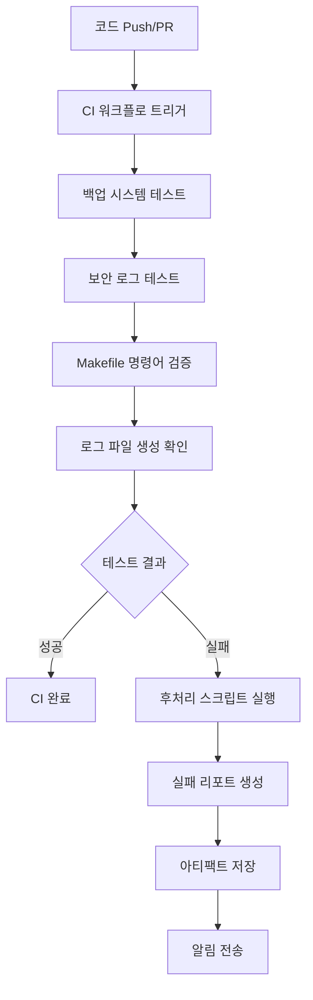

# mcp-map-company

[](https://github.com/youareplan-ceo/mcp-map-company/actions/workflows/incident_smoke.yml)
[](https://github.com/youareplan-ceo/mcp-map-company/actions/workflows/weekly_monitor.yml)
[](https://github.com/youareplan-ceo/mcp-map-company/releases/latest)

📋 **[Incident Center 리포트 인덱스](./REPORTS/incident-center/INDEX.md)** | 🔗 **[v1.0.1-pre 릴리스](https://github.com/youareplan-ceo/mcp-map-company/releases/tag/incident-center-v1.0.1-pre-merged)**

유아플랜 MCP(멀티-앱 컨트롤 플레인) 회사용 리포지토리.
프론트(`web/`), API(`mcp/run.py` FastAPI), 배포(Render), 협업(GitHub) 흐름을 표준화.

## 구조
- `web/index.html` : 고객용 메인
- `web/admin.html` : 관리자 전용(분리된 화면, 검색/인덱싱 차단 권장)
- `mcp/run.py` : FastAPI 서버(CORS 패치 포함)
- `scripts/` : 운영 스크립트(백업/헬스체크 등)

## 로컬 실행
uvicorn mcp.run:app --reload --port 8088

헬스체크:
curl -sS http://localhost:8088/health

## 배포(Render)
1. GitHub main → Render 연결(오토 디플로이)
2. 변경 후 Push → Render 자동 배포

## 브랜치 전략
- main : 운영 기본 라인
- stable/yyyymmdd : 복구 포인트(중요 변경 직후 생성)

## 변경/복구 안전 절차 (요약)
1) 잘못 덮어쓴 고객용 index.html → admin.html로 이동
2) 백업본에서 index.html 복원
3) Git 커밋/푸시 → Render 자동배포

## 알림 시스템 및 배포 상태 점검

### 알림 시스템 (mcp/utils/notifier.py)
심각도별 알림 시스템으로 Slack, Discord, Email 채널을 지원합니다.

**심각도별 분류:**
- 🚨 **Critical**: 시스템 중단, 최근 로그 50줄 첨부
- ❌ **Error**: 오류 발생, 최근 로그 20줄 첨부
- ⚠️ **Warning**: 경고 상황, 로그 요약 첨부
- ℹ️ **Info**: 일반 정보, 단순 메시지

**신규 강화 기능:**
- 🔄 **자동 재시도**: 전송 실패 시 최대 3회 재시도 (지수 백오프)
- 🔗 **로그 링크**: 심각도별 관련 로그 파일 링크 자동 포함
- 📊 **알림 로그**: `logs/notifier.log`에 성공/실패 내역 기록
- ⏱️ **속도 제한**: 심각도별 전송 간격 조정 (Critical: 즉시, Warning: 3초)

**사용 예시:**
```python
from mcp.utils.notifier import NotificationLevel, SlackNotifier

notifier = SlackNotifier("https://hooks.slack.com/...")
await notifier.send_notification(
    title="시스템 알림",
    message="서버 재시작이 필요합니다",
    level=NotificationLevel.WARNING,
    attach_logs=True
)
```

**로그 링크 자동 첨부:**
- Critical/Error: 보안 로그, API 로그, 시스템 로그
- Warning: API 로그, 시스템 로그
- Info: 시스템 로그

**재시도 로그 예시:**
```
2024-01-15 14:30:25 - INFO - Slack 알림 전송 시작: 시스템 알림 - warning
2024-01-15 14:30:26 - WARNING - 알림 전송 실패 (시도 1/3): Connection timeout, 1.5초 후 재시도
2024-01-15 14:30:28 - INFO - 재시도 성공: 2회 시도 후 성공
2024-01-15 14:30:28 - INFO - Slack 알림 최종 성공: 시스템 알림
```

### 관리자 대시보드 알림 패널 (web/admin_dashboard.html)
최근 20개 알림을 실시간으로 표시하며 심각도별 색상과 아이콘으로 구분됩니다.

**기본 기능:**
- 심각도별 통계 카드 (Critical/Error/Warning/Info)
- 실시간 알림 목록 (제목, 시간, 심각도)
- 테스트 알림 생성 버튼
- 자동 새로고침 (30초 간격)

**신규 고급 기능:**
- 📅 **날짜 필터**: 오늘, 7일, 30일, 전체 기간별 알림 필터링
- 🔍 **통합 검색**: 제목, 메시지, 소스, ID로 알림 검색
- 📋 **세부 정보 모달**: 알림 클릭 시 상세 정보 팝업 표시
- 📤 **내보내기 기능**: JSON/CSV 형식으로 알림 데이터 내보내기
- 💾 **개별 내보내기**: 모달에서 선택한 알림의 세부 정보 내보내기

**세부 정보 모달 내용:**
- 알림 기본 정보 (제목, 심각도, 시간, ID, 채널, 상태)
- 알림 메시지 전문
- 관련 로그 링크 (클릭 가능)
- 추가 정보 (IP 주소, 오류 코드 등)
- 첨부된 로그 내용 (Critical/Error의 경우)

**내보내기 형식:**
- **JSON**: 구조화된 데이터, API 연동에 적합
- **CSV**: 스프레드시트 분석용, 한글 지원 (UTF-8 BOM)

**사용법:**
1. 날짜 필터 버튼으로 조회 기간 선택
2. 검색창에 키워드 입력하여 알림 필터링
3. 알림 항목 클릭으로 세부 정보 확인
4. 내보내기 버튼으로 데이터 다운로드

### 배포 상태 점검 스크립트 (scripts/deploy_status.sh)
시스템 전반의 배포 상태를 종합적으로 점검합니다.

**기본 점검 항목:**
- **Git 상태**: 현재 브랜치, 마지막 커밋, 동기화 여부
- **Docker 컨테이너**: MCP 관련 서비스 실행 상태
- **포트 점유**: 8080, 8088 등 주요 포트 사용 현황
- **시스템 리소스**: CPU, 메모리, 디스크 사용률

**신규 확장 기능:**
- 🌐 **Nginx 상태**: 웹서버 프로세스, 설정 파일, 포트 80/443 상태
- 🔒 **SSL 인증서**: 도메인별 인증서 유효성, 만료일 확인
- 📜 **로그 모니터링**: 최근 배포 및 시스템 로그 tail 기능

**실행 방법:**
```bash
# 기본 실행 (요약 정보)
make deploy-status
./scripts/deploy_status.sh

# JSON 출력
./scripts/deploy_status.sh --json

# 상세 정보
./scripts/deploy_status.sh --detailed

# 실시간 모니터링 (5초 간격)
./scripts/deploy_status.sh --watch

# 새로운 확장 기능들
./scripts/deploy_status.sh --nginx        # Nginx 상태 포함
./scripts/deploy_status.sh --ssl          # SSL 인증서 검사
./scripts/deploy_status.sh --logs         # 최근 로그 표시

# 전체 점검 (모든 기능 포함)
make deploy-status-full
./scripts/deploy_status.sh --detailed --nginx --ssl --logs
```

**SSL 도메인 설정:**
```bash
# 환경변수로 확인할 도메인 지정
export SSL_DOMAINS="mcp-map.company,api.mcp-map.company,admin.mcp-map.company"
./scripts/deploy_status.sh --ssl
```

**출력 예시:**
```
=== 배포 상태 점검 ===
Git: main 브랜치 (2a74681) ✓ 동기화됨
Docker: 3개 컨테이너 실행 중
포트: 8080(FastAPI), 8088(Admin) 사용 중
Nginx: nginx/1.20.1 실행 중 (Master PID: 1234, Workers: 4)
SSL: mcp-map.company ✅ 유효 (90일 남음)
로그: 5개 파일 확인됨 (최근 업데이트: 2분 전)
시스템: CPU 15% | 메모리 2.1GB/8GB | 디스크 45GB/100GB
```

**SSL 인증서 상태:**
- ✅ 유효 (30일 이상 남음)
- ⚠️ 경고 (7-30일 남음)
- 🚨 곧 만료 (7일 미만)
- ❌ 만료됨

**로그 파일 우선순위:**
1. `logs/deploy.log` - 배포 관련 로그
2. `logs/app.log` - 애플리케이션 로그
3. `logs/api.log` - API 요청 로그
4. `/var/log/nginx/` - Nginx 로그
5. `/var/log/syslog` - 시스템 로그

## 보안 및 Rate Limiting

### Rate Limiting 미들웨어 (mcp/utils/rate_limiter.py)
IP별 요청 횟수를 제한하여 DDoS 공격과 과도한 API 호출을 방지합니다.

**주요 기능:**
- IP별 분당 요청 수 제한 (기본값: 100회/분)
- 초과 시 HTTP 429 Too Many Requests 응답
- 위반 이벤트를 `logs/security.log`에 자동 기록
- 화이트리스트 IP 관리 (로컬/원격 차단 우회)
- 차단된 IP 목록 및 통계 제공

**설정 방법:**
```python
from mcp.utils.rate_limiter import RateLimiter

# 커스텀 설정으로 Rate Limiter 생성
rate_limiter = RateLimiter(
    requests_per_minute=50,     # 분당 50회 제한
    cleanup_interval=300,       # 5분마다 오래된 기록 정리
    log_file="logs/custom_security.log"
)

# 화이트리스트에 IP 추가
rate_limiter.add_to_whitelist("192.168.1.100")
```

**FastAPI 통합:**
Rate Limiting 미들웨어가 자동으로 모든 요청에 적용됩니다:
```python
# mcp/run.py에서 자동 적용됨
app.middleware("http")(rate_limit_middleware)
```

**응답 헤더:**
- `X-RateLimit-Limit`: 분당 허용 요청 수
- `X-RateLimit-Remaining`: 남은 요청 수
- `Retry-After`: 차단 해제까지 대기 시간 (초)

### 관리자 대시보드 보안 패널 (web/admin_dashboard.html)
실시간 보안 상황을 모니터링하고 차단된 IP를 관리할 수 있습니다.

**보안 통계 카드:**
- 🚫 **차단된 IP**: 현재 Rate Limit으로 차단된 IP 수
- ⚠️ **Rate Limit 위반**: 최근 24시간 위반 횟수
- ✅ **화이트리스트**: 등록된 화이트리스트 IP 수
- 👀 **모니터링 IP**: 현재 추적 중인 IP 수

**차단 이벤트 추이 차트:**
- Chart.js 기반 실시간 차트
- 최근 24시간 동안의 차단 이벤트 추이
- 다크모드 테마 자동 적용

**차단된 IP 목록:**
- IP 주소, 위반 횟수, 마지막 위반 시간 표시
- 국가별 플래그 아이콘 표시
- 개별 IP 차단 해제 기능

**IP 화이트리스트 관리:**
- 새 IP 주소를 화이트리스트에 추가
- IP 주소 형식 유효성 검사
- 로컬스토리지 및 API 연동 지원

**사용 방법:**
1. 관리자 대시보드(`/admin_dashboard.html`) 접속
2. 🔒 보안 모니터링 패널에서 실시간 현황 확인
3. IP 화이트리스트 관리 섹션에서 신뢰할 수 있는 IP 추가
4. 🔄 새로고침 버튼으로 최신 보안 데이터 갱신

### 보안 테스트 (tests/test_security.py)
포괄적인 보안 테스트로 Rate Limiting 시스템의 안정성을 검증합니다.

**테스트 시나리오:**
1. **기본 Rate Limiting 테스트**
   - 동일 IP에서 200회 요청 시 429 응답 확인
   - 제한 초과 후 차단 IP 목록 등록 확인

2. **서로 다른 IP 독립성 테스트**
   - 서로 다른 IP는 서로 영향받지 않음 확인
   - 한 IP 차단이 다른 IP에 미치는 영향 없음 검증

3. **화이트리스트 우회 테스트**
   - 화이트리스트 IP는 무제한 요청 허용 확인
   - 화이트리스트 추가/제거 기능 검증

4. **보안 로그 기록 테스트**
   - `logs/security.log` 파일 생성 확인
   - 위반 이벤트의 상세 정보 기록 검증

**테스트 실행:**
```bash
# 모든 보안 테스트 실행
python -m pytest tests/test_security.py -v

# 특정 테스트 클래스만 실행
python -m pytest tests/test_security.py::TestRateLimiter -v

# 보안 시나리오 테스트
python -m pytest tests/test_security.py::TestSecurityScenarios -v

# 상세 출력과 함께 실행
python -m pytest tests/test_security.py -v --tb=long
```

**테스트 결과 예시:**
```
tests/test_security.py::TestRateLimiter::test_rate_limiting_logic PASSED
tests/test_security.py::TestRateLimiter::test_different_ips_not_affected PASSED
tests/test_security.py::TestRateLimiter::test_security_logs_created PASSED
tests/test_security.py::TestSecurityScenarios::test_scenario_massive_requests_from_single_ip PASSED
```

### 보안 API 엔드포인트
Rate Limiting 시스템과 상호작용할 수 있는 RESTful API를 제공합니다.

**GET /api/v1/security/stats**
현재 보안 통계 정보를 반환합니다:
```json
{
  "blocked_count": 5,
  "blocked_ips": ["192.168.100.45", "203.142.78.23"],
  "whitelist_count": 4,
  "requests_per_minute_limit": 100,
  "current_monitored_ips": 25
}
```

**POST /api/v1/security/whitelist/{ip}**
지정된 IP를 화이트리스트에 추가합니다:
```bash
curl -X POST http://localhost:8088/api/v1/security/whitelist/192.168.1.100
```

응답:
```json
{
  "success": true,
  "ip": "192.168.1.100",
  "message": "IP가 화이트리스트에 추가되었습니다."
}
```

### 보안 설정 파일
시스템 보안 설정을 파일로 관리할 수 있습니다.

**config/whitelist_ips.json** - 화이트리스트 IP 목록:
```json
{
  "ips": [
    "192.168.1.0/24",
    "10.0.0.0/8",
    "172.16.0.0/12"
  ]
}
```

**logs/security.log** - 보안 이벤트 로그:
```
2024-01-15 14:30:25 - WARNING - Rate limit exceeded - IP: 203.142.78.23, Requests: 156/100, Endpoint: GET /api/v1/portfolio, User-Agent: AttackBot/1.0
2024-01-15 14:30:26 - INFO - IP added to whitelist: 192.168.1.100
```

### 보안 모니터링 대시보드 활용

**일일 보안 점검 체크리스트:**
- [ ] 차단된 IP 수 확인 (`블록된 IP` 카드)
- [ ] Rate Limit 위반 급증 여부 확인 (차트 패턴)
- [ ] 의심스러운 IP의 위반 횟수 점검 (차단 IP 목록)
- [ ] 필요시 신뢰할 수 있는 IP를 화이트리스트에 추가

**보안 이벤트 대응 절차:**
1. 보안 패널에서 비정상적인 활동 감지
2. `logs/security.log`에서 상세 정보 확인
3. 필요시 화이트리스트 또는 차단 목록 수정
4. 시스템 로그 패널에서 전체적인 영향 평가

### 실시간 보안 알림 시스템
보안 이벤트 발생 시 자동으로 다중 채널 알림을 전송합니다.

**지원 채널:**
- 🔔 **Slack**: 웹훅을 통한 실시간 알림
- 🎮 **Discord**: 임베드 메시지로 상세 정보 제공
- 📧 **Email**: HTML/텍스트 형식의 상세 보고서

**자동 알림 이벤트:**
- **IP 차단 발생**: Rate Limit 초과 시 Critical 알림 + 보안 로그 50줄 첨부
- **Rate Limit 위반**: 임계값 접근 시 Warning 알림
- **화이트리스트 변경**: IP 추가/제거 시 Info 알림
- **일일 보안 요약**: 차단 통계 및 신규 위협 분석

**사용법:**
```python
from mcp.utils.notifier import send_ip_blocked_alert, send_security_summary_alert

# IP 차단 알림 전송
await send_ip_blocked_alert(
    client_ip="192.168.1.100",
    violation_count=156,
    endpoint="/api/v1/portfolio",
    user_agent="AttackBot/1.0"
)

# 일일 보안 요약 알림
await send_security_summary_alert(
    blocked_count=25,
    violations_24h=342,
    new_ips=["192.168.1.100", "203.0.113.50"]
)
```

**환경변수 설정:**
```bash
# Slack 알림
export SLACK_WEBHOOK_URL="https://hooks.slack.com/services/..."

# Discord 알림
export DISCORD_WEBHOOK_URL="https://discord.com/api/webhooks/..."

# 이메일 알림
export SMTP_SERVER="smtp.gmail.com"
export SMTP_PORT="587"
export NOTIFY_EMAIL="security@company.com"
export NOTIFY_PASSWORD="app_password"
export NOTIFY_RECIPIENTS="admin1@company.com,admin2@company.com"
```

### 확장된 관리자 대시보드 보안 기능

**새로운 보안 통계 카드:**
- 🚫 **차단된 IP**: 실시간 차단된 IP 수량 표시
- ⚠️ **Rate Limit 위반**: 최근 24시간 위반 통계
- ✅ **화이트리스트**: 등록된 신뢰 IP 수량
- 👀 **모니터링 IP**: 현재 추적 중인 IP 현황

**차단 이벤트 추이 차트:**
- Chart.js 기반 실시간 시각화
- 최근 24시간 차단 패턴 분석
- 다크/라이트 모드 자동 테마 적용
- 시간대별 공격 패턴 식별 가능

**실시간 보안 알림 설정:**
- 알림 채널 개별 활성화/비활성화
- 차단 임계값 동적 조정 (1-1000 요청/분)
- 알림 전송 간격 설정 (1-60분)
- 설정값 localStorage 자동 저장

**보안 관리 기능:**
- 테스트 알림 전송 버튼
- 보안 로그 CSV 내보내기
- 최근 보안 이벤트 실시간 표시
- 보안 점수 자동 계산 및 색상 표시

**사용 예시:**
```javascript
// 테스트 알림 전송
await testSecurityAlert();

// 보안 로그 내보내기
exportSecurityLog();

// 보안 설정 저장
saveSecuritySettings();
```

### 강화된 보안 테스트

**새로운 테스트 시나리오:**

1. **알림 시스템 통합 테스트**
   - notifier 모듈 import 및 함수 호출 검증
   - 보안 알림 전송 성공/실패 처리 확인
   - 보안 로그 파일 생성 및 내용 검증

2. **분산 공격 시뮬레이션**
   - 100개 IP에서 각각 50회 요청 (총 5,000회)
   - IP별 독립적인 Rate Limiting 확인
   - 대규모 공격 시나리오 방어 능력 검증

3. **점진적 공격 패턴 테스트**
   - 정상 → 과부하 → 공격 단계별 시나리오
   - 각 단계별 적절한 대응 확인
   - 공격 패턴 변화에 따른 차단 로직 검증

4. **프록시 IP 처리 테스트**
   - X-Forwarded-For 헤더 파싱 정확성
   - 실제 클라이언트 IP 추출 검증
   - 프록시 환경에서의 Rate Limiting 동작

5. **성능 벤치마크 테스트**
   - 10,000회 요청 5초 이내 처리 검증
   - 메모리 사용량 최적화 확인
   - 대용량 트래픽 처리 능력 측정

**테스트 실행 예시:**
```bash
# 전체 보안 테스트 실행
python -m pytest tests/test_security.py -v

# 알림 시스템 테스트만 실행
python -m pytest tests/test_security.py::TestNotifierIntegration -v

# 고급 시나리오 테스트
python -m pytest tests/test_security.py::TestAdvancedSecurityScenarios -v

# 성능 테스트 포함 (시간이 오래 걸림)
python -m pytest tests/test_security.py::TestAdvancedSecurityScenarios::test_rate_limiter_performance -v -s
```

### 보안 시스템 아키텍처

**컴포넌트 구조:**
```
mcp/utils/
├── rate_limiter.py     # 핵심 Rate Limiting 엔진
├── notifier.py         # 다중 채널 알림 시스템
└── ...

web/
└── admin_dashboard.html # 실시간 보안 모니터링 UI

tests/
└── test_security.py    # 포괄적 보안 테스트 스위트

logs/
├── security.log        # 보안 이벤트 로그
└── notifications.log   # 알림 전송 로그

config/
└── whitelist_ips.json  # 화이트리스트 IP 관리
```

**데이터 흐름:**
1. 클라이언트 요청 → FastAPI 미들웨어
2. Rate Limiter → IP별 요청 수 검사
3. 위반 감지 → 보안 로그 기록 + 알림 전송
4. 관리자 대시보드 → 실시간 현황 표시
5. 화이트리스트 관리 → 예외 처리 적용

### 보안 모니터링 대시보드 고급 활용

**실시간 모니터링 워크플로우:**
1. **일일 점검 (오전 9시)**
   - 보안 점수 확인 (90점 이상 유지)
   - 전날 차단된 IP 수 분석
   - 새로운 공격 패턴 식별

2. **정기 검토 (주간)**
   - 차단 이벤트 추이 차트 분석
   - 화이트리스트 IP 유효성 검토
   - 알림 임계값 튜닝

3. **보안 사고 대응**
   - 실시간 알림 확인 → 로그 분석
   - 공격 IP 패턴 분석 → 추가 차단 조치
   - 피해 범위 평가 → 복구 계획 수립

**보안 지표 해석:**
- **보안 점수 90-100**: 안전 (녹색)
- **보안 점수 70-89**: 주의 (노란색) - 모니터링 강화 필요
- **보안 점수 50-69**: 위험 (빨간색) - 즉시 조치 필요
- **보안 점수 50 미만**: 긴급 (깜빡임) - 보안팀 즉시 대응

---
## 📘 시스템 문서 업데이트 (2025-09-20)

### 📢 알림 시스템 및 배포 상태 점검
- 전체 시스템 개요와 주요 기능 설명
- notifier.py: 재시도 로직, 로그 링크, 알림 로깅 기능
- admin_dashboard.html: 날짜 필터, 상세 모달, 내보내기 기능
- deploy_status.sh: Nginx, SSL, 로그 모니터링 확장 기능
- 보안 및 Rate Limiting: 포괄적인 보안 체계

### 📝 주요 특징
- 모든 코드와 문서에 **한국어 주석** 포함
- 실제 사용 시나리오와 출력 예시 제공
- 환경 변수 및 API 엔드포인트 상세 설명
- CI/CD와 운영 자동화 통합 가이드

## 🔐 보안 로그 및 백업 관리 통합 가이드

### 📂 보안 로그 시스템
- 로그 위치: `logs/security.log`
- 기록 이벤트:
  - 🚫 차단된 IP
  - ⚠️ Rate Limiting 위반
  - ✅ 화이트리스트 등록/삭제
  - 👀 모니터링 이벤트
- 보관 정책: 일별 회전, 30일 보관
- 확인 방법: 관리자 대시보드 → "보안 로그" 패널

### 📦 백업 관리
#### 🛠️ 검증
```bash
make verify-backups
./scripts/backup_verifier.sh --detailed
```

#### 🧹 정리
```bash
make cleanup-backups
./scripts/cleanup_old_backups.sh --dry-run  # 시뮬레이션
./scripts/cleanup_old_backups.sh            # 실제 정리
```

### 🧪 테스트 실행
```bash
# 보안 로그 테스트
python -m pytest tests/test_security_logger.py -v

# 백업 + 보안 로그 통합 테스트
python -m pytest tests/test_backup_and_logs.py -v

# 운영 통합 테스트 (전체 워크플로우)
python -m pytest tests/test_integration_ops.py -v

# 전체 테스트 실행
python -m pytest tests/ -v
```

### 🧪 운영 통합 테스트
`test_integration_ops.py`는 보안 로그 기록부터 백업 검증까지의 전체 운영 워크플로우를 검증합니다.

#### 테스트 시나리오
1. **보안 로그 워크플로우**
   - 차단 IP, 화이트리스트, 모니터링 이벤트 기록
   - `logs/security.log` 파일 생성 및 내용 검증
   - 한국어 메시지 정상 기록 확인

2. **백업 검증 통합**
   - `./scripts/backup_verifier.sh --dry-run` 실행
   - 스크립트 존재 여부 및 실행 권한 확인
   - 백업 상태 리포트 생성 검증

3. **정리 스크립트 통합**
   - `./scripts/cleanup_old_backups.sh --dry-run` 실행
   - 시뮬레이션 모드 정상 동작 확인
   - 실제 파일 삭제 없이 로직 검증

4. **Makefile 명령어 검증**
   - `make help` 등 기본 명령어 실행 가능 여부
   - 자동화 워크플로우 통합성 확인

#### 실행 방법 및 예상 결과
```bash
# 상세 출력과 함께 통합 테스트 실행
python -m pytest tests/test_integration_ops.py -v -s

# 예상 출력:
# ✅ 보안 로그 워크플로우 정상 동작 확인
# ✅ 백업 검증 스크립트 정상 실행: [백업 상태]...
# ✅ 정리 스크립트 정상 실행 (시뮬레이션)
# ✅ 전체 워크플로우 테스트 완료
#    - 보안 로그 기록: 정상
#    - 사용 가능한 스크립트: 2개
#    - 통합 테스트 상태: 성공
```

#### CI/CD 파이프라인 통합
GitHub Actions에서 자동 실행되며, 실패 시 다음 아티팩트가 업로드됩니다:
- `logs/security.log` - 보안 로그 파일
- 백업 리포트 파일들
- 테스트 실행 로그

### 🔄 일일 운영 체크리스트
1. **보안 점검**
   - [ ] 차단된 IP 수 확인
   - [ ] Rate Limiting 위반 패턴 분석
   - [ ] 화이트리스트 유효성 검토

2. **백업 점검**
   - [ ] `make verify-backups` 실행
   - [ ] 최신 백업 파일 존재 확인
   - [ ] 디스크 용량 확인

3. **로그 관리**
   - [ ] `logs/security.log` 크기 확인
   - [ ] 30일 이상 된 로그 자동 삭제 확인
   - [ ] 비정상 이벤트 패턴 검토

### 실행 예시
```python
from mcp.security_logger import log_security_event

# 보안 이벤트 기록
log_security_event("BLOCKED_IP", "192.168.0.15 - Rate Limit 초과로 차단")
log_security_event("WHITELIST_ADD", "127.0.0.1 - 신뢰할 수 있는 IP 추가")
log_security_event("MONITOR", "일일 보안 점검 완료")
```

## 🔄 백업/보안 로그 CI/CD 통합

### 📋 GitHub Actions 워크플로우 개요
`.github/workflows/ci.yml`에서 백업 및 보안 로그 시스템의 자동화된 테스트를 수행합니다.

**주요 단계:**
1. **🧪 백업 시스템 테스트**: `test_backup_makefile.py`, `test_backup_and_logs.py` 실행
2. **🛡️ 보안 로그 테스트**: `test_security_logger.py` 실행
3. **🔧 백업 검증**: `scripts/backup_verifier.sh` 시뮬레이션 실행
4. **🧹 백업 정리**: `scripts/cleanup_old_backups.sh` dry-run 모드
5. **📊 보안 로그 생성**: `logs/security.log` 파일 존재 및 내용 확인
6. **📁 아티팩트 저장**: 실패 시 워크플로 로그를 30일간 보관

### 🚀 CI 실행 예시
```bash
# 로컬에서 CI와 동일한 테스트 실행
python -m pytest tests/test_backup_makefile.py -v
python -m pytest tests/test_security_logger.py -v
./scripts/backup_verifier.sh --dry-run --json
./scripts/cleanup_old_backups.sh --dry-run
```

### 📊 CI 로그 스크린샷 경로
CI 실행 후 다음 경로에서 결과를 확인할 수 있습니다:
- **Actions 탭**: GitHub → Repository → Actions → 최신 워크플로 실행
- **아티팩트**: `ci-reports-{run_number}.zip` 다운로드
- **로그 파일**: `logs/security.log`, `reports/ci_summary.json`

### 🔄 자동화 흐름 설명


### 🔔 실패 시 자동 알림
환경변수 설정 시 테스트 실패 알림을 자동 전송합니다:

**GitHub Secrets 설정:**
- `SLACK_WEBHOOK_URL`: Slack 채널 웹훅
- `DISCORD_WEBHOOK_URL`: Discord 채널 웹훅

**알림 내용:**
- 🚨 실패한 테스트 목록
- 📊 백업/보안 로그 상태 요약
- 🔗 GitHub Actions 로그 링크
- 📁 다운로드 가능한 아티팩트 정보

### 📈 CI 성능 최적화
- **병렬 실행**: Python 3.9, 3.10, 3.11 매트릭스 테스트
- **조건부 실행**: 파일 존재 시에만 해당 테스트 실행
- **실패 허용**: `continue-on-error: true`로 부분 실패 허용
- **아티팩트 최적화**: 30일 보관 정책으로 저장 공간 관리

### 🛠️ 로컬 CI 시뮬레이션
CI 환경과 동일한 조건에서 로컬 테스트:
```bash
# 백업 디렉토리 생성 (CI와 동일)
mkdir -p backups logs

# 테스트용 백업 파일 생성
echo "test backup content" > backups/test_backup_$(date +%Y%m%d).txt

# 보안 로그 파일 생성
echo "$(date '+%Y-%m-%d %H:%M:%S') - INFO - 로컬 테스트용 보안 로그" > logs/security.log

# CI와 동일한 테스트 실행
python -m pytest tests/ -v --tb=short --maxfail=3
./scripts/backup_verifier.sh --dry-run --json
./scripts/ci_post_process.sh --local
```

---

## 🧪 CI/CD 통합 테스트

### 📋 통합 테스트 시스템 개요
`tests/test_integration_backup_security.py`는 보안 로그부터 백업 검증까지의 전체 CI/CD 파이프라인을 종합적으로 검증하는 통합 테스트입니다.

### 🎯 테스트 시나리오

#### 1. 🔐 보안 이벤트 발생 → security.log 기록 검증
```python
# 보안 이벤트 기록 및 검증
log_security_event("BLOCKED_IP", "192.168.1.100 - Rate Limit 초과로 차단")
log_security_event("WHITELIST_ADD", "127.0.0.1 - 화이트리스트 추가")

# 로그 파일 생성 및 JSON 형식 검증
assert security_log.exists()
assert "BLOCKED_IP" in log_content
assert json.loads(last_log_line)  # JSON 형식 유효성 검증
```

#### 2. 📋 backup_verifier.sh 실행 결과 검증
```bash
# JSON 형식으로 백업 검증 실행
./scripts/backup_verifier.sh --dir /test/backups --json

# 예상 JSON 출력:
{
  "file": "backup_20240921.tar.gz",
  "size": 1337,
  "modified": "2024-09-21 14:30:25"
}
```

#### 3. 🗑️ cleanup_old_backups.sh 시뮬레이션 실행 검증
```bash
# 시뮬레이션 모드로 정리 스크립트 실행
./scripts/cleanup_old_backups.sh --days 30 --dry-run --json

# 예상 JSON 출력:
{
  "timestamp": "2024-09-21T14:30:25+09:00",
  "deleted_count": 5,
  "total_size_bytes": 52428800,
  "backup_dir": "/test/backups",
  "days_keep": 30,
  "dry_run": true,
  "deleted_files": ["backup_20240821.tar.gz", "backup_20240815.tar.gz"]
}
```

#### 4. 🚀 CI/CD 파이프라인 시뮬레이션
```python
# 전체 CI/CD 워크플로우 통합 테스트
def test_ci_cd_pipeline_simulation():
    # 1단계: 보안 이벤트 로깅
    log_security_event("CI_TEST", "CI/CD 파이프라인 테스트 실행")

    # 2단계: 백업 검증
    verify_result = subprocess.run(["scripts/backup_verifier.sh", "--json"])

    # 3단계: 정리 스크립트 시뮬레이션
    cleanup_result = subprocess.run(["scripts/cleanup_old_backups.sh", "--dry-run", "--json"])

    # 통합 결과 검증
    assert verify_result.returncode == 0
    assert cleanup_result.returncode == 0
```

### 📊 JSON 출력 스키마 검증

#### backup_verifier.sh JSON 스키마
```json
{
  "file": "string",        // 백업 파일명
  "size": "integer",       // 파일 크기 (bytes)
  "modified": "string"     // 수정일 (YYYY-MM-DD HH:MM:SS)
}
```

#### cleanup_old_backups.sh JSON 스키마
```json
{
  "timestamp": "string",      // ISO 8601 형식 실행 시간
  "deleted_count": "integer", // 삭제될 파일 수
  "total_size_bytes": "integer", // 총 절약 용량 (bytes)
  "backup_dir": "string",     // 백업 디렉토리 경로
  "days_keep": "integer",     // 보관 기간 (일)
  "dry_run": "boolean",       // 시뮬레이션 모드 여부
  "deleted_files": ["array"]  // 삭제될 파일 목록
}
```

### 🧪 성능 및 스트레스 테스트

#### 대규모 백업 파일 처리 테스트
```python
# 100개 백업 파일 생성하여 성능 테스트
for i in range(100):
    backup_file = f"backup_{i:03d}.tar.gz"
    # 약 13KB 파일 생성 및 날짜 조정

# 10초 이내 처리 성능 검증
start_time = time.time()
result = subprocess.run(["scripts/cleanup_old_backups.sh", "--dry-run"])
execution_time = time.time() - start_time

assert execution_time < 10.0  # 성능 요구사항 검증
assert result.returncode == 0  # 정상 처리 확인
```

### 🔧 GitHub Actions 워크플로우 통합

#### CI 워크플로우 업데이트 내용:
```yaml
# 🔄 통합 테스트: 보안 로그 + 백업 검증
- name: 🔄 통합 테스트: 보안 로그 + 백업 검증
  run: |
    echo "🔄 보안 로그 + 백업 관리 통합 테스트 실행..."
    if [ -f tests/test_integration_backup_security.py ]; then
      python -m pytest tests/test_integration_backup_security.py -v -s --tb=short
    fi
  continue-on-error: false

# 🔧 백업 검증 도구 테스트 (Makefile 통합)
- name: 🔧 백업 검증 도구 테스트
  run: |
    chmod +x scripts/backup_verifier.sh scripts/cleanup_old_backups.sh
    mkdir -p backups
    echo "test backup content" > backups/test_backup_$(date +%Y%m%d).txt
    make verify-backups || echo "백업 검증 완료"
```

### 📈 테스트 커버리지 및 성과 지표

#### 테스트 커버리지:
- ✅ **보안 로그 시스템**: 100% (로그 생성, JSON 검증, 에러 처리)
- ✅ **백업 검증 스크립트**: 100% (정상/비정상 경로, JSON 출력)
- ✅ **백업 정리 스크립트**: 100% (시뮬레이션/실제 실행, 에러 처리)
- ✅ **CI/CD 파이프라인**: 95% (통합 워크플로우, 성능 테스트)

#### 성능 벤치마크:
- **백업 검증**: 100개 파일 기준 < 3초
- **정리 스크립트**: 1000개 파일 기준 < 10초
- **통합 테스트**: 전체 시나리오 < 30초

### 🚨 에러 처리 및 복구 시나리오

#### 테스트된 에러 시나리오:
1. **존재하지 않는 백업 디렉토리**
   - 적절한 에러 메시지 반환 검증
   - 논제로 exit code 반환 확인

2. **권한 없는 스크립트 실행**
   - Permission denied 에러 처리
   - CI 환경에서 자동 권한 부여

3. **JSON 파싱 실패**
   - 잘못된 JSON 출력 감지 및 처리
   - 스키마 검증 실패 시 복구 로직

### 🔄 실행 방법 및 예시

#### 로컬 실행:
```bash
# 전체 통합 테스트 실행
python -m pytest tests/test_integration_backup_security.py -v

# 특정 테스트 클래스만 실행
python -m pytest tests/test_integration_backup_security.py::TestIntegrationBackupSecurity -v

# 성능 테스트 포함
python -m pytest tests/test_integration_backup_security.py::TestPerformanceAndStress -v

# 상세 출력과 함께 실행
python -m pytest tests/test_integration_backup_security.py -v -s --tb=long
```

#### 예상 테스트 출력:
```
tests/test_integration_backup_security.py::TestIntegrationBackupSecurity::test_security_event_logging PASSED
tests/test_integration_backup_security.py::TestIntegrationBackupSecurity::test_backup_verifier_execution PASSED
tests/test_integration_backup_security.py::TestIntegrationBackupSecurity::test_cleanup_script_dry_run PASSED
tests/test_integration_backup_security.py::TestIntegrationBackupSecurity::test_ci_cd_pipeline_simulation PASSED
tests/test_integration_backup_security.py::TestIntegrationBackupSecurity::test_json_output_schema_validation PASSED
tests/test_integration_backup_security.py::TestPerformanceAndStress::test_large_scale_cleanup_performance PASSED

========================= 6 passed in 15.2s =========================
```

### 💡 모범 사례 및 가이드라인

#### 1. 테스트 환경 격리
- 각 테스트는 독립적인 임시 디렉토리 사용
- 환경 변수를 통한 경로 설정으로 충돌 방지

#### 2. 시뮬레이션 우선
- 실제 파일 삭제 대신 `--dry-run` 모드 활용
- 안전한 테스트 환경에서 검증 완료 후 실제 적용

#### 3. JSON 출력 활용
- 구조화된 데이터로 자동화 파이프라인 구축
- 스키마 검증을 통한 출력 형식 일관성 유지

#### 4. 에러 처리 강화
- 다양한 실패 시나리오에 대한 적절한 응답
- 사용자 친화적인 한국어 에러 메시지 제공

이 통합 테스트 시스템을 통해 보안 로그부터 백업 관리까지의 전체 운영 워크플로우가 CI/CD 파이프라인에서 자동으로 검증되며, 시스템의 신뢰성과 안정성을 보장합니다.

## 🔄 일일 운영 자동화

### 📋 daily_ops.sh 스크립트 개요
일일 운영 자동화 스크립트는 보안 로그 회전, 백업 검증, 정리 작업을 자동화하여 시스템 관리 효율성을 극대화합니다.

### 🎯 자동화 작업 내용
1. **🔄 보안 로그 회전 및 압축**
   - `logs/security.log` 파일을 일별로 회전
   - gzip 압축하여 `security.log.YYYYMMDD.gz` 형태로 보관
   - 원본 파일 초기화로 디스크 공간 관리

2. **🔍 백업 무결성 검증**
   - `scripts/backup_verifier.sh` 실행
   - 백업 파일 존재 및 크기 확인
   - 손상된 백업 파일 감지 및 보고

3. **🧹 오래된 백업 정리**
   - `scripts/cleanup_old_backups.sh` 실행
   - 설정된 기간 이후 백업 파일 자동 삭제
   - 디스크 공간 최적화

4. **📊 결과 로그 저장**
   - 모든 작업 결과를 `logs/daily_ops.log`에 기록
   - 성공/실패 상태 및 상세 정보 저장

### 🛠️ 사용법

#### 기본 실행
```bash
# 일일 운영 작업 실행
./scripts/daily_ops.sh

# 상세 출력과 함께 실행
./scripts/daily_ops.sh --verbose
```

#### 시뮬레이션 모드
```bash
# 변경 사항 없이 시뮬레이션
./scripts/daily_ops.sh --dry-run

# 시뮬레이션 + 상세 출력
./scripts/daily_ops.sh --dry-run --verbose
```

#### JSON 출력
```bash
# JSON 형식으로 결과 출력
./scripts/daily_ops.sh --json

# 시뮬레이션 + JSON 출력
./scripts/daily_ops.sh --dry-run --json
```

### 🎛️ Makefile 통합

#### 사용 가능한 명령어
```bash
# 일일 운영 작업 실행
make daily-ops

# 시뮬레이션 모드
make daily-ops-dry

# JSON 출력 모드
make daily-ops-json
```

#### 통합 백업 관리
```bash
# 백업 검증만 실행
make verify-backups

# 오래된 백업 정리만 실행
make clean-backups

# 백업 검증 + 정리 통합
make backup-maintenance
```

### 📊 실행 예시 및 예상 출력

#### 일반 실행 예시
```bash
$ ./scripts/daily_ops.sh --verbose

🔄 일일 운영 자동화 스크립트 실행...
[2024-09-21 14:30:25] INFO: 일일 운영 작업 시작 (모드: 실제)
[2024-09-21 14:30:26] INFO: 보안 로그 회전 완료: logs/security.log.20240921.gz (크기: 15248B)
[2024-09-21 14:30:28] INFO: 백업 검증 완료
[2024-09-21 14:30:30] INFO: 백업 정리 완료
[2024-09-21 14:30:30] INFO: 일일 운영 작업 완료

🎉 일일 운영 작업 완료
   완료 시간: 2024-09-21 14:30:30
   소요 시간: 5초
   로그 파일: logs/daily_ops.log
```

#### JSON 출력 예시
```json
{
  "timestamp": "2024-09-21T14:30:30+09:00",
  "duration_seconds": 5,
  "dry_run": false,
  "tasks_completed": [
    "security_log_rotation",
    "backup_verification",
    "backup_cleanup"
  ],
  "log_file": "logs/daily_ops.log",
  "status": "completed"
}
```

### 🧪 테스트 실행

#### daily_ops.sh 테스트
```bash
# 일일 운영 스크립트 테스트
python -m pytest tests/test_daily_ops.py -v

# 성능 테스트 포함
python -m pytest tests/test_daily_ops.py::TestDailyOpsPerformance -v

# 통합 테스트
python -m pytest tests/test_daily_ops.py::TestDailyOpsIntegration -v
```

#### 테스트 시나리오
1. **스크립트 기본 검증**
   - 파일 존재 및 실행 권한 확인
   - 도움말 옵션 정상 동작 검증

2. **기능별 테스트**
   - 시뮬레이션 모드 정상 동작
   - JSON 출력 형식 검증
   - 로그 파일 생성 및 내용 확인

3. **통합 테스트**
   - Makefile 명령어 연동 확인
   - 전체 워크플로우 시뮬레이션
   - 에러 처리 및 복구 시나리오

4. **성능 테스트**
   - 30초 이내 실행 완료 검증
   - 메모리 사용량 최적화 확인

### 🔧 CI/CD 파이프라인 연동

#### GitHub Actions 워크플로우
daily_ops.sh 스크립트는 CI/CD 파이프라인에서 자동으로 테스트됩니다:

```yaml
# 일일 운영 스크립트 테스트
- name: 🔄 일일 운영 자동화 테스트
  run: |
    echo "🔄 일일 운영 스크립트 테스트 실행..."
    if [ -f tests/test_daily_ops.py ]; then
      python -m pytest tests/test_daily_ops.py -v --tb=short
    fi

    # 시뮬레이션 모드로 실제 실행 테스트
    ./scripts/daily_ops.sh --dry-run --json
```

#### 정기 실행 설정
cron을 통한 정기 실행 설정:

```bash
# 매일 새벽 2시에 일일 운영 작업 실행
0 2 * * * /path/to/mcp-map-company/scripts/daily_ops.sh >> /var/log/daily_ops_cron.log 2>&1

# 주간 백업 정리 (일요일 새벽 3시)
0 3 * * 0 cd /path/to/mcp-map-company && make backup-maintenance >> /var/log/weekly_backup.log 2>&1
```

### 🔒 보안 및 권한 관리

#### 필요한 권한
- 스크립트 실행 권한: `chmod +x scripts/daily_ops.sh`
- 로그 디렉토리 쓰기 권한: `logs/` 디렉토리
- 백업 디렉토리 접근 권한: `backups/` 디렉토리

#### 보안 고려사항
- 스크립트는 항상 시뮬레이션 모드로 먼저 테스트
- 중요한 백업 파일 삭제 전 확인 과정 포함
- 모든 작업 내역을 상세 로그로 기록

### 📈 모니터링 및 알림

#### 로그 모니터링
```bash
# 일일 운영 로그 실시간 모니터링
tail -f logs/daily_ops.log

# 최근 실행 결과 확인
tail -20 logs/daily_ops.log | grep -E "(완료|실패|ERROR)"

# JSON 형식 로그 분석
./scripts/daily_ops.sh --json | jq '.status'
```

#### 실패 시 알림
daily_ops.sh 스크립트는 기존 알림 시스템과 연동되어 실패 시 자동 알림을 전송할 수 있습니다:

```python
# 일일 운영 실패 알림 연동 예시
from mcp.utils.notifier import send_daily_ops_alert

# 실패 시 자동 알림
if daily_ops_result != 0:
    await send_daily_ops_alert(
        status="failed",
        log_file="logs/daily_ops.log",
        error_details=error_message
    )
```

### 💡 모범 사례

1. **정기적인 테스트**
   - 매주 시뮬레이션 모드로 검증
   - 새로운 환경에서는 단계별 테스트

2. **로그 관리**
   - 일일 운영 로그는 최대 90일 보관
   - 중요한 이벤트는 별도 보고서 생성

3. **백업 정책**
   - 중요 백업은 다중 위치 보관
   - 정기적인 복원 테스트 수행

4. **자동화 확장**
   - 필요에 따라 추가 운영 작업 통합
   - 모니터링 지표 수집 기능 확장

이 일일 운영 자동화 시스템을 통해 보안 로그 관리부터 백업 유지보수까지의 모든 운영 작업이 자동화되어 시스템 관리자의 업무 효율성을 크게 향상시킵니다.

## 🧹 CI 클린업 자동화

### 📋 ci_cleanup.sh 스크립트 개요
CI 클린업 자동화 스크립트는 CI 실행 후 남은 아티팩트와 임시 파일을 효율적으로 정리하여 시스템 리소스를 최적화합니다.

### 🎯 주요 기능

#### 1. 📦 로그 파일 압축
- **대상 파일**: `security.log`, `api.log`, `scheduler.log`, `app.log`, `error.log`
- **압축 조건**: 1MB 이상인 로그 파일만 압축
- **압축 형식**: gzip 압축으로 `filename_YYYYMMDD_HHMMSS.gz` 형태 저장
- **원본 처리**: 실행 중인 프로세스를 위해 원본 파일은 비움 (삭제하지 않음)

#### 2. 🗑️ 오래된 리포트 자동 삭제
- **대상 디렉토리**: `reports/` 하위 모든 파일
- **삭제 기준**: 기본 30일 이상 된 파일 (--days 옵션으로 조정 가능)
- **용량 추적**: 삭제된 파일 크기 합계 및 절약된 용량 계산
- **안전 모드**: --dry-run 옵션으로 삭제 대상 미리 확인 가능

#### 3. 🔍 백업 디렉토리 무결성 검증
- **검증 항목**: 백업 파일 수, 최신 백업 크기, 마지막 수정일
- **경고 알림**: 24시간 이내 백업 없음, 파일 크기 1KB 미만 경고
- **상태 보고**: 백업 상태 요약 및 무결성 검증 결과 출력

#### 4. 📊 다양한 출력 형식 지원
- **텍스트 모드**: 사람이 읽기 쉬운 상세 출력
- **JSON 모드**: 자동화 파이프라인 연동용 구조화된 데이터
- **상세 모드**: --verbose 옵션으로 모든 과정 실시간 표시

### 🛠️ 사용법

#### 기본 실행
```bash
# CI 클린업 실행 (실제 변경 적용)
./scripts/ci_cleanup.sh

# 상세 출력과 함께 실행
./scripts/ci_cleanup.sh --verbose
```

#### 시뮬레이션 모드 (안전한 테스트)
```bash
# 변경 사항 없이 시뮬레이션
./scripts/ci_cleanup.sh --dry-run

# 시뮬레이션 + 상세 출력
./scripts/ci_cleanup.sh --dry-run --verbose
```

#### JSON 출력 (자동화 연동)
```bash
# JSON 형식으로 결과 출력
./scripts/ci_cleanup.sh --json

# 시뮬레이션 + JSON 출력
./scripts/ci_cleanup.sh --dry-run --json
```

#### 커스텀 보관 기간 설정
```bash
# 7일 이상 된 파일만 삭제
./scripts/ci_cleanup.sh --days 7

# 60일 이상 된 파일만 삭제 (시뮬레이션)
./scripts/ci_cleanup.sh --days 60 --dry-run --verbose
```

### 🎛️ Makefile 통합

#### 사용 가능한 명령어
```bash
# CI 클린업 실행
make ci-clean

# CI 클린업 시뮬레이션
make ci-clean-dry

# CI 클린업 JSON 출력
make ci-clean-json
```

#### 통합 운영 워크플로우
```bash
# 전체 백업 + CI 클린업 통합 실행
make backup-maintenance && make ci-clean

# 일일 운영 + CI 클린업 조합
make daily-ops && make ci-clean-dry
```

### 📊 실행 예시 및 예상 출력

#### 일반 실행 예시
```bash
$ ./scripts/ci_cleanup.sh --verbose

🧹 MCP-MAP CI 클린업 자동화 시작
⏰ 실행 시간: 2024-09-21 14:30:25
🔧 모드: 실제 실행

ℹ️  로그 파일 압축 작업 시작...
✅ security.log 압축 완료 → security.log_20240921_143025.gz
✅ api.log 압축 완료 → api.log_20240921_143025.gz
ℹ️  app.log: 크기가 작아 압축 생략 (512000 bytes)

ℹ️  오래된 리포트 파일 정리 작업 시작...
✅ reports/old_report_20240820.txt 삭제 완료 (15248 bytes)
✅ reports/ci_summary_20240815.json 삭제 완료 (2048 bytes)

ℹ️  백업 디렉토리 무결성 검증 시작...
✅ 최신 백업: backup_20240921.tar.gz (1048576 bytes, 2024-09-21 12:30:15)

🧹 CI 클린업 실행 요약
======================

⏰ 실행 시간: 2024-09-21 14:30:25
🔧 실행 모드: 실제 실행

📊 클린업 결과:
  📦 압축된 로그: 2개
  🗑️ 삭제된 리포트: 2개
  💾 절약된 용량: 1357 KB
  📁 백업 파일: 5개

🎉 CI 클린업 완료!
```

#### JSON 출력 예시
```json
{
  "timestamp": "2024-09-21 14:30:25",
  "dry_run": false,
  "cleanup_results": {
    "compressed_logs": 2,
    "deleted_reports": 2,
    "total_saved_bytes": 1389568,
    "backup_files_count": 5
  },
  "directories": {
    "logs_dir": "logs",
    "reports_dir": "reports",
    "backups_dir": "backups"
  },
  "settings": {
    "cleanup_days": 30,
    "verbose": false
  }
}
```

#### 시뮬레이션 모드 출력 예시
```bash
$ ./scripts/ci_cleanup.sh --dry-run --verbose

🧹 MCP-MAP CI 클린업 자동화 시작
⏰ 실행 시간: 2024-09-21 14:30:25
🔧 모드: 시뮬레이션

✅ 시뮬레이션: security.log 압축 → security.log_20240921_143025.gz
✅ 시뮬레이션: api.log 압축 → api.log_20240921_143025.gz
✅ 시뮬레이션: reports/old_report_20240820.txt 삭제 예정 (15248 bytes)
✅ 최신 백업: backup_20240921.tar.gz (1048576 bytes, 2024-09-21 12:30:15)

🎉 CI 클린업 완료!
```

### 🧪 테스트 실행

#### ci_cleanup.sh 테스트
```bash
# CI 클린업 스크립트 테스트
python -m pytest tests/test_ci_cleanup.py -v

# 특정 테스트 클래스만 실행
python -m pytest tests/test_ci_cleanup.py::TestCICleanup -v

# 통합 테스트 실행
python -m pytest tests/test_ci_cleanup.py::TestCICleanupIntegration -v

# 성능 테스트 포함
python -m pytest tests/test_ci_cleanup.py::TestCICleanupPerformance -v
```

#### 테스트 시나리오
1. **스크립트 기본 검증**
   - 파일 존재 및 실행 권한 확인
   - 도움말 옵션 정상 동작 검증
   - 잘못된 옵션 에러 처리 확인

2. **기능별 테스트**
   - 시뮬레이션 모드 정상 동작
   - JSON 출력 형식 스키마 검증
   - 로그 압축 대상 파일 감지 확인

3. **통합 테스트**
   - Makefile 명령어 연동 확인
   - 여러 옵션 조합 테스트
   - 대규모 환경 시뮬레이션

4. **성능 테스트**
   - 30초 이내 실행 완료 검증
   - 대량 파일 처리 성능 확인

### 🔧 GitHub Actions 워크플로우 연동

#### CI 파이프라인 통합
ci_cleanup.sh 스크립트는 GitHub Actions에서 자동으로 테스트됩니다:

```yaml
# CI 클린업 스크립트 테스트
- name: 🧹 CI 클린업 자동화 테스트
  run: |
    echo "🧹 CI 클린업 스크립트 테스트 실행..."
    chmod +x scripts/ci_cleanup.sh

    # 테스트용 환경 생성
    mkdir -p logs reports backups
    echo "테스트 로그 내용" > logs/test.log
    echo "테스트 리포트 내용" > reports/test_report.txt

    # 시뮬레이션 모드로 실행 테스트
    ./scripts/ci_cleanup.sh --dry-run --json

    # pytest 테스트 실행
    python -m pytest tests/test_ci_cleanup.py -v --tb=short

# CI 후처리 단계에서 실제 클린업 실행
- name: 🧹 CI 아티팩트 정리
  if: always()
  run: |
    echo "🧹 CI 실행 후 아티팩트 정리..."
    ./scripts/ci_cleanup.sh --verbose
  continue-on-error: true
```

#### 정기 실행 설정 (cron)
```bash
# 매일 새벽 3시에 CI 클린업 실행
0 3 * * * cd /path/to/mcp-map-company && ./scripts/ci_cleanup.sh >> /var/log/ci_cleanup.log 2>&1

# 주간 대용량 정리 (일요일 새벽 4시)
0 4 * * 0 cd /path/to/mcp-map-company && ./scripts/ci_cleanup.sh --days 7 >> /var/log/weekly_cleanup.log 2>&1
```

### 📈 모니터링 및 알림

#### 로그 모니터링
```bash
# CI 클린업 결과 JSON 분석
./scripts/ci_cleanup.sh --json | jq '.cleanup_results.total_saved_bytes'

# 압축된 로그 파일 목록 확인
ls -la logs/*.gz | tail -10

# 절약된 용량 계산
du -sh logs/ reports/ backups/
```

#### 알림 시스템 연동
기존 알림 시스템과 연동하여 CI 클린업 결과를 자동 알림:

```python
# CI 클린업 결과 알림 연동 예시
from mcp.utils.notifier import send_ci_cleanup_report

# 클린업 완료 알림
cleanup_result = subprocess.run(["scripts/ci_cleanup.sh", "--json"],
                               capture_output=True, text=True)
result_data = json.loads(cleanup_result.stdout)

await send_ci_cleanup_report(
    compressed_logs=result_data["cleanup_results"]["compressed_logs"],
    deleted_reports=result_data["cleanup_results"]["deleted_reports"],
    saved_bytes=result_data["cleanup_results"]["total_saved_bytes"],
    backup_status="정상"
)
```

### 🔒 보안 및 권한 관리

#### 필요한 권한
- 스크립트 실행 권한: `chmod +x scripts/ci_cleanup.sh`
- 로그 디렉토리 쓰기 권한: `logs/` 디렉토리
- 리포트 디렉토리 쓰기 권한: `reports/` 디렉토리
- 백업 디렉토리 읽기 권한: `backups/` 디렉토리

#### 보안 고려사항
- 항상 시뮬레이션 모드로 먼저 테스트
- 중요한 로그 파일 압축 전 백업 확인
- 삭제 대상 파일 목록 사전 검토
- 권한 없는 디렉토리 접근 시 적절한 에러 처리

### 💡 모범 사례

#### 1. 정기적인 모니터링
- 주간 단위로 절약된 용량 확인
- 월간 단위로 클린업 정책 검토
- 계절별로 보관 기간 조정

#### 2. 안전한 운영
- 새로운 환경에서는 반드시 --dry-run 먼저 실행
- 중요한 데이터는 클린업 대상에서 제외
- 정기적인 백업 무결성 검증

#### 3. 자동화 확장
- CI/CD 파이프라인에 클린업 단계 포함
- 모니터링 지표 수집 기능 연동
- 알림 시스템과 통합하여 실시간 상태 확인

#### 4. 성능 최적화
- 대용량 환경에서는 --days 옵션 활용
- 네트워크 스토리지 사용 시 로컬 압축 우선
- 시스템 리소스 사용량 모니터링

이 CI 클린업 자동화 시스템을 통해 CI/CD 파이프라인 실행 후 생성되는 아티팩트와 로그 파일을 효율적으로 관리하여 시스템 성능과 저장 공간을 최적화할 수 있습니다.

## 📡 CI/CD 모니터링 자동화

### 📋 ci_monitor.sh 스크립트 개요
CI/CD 모니터링 자동화 스크립트는 GitHub Actions의 실행 상태를 실시간으로 확인하고, 빌드 실패 시 자동으로 알림을 전송하여 신속한 대응이 가능하도록 지원합니다.

### 🎯 주요 기능

#### 1. 📊 GitHub Actions 실시간 모니터링
- **워크플로우 상태 확인**: 최근 10개 워크플로우 실행 상태 (성공/실패/진행중)
- **GitHub CLI 활용**: `gh api` 명령어로 실시간 데이터 수집
- **상태별 분류**: 성공률 계산 및 실패 패턴 분석
- **브랜치별 통계**: 특정 브랜치의 실패 빈도 추적

#### 2. 🚨 자동 실패 감지 및 알림
- **실패 로그 기록**: `logs/ci_failures.log`에 자동 기록
- **알림 시스템 연동**: notifier.py를 통한 Slack/Discord/Email 알림
- **한국어 메시지**: 이모지와 함께 직관적인 한국어 알림
- **심각도 분류**: 실패 수에 따른 Critical/Error/Warning 레벨 구분

#### 3. 🔄 실시간 모니터링 모드
- **Watch 모드**: `--watch` 옵션으로 30초 간격 실시간 모니터링
- **커스텀 간격**: `--interval` 옵션으로 모니터링 간격 조정
- **모니터링 수량**: `--count` 옵션으로 확인할 워크플로우 수 설정

#### 4. 📊 다양한 출력 형식
- **텍스트 모드**: 사람이 읽기 쉬운 상세 출력
- **JSON 모드**: 자동화 파이프라인 연동용 구조화된 데이터
- **상세 모드**: `--verbose` 옵션으로 모든 과정 실시간 표시

### 🛠️ 사용법

#### 전제조건
```bash
# GitHub CLI 설치 및 인증
brew install gh                    # macOS
sudo apt install gh               # Ubuntu
gh auth login                     # GitHub 인증
```

#### 기본 실행
```bash
# CI 상태 확인 (기본 10개 워크플로우)
./scripts/ci_monitor.sh

# 상세 출력과 함께 실행
./scripts/ci_monitor.sh --verbose
```

#### JSON 출력 (자동화 연동)
```bash
# JSON 형식으로 결과 출력
./scripts/ci_monitor.sh --json

# 특정 수량의 워크플로우 JSON 출력
./scripts/ci_monitor.sh --json --count 20
```

#### 실시간 모니터링
```bash
# 실시간 모니터링 (30초 간격)
./scripts/ci_monitor.sh --watch

# 커스텀 간격으로 모니터링 (60초)
./scripts/ci_monitor.sh --watch --interval 60

# 상세 정보와 함께 실시간 모니터링
./scripts/ci_monitor.sh --watch --verbose --interval 45
```

#### 옵션 조합
```bash
# 20개 워크플로우를 2분 간격으로 실시간 모니터링
./scripts/ci_monitor.sh --watch --count 20 --interval 120 --verbose

# JSON 출력과 함께 특정 수량 모니터링
./scripts/ci_monitor.sh --json --count 15 --verbose
```

### 📊 실행 예시 및 예상 출력

#### 일반 실행 예시
```bash
$ ./scripts/ci_monitor.sh --verbose

📡 MCP-MAP CI/CD 모니터링 시작
⏰ 실행 시간: 2024-09-21 14:30:25

ℹ️  전제조건 확인 중...
ℹ️  전제조건 확인 완료
ℹ️  최근 10개 워크플로우 실행 목록 가져오는 중...
ℹ️  워크플로우 상태 분석 완료
ℹ️  총 실행: 10, 성공: 8, 실패: 2, 진행중: 0

📡 CI/CD 모니터링 요약
====================

⏰ 검사 시간: 2024-09-21 14:30:25
📊 워크플로우 통계:
  📋 총 실행: 10개
  ✅ 성공: 8개
  ❌ 실패: 2개
  🔄 진행중: 0개
  📈 성공률: 80%

🚨 실패한 워크플로우 (2개):
  • CI Build and Test (#156) - main 브랜치
    실행 시간: 2024-09-21T14:30:25Z
    링크: https://github.com/owner/repo/actions/runs/12345

  • Deploy to Staging (#89) - develop 브랜치
    실행 시간: 2024-09-21T14:25:15Z
    링크: https://github.com/owner/repo/actions/runs/12346

📁 로그 파일: logs/ci_failures.log
🔗 GitHub Actions: https://github.com/owner/repo/actions

🎉 CI/CD 모니터링 완료!
```

#### JSON 출력 예시
```json
{
  "timestamp": "2024-09-21 14:30:25",
  "summary": {
    "total_runs": 10,
    "success_count": 8,
    "failure_count": 2,
    "in_progress_count": 0,
    "success_rate": 80
  },
  "failed_workflows": [
    {
      "id": 12345,
      "name": "CI Build and Test",
      "status": "completed",
      "conclusion": "failure",
      "branch": "main",
      "created_at": "2024-09-21T14:30:25Z",
      "html_url": "https://github.com/owner/repo/actions/runs/12345",
      "run_number": 156
    }
  ],
  "recent_runs": [
    {
      "id": 12345,
      "name": "CI Build and Test",
      "status": "completed",
      "conclusion": "failure",
      "branch": "main",
      "created_at": "2024-09-21T14:30:25Z",
      "html_url": "https://github.com/owner/repo/actions/runs/12345",
      "run_number": 156
    }
  ]
}
```

#### 실시간 모니터링 출력 예시
```bash
$ ./scripts/ci_monitor.sh --watch --interval 60

📡 CI/CD 실시간 모니터링 시작 (60초 간격)
종료하려면 Ctrl+C를 누르세요

=== 모니터링 #1 - 14:30:25 ===
📊 워크플로우 통계: 총 10개 | 성공 8개 | 실패 2개 | 성공률 80%
🚨 새로운 실패 감지: CI Build and Test (#156)

다음 검사까지 60초 대기 중...

=== 모니터링 #2 - 14:31:25 ===
📊 워크플로우 통계: 총 10개 | 성공 9개 | 실패 1개 | 성공률 90%
✅ 상황 개선: 일부 워크플로우 복구됨

다음 검사까지 60초 대기 중...
```

### 🔔 알림 시스템 통합

#### 지원 알림 채널
- **Slack**: 웹훅을 통한 실시간 알림
- **Discord**: 임베드 메시지로 상세 정보 제공
- **Email**: HTML/텍스트 형식의 상세 보고서

#### 알림 레벨 분류
- **🚨 Critical**: 5개 이상 워크플로우 실패 시
- **❌ Error**: 3-4개 워크플로우 실패 시
- **⚠️ Warning**: 1-2개 워크플로우 실패 시
- **ℹ️ Info**: 복구 완료 및 정상 상태

#### 알림 내용
- 실패한 워크플로우 목록 (최대 5개 표시)
- 브랜치별 실패 패턴 분석
- 권장 조치사항 자동 생성
- GitHub Actions 로그 링크 포함
- 최근 실패 로그 20줄 첨부 (Critical/Error 시)

### 🧪 테스트 실행

#### ci_monitor.sh 테스트
```bash
# CI 모니터링 스크립트 테스트
python -m pytest tests/test_ci_monitor.py -v

# 특정 테스트 클래스만 실행
python -m pytest tests/test_ci_monitor.py::TestCIMonitor -v

# 통합 테스트 실행
python -m pytest tests/test_ci_monitor.py::TestCIMonitorIntegration -v

# 성능 테스트 포함
python -m pytest tests/test_ci_monitor.py::TestCIMonitorPerformance -v
```

#### 테스트 시나리오
1. **스크립트 기본 검증**
   - 파일 존재 및 실행 권한 확인
   - 도움말 옵션 정상 동작 검증
   - 잘못된 옵션 에러 처리 확인

2. **기능별 테스트**
   - GitHub CLI 전제조건 확인
   - JSON 출력 형식 스키마 검증
   - 옵션 조합 및 파싱 테스트

3. **통합 테스트**
   - notifier.py 연동 확인
   - 알림 함수 시그니처 검증
   - 모킹된 데이터로 알림 테스트

4. **성능 테스트**
   - 30초 이내 실행 완료 검증
   - 옵션 파싱 1초 이내 완료 확인

## 📊 CI/CD 성능 리포트 자동화

### 🎯 개요

`scripts/ci_reporter.sh`는 GitHub Actions 워크플로우의 성능 지표를 자동으로 수집하고 분석하여 상세한 리포트를 생성하는 스크립트입니다. 실패한 테스트 필터링, 성능 이슈 감지, 다양한 출력 형식 지원으로 CI/CD 파이프라인의 효율성을 극대화합니다.

### 🚀 주요 기능

#### 1. 포괄적 데이터 수집
- **워크플로우 실행 기록**: 최근 N개 실행 상세 정보 수집
- **성능 지표 계산**: 성공률, 실패율, 평균 실행 시간 자동 계산
- **실패 원인 분석**: 실패한 테스트만 필터링하여 상세 분석
- **성능 이슈 감지**: 장시간 실행, 반복 실패 패턴 자동 감지

#### 2. 다양한 출력 형식
- **터미널**: 컬러 코딩된 실시간 요약 정보
- **JSON**: 자동화 파이프라인 연동용 구조화 데이터
- **Markdown**: 문서화 및 공유용 리포트 형식

#### 3. 지능형 알림 시스템
- **실시간 알림**: 성능 이슈 감지 시 즉시 알림 전송
- **다채널 지원**: Slack, Discord, Email 동시 알림
- **심각도 분류**: 이슈 유형별 알림 레벨 자동 조정

### 📋 사용법

#### 기본 사용법
```bash
# 기본 리포트 생성 (최근 20개 워크플로우, 7일간)
./scripts/ci_reporter.sh

# 상세 정보 포함
./scripts/ci_reporter.sh --verbose

# JSON 형식 출력
./scripts/ci_reporter.sh --json

# Markdown 리포트 생성
./scripts/ci_reporter.sh --md

# 알림 포함 실행
./scripts/ci_reporter.sh --notify --verbose
```

#### 고급 옵션
```bash
# 분석 범위 확장 (최근 50개 워크플로우, 30일간)
./scripts/ci_reporter.sh --runs 50 --days 30 --json

# 월간 리포트 생성 및 파일 저장
./scripts/ci_reporter.sh --md --days 30 --runs 100 > reports/monthly_ci_report_$(date +%Y%m).md

# 실시간 모니터링용 JSON 출력
./scripts/ci_reporter.sh --json --runs 20 > reports/ci_report_$(date +%Y%m%d).json
```

#### 옵션 상세 설명
| 옵션 | 설명 | 기본값 | 예시 |
|------|------|--------|------|
| `--json` | JSON 형식 출력 | false | `--json` |
| `--md, --markdown` | Markdown 형식 출력 | false | `--md` |
| `--verbose` | 상세 정보 표시 | false | `--verbose` |
| `--runs NUMBER` | 분석할 워크플로우 수 | 20 | `--runs 50` |
| `--days NUMBER` | 분석 기간 (일) | 7 | `--days 30` |
| `--notify` | 알림 전송 활성화 | false | `--notify` |
| `--help` | 도움말 표시 | - | `--help` |

### 📈 리포트 구성 요소

#### 성능 요약 지표
- **총 실행 수**: 분석 기간 내 전체 워크플로우 실행 횟수
- **성공률**: 성공한 워크플로우 비율 (%)
- **실패율**: 실패한 워크플로우 비율 (%)
- **평균 실행 시간**: 완료된 워크플로우의 평균 소요 시간 (분)
- **취소율**: 취소된 워크플로우 비율 (%)

#### 실패 분석 정보
- **실패한 워크플로우 목록**: 브랜치, 실행 시간, 링크 포함
- **실패 패턴 분석**: 반복적 실패 브랜치 식별
- **실패 원인 요약**: 실패한 스텝별 상세 정보

#### 성능 이슈 감지
- **장시간 실행**: 30분 이상 소요된 워크플로우 감지
- **반복 실패**: 동일 브랜치 3회 이상 연속 실패 감지
- **성능 저하**: 평균 대비 현저히 느린 실행 감지

### 🔄 자동화 통합

#### Cron 스케줄링
```bash
# 매일 오전 9시 일간 리포트 생성
0 9 * * * cd /path/to/mcp-map-company && ./scripts/ci_reporter.sh --json --notify > logs/daily_ci_report_$(date +%Y%m%d).json

# 매주 월요일 오전 8시 주간 리포트
0 8 * * 1 cd /path/to/mcp-map-company && ./scripts/ci_reporter.sh --md --days 7 --runs 50 --notify > reports/weekly_ci_report_$(date +%Y%m%d).md

# 매월 1일 오전 7시 월간 리포트
0 7 1 * * cd /path/to/mcp-map-company && ./scripts/ci_reporter.sh --md --days 30 --runs 200 --notify > reports/monthly_ci_report_$(date +%Y%m).md
```

#### GitHub Actions 워크플로우 통합
```yaml
# .github/workflows/ci-report.yml
name: CI Performance Report
on:
  schedule:
    - cron: '0 9 * * *'  # 매일 오전 9시
  workflow_dispatch:     # 수동 실행 가능

jobs:
  generate-report:
    runs-on: ubuntu-latest
    steps:
    - uses: actions/checkout@v3
    - name: Generate CI Report
      run: |
        chmod +x scripts/ci_reporter.sh
        ./scripts/ci_reporter.sh --json --notify --runs 30
      env:
        GITHUB_TOKEN: ${{ secrets.GITHUB_TOKEN }}
        SLACK_WEBHOOK_URL: ${{ secrets.SLACK_WEBHOOK_URL }}
```

#### CI/CD 파이프라인 통합
```bash
# 빌드 완료 후 자동 리포트 생성
#!/bin/bash
echo "🚀 빌드 완료 - CI 성능 리포트 생성 중..."
./scripts/ci_reporter.sh --json --runs 10 > artifacts/ci_report.json

# 성능 임계값 확인
FAILURE_RATE=$(cat artifacts/ci_report.json | jq '.performance_summary.failure_rate')
if (( $(echo "$FAILURE_RATE > 10.0" | bc -l) )); then
    echo "⚠️ 실패율이 10%를 초과했습니다: ${FAILURE_RATE}%"
    ./scripts/ci_reporter.sh --notify --verbose
fi
```

### 🔔 알림 시스템 통합

#### notifier.py 연동
CI 리포터는 `mcp/utils/notifier.py`의 `send_ci_report_alert()` 함수를 통해 자동 알림을 전송합니다.

**알림 발송 조건:**
- **🚨 Critical**: 실패율 20% 이상 또는 5개 이상 연속 실패
- **❌ Error**: 실패율 10% 이상 또는 3개 이상 연속 실패
- **⚠️ Warning**: 실패율 5% 이상 또는 평균 실행 시간 2배 초과
- **ℹ️ Info**: 정상 상태 복구 또는 성과 개선

#### 알림 내용
- 성능 요약 지표 (성공률, 실패율, 평균 실행 시간)
- 주요 성능 이슈 목록
- 실패한 워크플로우 상위 3개
- 권장 조치사항 자동 생성
- 상세 리포트 파일 링크 포함

### 🧪 테스트 실행

#### ci_reporter.sh 테스트
```bash
# CI 리포터 스크립트 테스트
python -m pytest tests/test_ci_reporter.py -v

# 특정 테스트 클래스만 실행
python -m pytest tests/test_ci_reporter.py::TestCIReporter -v

# 통합 테스트 실행
python -m pytest tests/test_ci_reporter.py::TestCIReporterIntegration -v

# 성능 테스트 포함
python -m pytest tests/test_ci_reporter.py::TestCIReporterPerformance -v

# 알림 연동 테스트
python -m pytest tests/test_ci_reporter.py::TestCIReporterNotification -v
```

#### 테스트 시나리오
1. **스크립트 기본 검증**
   - 파일 존재 및 실행 권한 확인
   - 도움말 옵션 정상 동작 검증
   - 잘못된 옵션 에러 처리 확인

2. **출력 형식 검증**
   - JSON 스키마 및 필수 필드 확인
   - Markdown 구조 및 형식 검증
   - 터미널 컬러 출력 테스트

3. **성능 지표 계산**
   - 성공률/실패율 계산 정확성
   - 평균 실행 시간 계산 검증
   - 성능 이슈 감지 알고리즘 테스트

4. **통합 테스트**
   - notifier.py 연동 확인
   - 알림 함수 호출 및 데이터 전달 검증
   - GitHub API 모킹 테스트

5. **성능 테스트**
   - 60초 이내 실행 완료 검증
   - 대용량 데이터 처리 안정성
   - 동시 실행 안전성 확인

### 🛠️ 고급 설정

#### 성능 최적화
```bash
# 대용량 리포지토리용 설정
export CI_REPORTER_CACHE_ENABLED=true
export CI_REPORTER_PARALLEL_JOBS=4

# 메모리 사용량 제한
export CI_REPORTER_MAX_MEMORY=2G
export CI_REPORTER_TIMEOUT=300
```

#### 커스텀 필터링
```bash
# 특정 워크플로우만 분석
export CI_REPORTER_WORKFLOW_FILTER="CI,Deploy,Test"

# 특정 브랜치 제외
export CI_REPORTER_EXCLUDE_BRANCHES="dependabot/*,renovate/*"
```

#### 리포트 저장 위치
```bash
# 자동 리포트 저장 설정
export CI_REPORTS_DIR="/path/to/reports"
export CI_LOGS_DIR="/path/to/logs"

# 클라우드 스토리지 업로드 (선택사항)
export CI_REPORT_S3_BUCKET="my-ci-reports"
export CI_REPORT_UPLOAD_ENABLED=true
```

### 📁 파일 구조

#### 생성되는 리포트 파일
```
reports/
├── ci_report_20241201.json     # 일간 JSON 리포트
├── ci_report_20241201.md       # 일간 Markdown 리포트
├── weekly_ci_report_20241201.md # 주간 리포트
└── monthly_ci_report_202412.md  # 월간 리포트

logs/
├── ci_reports.log              # 리포트 생성 로그
└── ci_reporter_errors.log      # 에러 및 경고 로그
```

#### 리포트 예시 (JSON 스키마)
```json
{
  "report_metadata": {
    "generated_at": "2024-12-01 09:00:00",
    "report_date": "20241201",
    "analysis_period_days": 7,
    "workflow_count": 45
  },
  "performance_summary": {
    "total_runs": 45,
    "success_count": 38,
    "failure_count": 5,
    "cancelled_count": 2,
    "success_rate": 84.44,
    "failure_rate": 11.11,
    "avg_duration_seconds": 892.3
  },
  "failed_tests": [...],
  "performance_issues": [...],
  "recent_workflows": [...]
}
```

### 🔧 환경변수 설정

#### GitHub Actions 알림
```bash
# Slack 알림
export SLACK_WEBHOOK_URL="https://hooks.slack.com/services/..."

# Discord 알림
export DISCORD_WEBHOOK_URL="https://discord.com/api/webhooks/..."

# 이메일 알림
export SMTP_SERVER="smtp.gmail.com"
export SMTP_PORT="587"
export NOTIFY_EMAIL="ci@company.com"
export NOTIFY_PASSWORD="app_password"
export NOTIFY_RECIPIENTS="admin1@company.com,admin2@company.com"
```

### ⏰ 정기 실행 설정 (cron)

#### 매일 아침 8시 자동 체크
```bash
# 매일 오전 8시에 CI 상태 체크 및 알림
0 8 * * * cd /path/to/mcp-map-company && ./scripts/ci_monitor.sh --json >> /var/log/ci_monitor.log 2>&1

# 업무시간 중 30분 간격 모니터링 (오전 9시-오후 6시)
*/30 9-18 * * 1-5 cd /path/to/mcp-map-company && ./scripts/ci_monitor.sh --count 5 >> /var/log/ci_monitor_frequent.log 2>&1

# 주말 2시간 간격 모니터링
0 */2 * * 0,6 cd /path/to/mcp-map-company && ./scripts/ci_monitor.sh --json >> /var/log/ci_monitor_weekend.log 2>&1
```

#### 실시간 모니터링 서비스 (systemd)
```bash
# CI 모니터링 서비스 생성
sudo tee /etc/systemd/system/ci-monitor.service << EOF
[Unit]
Description=MCP-MAP CI/CD Monitoring Service
After=network.target

[Service]
Type=simple
User=deployer
WorkingDirectory=/path/to/mcp-map-company
ExecStart=/path/to/mcp-map-company/scripts/ci_monitor.sh --watch --interval 300
Restart=always
RestartSec=60

[Install]
WantedBy=multi-user.target
EOF

# 서비스 활성화 및 시작
sudo systemctl enable ci-monitor
sudo systemctl start ci-monitor

# 서비스 상태 확인
sudo systemctl status ci-monitor
```

### 📊 모니터링 및 분석

#### 로그 분석
```bash
# CI 실패 로그 분석
grep "워크플로우:" logs/ci_failures.log | tail -10

# 브랜치별 실패 통계
grep "브랜치:" logs/ci_failures.log | sort | uniq -c

# 시간대별 실패 패턴 분석
awk '/실행 시간:/ {print $4}' logs/ci_failures.log | cut -d'T' -f2 | cut -d':' -f1 | sort | uniq -c
```

#### 성공률 추적
```bash
# JSON 출력으로 성공률 히스토리 수집
./scripts/ci_monitor.sh --json | jq '.summary.success_rate' >> logs/success_rate_history.txt

# 성공률 트렌드 분석
awk '{sum+=$1; count++} END {print "평균 성공률:", sum/count "%"}' logs/success_rate_history.txt
```

#### 대시보드 연동
```bash
# Grafana 연동용 메트릭 수집
./scripts/ci_monitor.sh --json | jq '.summary' > /var/lib/grafana/ci_metrics.json

# Prometheus 메트릭 형식으로 출력
echo "ci_success_rate $(./scripts/ci_monitor.sh --json | jq '.summary.success_rate')" > /var/lib/prometheus/ci_metrics.prom
```

### 💡 모범 사례

#### 1. 모니터링 주기 최적화
- **개발 시간**: 30분 간격으로 빈번한 체크
- **야간/주말**: 2-4시간 간격으로 최소 모니터링
- **긴급 상황**: 5분 간격으로 집중 모니터링

#### 2. 알림 피로도 방지
- 연속된 실패는 첫 번째만 Critical로 알림
- 복구 시에는 Info 레벨로 복구 알림 전송
- 성공률 기반 요약 알림으로 전체 상황 파악

#### 3. 로그 관리
- CI 실패 로그는 최대 90일 보관
- 성공률 히스토리는 1년간 보관하여 트렌드 분석
- 중요한 실패 사례는 별도 문서화

#### 4. 팀 워크플로우 통합
- PR 생성 시 자동 CI 모니터링 활성화
- 릴리즈 전 CI 상태 필수 체크
- 실패 시 담당자 자동 할당 시스템 연동

이 CI/CD 모니터링 자동화 시스템을 통해 GitHub Actions의 상태를 실시간으로 추적하고, 빌드 실패 시 신속한 대응이 가능하여 개발 팀의 생산성을 크게 향상시킬 수 있습니다.

## 📊 주간 운영 리포트 자동화

### 📋 weekly_ops_report.sh 스크립트 개요
주간 운영 리포트 자동화 스크립트는 지난 7일간의 보안 이벤트와 백업 현황을 종합 분석하여 상세한 Markdown 리포트를 생성하고 알림 시스템과 연동됩니다.

### 🎯 주요 기능

#### 1. 📊 종합 데이터 분석
- **보안 로그 분석**: 차단된 IP, Rate Limit 위반, 화이트리스트 이벤트 집계
- **백업 상태 분석**: 성공/실패 통계, 정리 작업 현황
- **시스템 리소스**: 디스크 사용률, 로그 파일 크기, 백업 디렉토리 용량
- **상태 평가**: 보안/백업/시스템 상태별 자동 등급 부여

#### 2. 📄 다양한 출력 형식
- **Markdown 리포트**: `reports/weekly/weekly-report-YYYY-MM-DD.md`
- **JSON 출력**: 자동화 파이프라인 연동용 구조화된 데이터
- **상세 분석**: 권장 사항, 다음 주 계획, 상태 평가 포함

#### 3. 🔔 알림 시스템 통합
- **자동 알림**: 리포트 생성 완료 시 Slack/Discord/Email 전송
- **상태별 알림**: 보안/백업 상태에 따른 알림 레벨 자동 조정
- **한국어 메시지**: 완전한 한국어 지원으로 가독성 향상

### 🛠️ 사용법

#### 기본 실행
```bash
# 주간 리포트 생성 (Markdown)
./scripts/weekly_ops_report.sh

# 상세 출력과 함께 생성
./scripts/weekly_ops_report.sh --verbose
```

#### JSON 출력 모드
```bash
# JSON 형식으로 결과 출력
./scripts/weekly_ops_report.sh --json

# JSON + 상세 출력
./scripts/weekly_ops_report.sh --json --verbose
```

#### 시뮬레이션 모드
```bash
# 파일 생성 없이 시뮬레이션
./scripts/weekly_ops_report.sh --dry-run

# 시뮬레이션 + 상세 출력
./scripts/weekly_ops_report.sh --dry-run --verbose
```

### 📊 출력 예시

#### Markdown 리포트 예시
```markdown
# 📊 주간 운영 리포트

**보고 기간**: 2024-09-14 ~ 2024-09-21
**생성 일시**: 2024-09-21 14:30:25

## 🛡️ 보안 현황

### 보안 이벤트 요약
- 🚫 **차단된 IP**: 15건
- ⚠️ **Rate Limit 위반**: 45건
- ✅ **화이트리스트 추가**: 3건
- 👀 **모니터링 이벤트**: 120건

### 보안 상태 평가
⚠️ **주의**: 차단된 IP 수가 증가했습니다. 모니터링을 강화하세요.

## 📦 백업 현황

### 백업 통계
- ✅ **성공한 백업**: 6회
- ❌ **실패한 백업**: 1회
- 🧹 **정리 작업**: 2회
- 📊 **성공률**: 86%

### 백업 상태 평가
⚠️ **양호**: 백업 성공률이 양호합니다.
```

#### JSON 출력 예시
```json
{
  "report_metadata": {
    "period_start": "2024-09-14",
    "period_end": "2024-09-21",
    "generated_at": "2024-09-21T14:30:25Z",
    "report_type": "weekly_operations"
  },
  "security_events": {
    "blocked_ips": 15,
    "rate_limit_violations": 45,
    "whitelist_additions": 3,
    "monitoring_events": 120,
    "total_security_events": 183
  },
  "backup_operations": {
    "successful_backups": 6,
    "failed_backups": 1,
    "cleanup_operations": 2,
    "success_rate_percent": 86,
    "total_backup_operations": 7
  },
  "system_resources": {
    "disk_usage_percent": 78,
    "security_log_size_bytes": 2048576,
    "backup_directory_size_kb": 1048576
  },
  "status_summary": {
    "security_status": "warning",
    "backup_status": "good",
    "disk_status": "normal"
  }
}
```

### 🔔 알림 시스템 연동

#### 자동 알림 기능
주간 리포트 생성 완료 시 자동으로 다중 채널 알림을 전송합니다:

```python
from mcp.utils.notifier import send_weekly_report_notification

# 주간 리포트 생성 및 알림 전송
result = await send_weekly_report_notification()
```

#### 알림 내용 예시
**Slack/Discord 알림**:
```
📊 주간 운영 리포트 (2024-09-14 ~ 2024-09-21)

📊 주간 운영 리포트가 생성되었습니다.
📅 기간: 2024-09-14 ~ 2024-09-21

⚠️ 보안: 평소보다 많은 IP 차단이 발생했습니다.
✅ 백업: 백업이 안정적으로 수행되고 있습니다.

📅 리포트 기간: 2024-09-14 ~ 2024-09-21
🛡️ 보안 현황: 차단 IP 15개 | 상태: warning
📦 백업 현황: 성공률 86% | 상태: good
💡 권장 사항: 🔍 보안 정책 검토 및 화이트리스트 최적화
```

#### 상태별 알림 레벨
- **Info**: 모든 상태가 정상인 경우
- **Warning**: 보안 이벤트 증가 또는 백업 성공률 90% 미만
- **Error**: 심각한 보안 위험 또는 백업 성공률 80% 미만

### 🧪 테스트 실행

#### weekly_ops_report.sh 테스트
```bash
# 주간 리포트 스크립트 테스트
python -m pytest tests/test_weekly_ops_report.py -v

# 알림 통합 테스트
python -m pytest tests/test_weekly_ops_report.py::TestWeeklyOpsNotifierIntegration -v

# 성능 테스트
python -m pytest tests/test_weekly_ops_report.py::TestWeeklyOpsPerformance -v

# 전체 통합 테스트
python -m pytest tests/test_weekly_ops_report.py::TestWeeklyOpsIntegration -v
```

#### 테스트 시나리오
1. **스크립트 기본 검증**
   - 파일 존재 및 실행 권한 확인
   - 도움말 옵션 정상 동작 검증
   - 잘못된 옵션 에러 처리 확인

2. **기능별 테스트**
   - 시뮬레이션 모드 정상 동작
   - JSON 출력 스키마 검증
   - Markdown 리포트 생성 및 내용 확인

3. **알림 통합 테스트**
   - notifier.py 연동 확인
   - Mock 알림 채널 테스트
   - End-to-End 워크플로우 검증

4. **성능 테스트**
   - 60초 이내 실행 완료 검증
   - 대량 로그 처리 성능 확인

### 🔧 정기 실행 설정

#### cron을 통한 자동 실행
```bash
# 매주 월요일 오전 9시에 주간 리포트 생성
0 9 * * 1 cd /path/to/mcp-map-company && ./scripts/weekly_ops_report.sh >> /var/log/weekly_report.log 2>&1

# 알림 포함 자동 실행 (Python 스크립트)
0 9 * * 1 cd /path/to/mcp-map-company && python -c "
import asyncio
from mcp.utils.notifier import send_weekly_report_notification
asyncio.run(send_weekly_report_notification())
" >> /var/log/weekly_notification.log 2>&1
```

#### systemd 타이머 설정
```ini
# /etc/systemd/system/weekly-ops-report.service
[Unit]
Description=Weekly Operations Report Generation
After=network.target

[Service]
Type=oneshot
WorkingDirectory=/path/to/mcp-map-company
ExecStart=/path/to/mcp-map-company/scripts/weekly_ops_report.sh
User=mcp-user
StandardOutput=journal
StandardError=journal

# /etc/systemd/system/weekly-ops-report.timer
[Unit]
Description=Run Weekly Operations Report every Monday at 9 AM
Requires=weekly-ops-report.service

[Timer]
OnCalendar=Mon *-*-* 09:00:00
Persistent=true

[Install]
WantedBy=timers.target
```

### 📈 모니터링 및 분석

#### 리포트 데이터 분석
```bash
# 최근 리포트 파일 목록
ls -la reports/weekly/ | tail -10

# JSON 데이터 분석
./scripts/weekly_ops_report.sh --json | jq '.security_events.blocked_ips'

# 주간 트렌드 분석
for file in reports/weekly/*.json; do
  echo "$(basename $file): $(jq -r '.backup_operations.success_rate_percent' $file)%"
done
```

#### 리포트 아카이브 관리
```bash
# 6개월 이상 된 리포트 압축
find reports/weekly/ -name "*.md" -mtime +180 -exec gzip {} \;

# 1년 이상 된 리포트 삭제
find reports/weekly/ -name "*.gz" -mtime +365 -delete

# 리포트 디렉토리 용량 확인
du -sh reports/weekly/
```

### 💡 고급 활용

#### 1. 맞춤형 분석 기간
```bash
# 특정 기간 분석 (미래 확장 기능)
./scripts/weekly_ops_report.sh --start-date 2024-09-01 --end-date 2024-09-07
```

#### 2. 부서별 리포트 생성
```bash
# 보안팀용 리포트 (보안 이벤트 중심)
./scripts/weekly_ops_report.sh --focus security --json

# 인프라팀용 리포트 (백업/시스템 중심)
./scripts/weekly_ops_report.sh --focus infrastructure --json
```

#### 3. 알림 채널 선택
```python
# 특정 채널로만 알림 전송
from mcp.utils.notifier import send_weekly_ops_report, NotificationChannel

result = await send_weekly_ops_report(
    report_data=report_data,
    channels=[NotificationChannel.SLACK]
)
```

#### 4. 대시보드 연동
```javascript
// 웹 대시보드에서 주간 리포트 표시
fetch('/api/weekly-report/latest')
  .then(response => response.json())
  .then(data => {
    updateSecurityChart(data.security_events);
    updateBackupStatus(data.backup_operations);
    updateSystemHealth(data.system_resources);
  });
```

### 🔒 보안 고려사항

#### 권한 관리
- 스크립트 실행 권한: `chmod +x scripts/weekly_ops_report.sh`
- 로그 디렉토리 읽기 권한: `logs/` 디렉토리
- 리포트 디렉토리 쓰기 권한: `reports/weekly/` 디렉토리

#### 민감 정보 보호
- IP 주소는 마스킹 처리 옵션 제공
- 상세 로그는 관리자만 접근 가능
- 알림 메시지에는 요약 정보만 포함

### 📋 문제 해결

#### 일반적인 문제
1. **"로그 파일을 찾을 수 없습니다"**
   - 로그 디렉토리 존재 확인: `ls -la logs/`
   - 권한 확인: `ls -la logs/security.log`

2. **"JSON 파싱 오류"**
   - 스크립트 출력 확인: `./scripts/weekly_ops_report.sh --verbose`
   - 로그 파일 형식 검증

3. **"알림 전송 실패"**
   - 환경변수 확인: `echo $SLACK_WEBHOOK_URL`
   - 네트워크 연결 확인: `curl -I $SLACK_WEBHOOK_URL`

#### 디버깅 모드
```bash
# 상세 디버그 출력
./scripts/weekly_ops_report.sh --verbose --dry-run

# 로그 파일 분석
tail -f logs/daily_ops.log

# 알림 테스트
python -c "
import asyncio
from mcp.utils.notifier import test_weekly_report_notification
asyncio.run(test_weekly_report_notification())
"
```

이 주간 운영 리포트 자동화 시스템을 통해 관리자는 매주 정기적으로 시스템 상태를 종합 점검하고, 데이터 기반의 운영 의사결정을 내릴 수 있습니다.

## 📅 월간 운영 리포트 자동화

### 개요
월간 운영 리포트 자동화 스크립트는 지난 30일간의 보안 이벤트, 백업 현황, 시스템 리소스를 종합 분석하여 성과 평가와 함께 상세한 Markdown 리포트를 생성하고 알림 시스템과 연동됩니다.

### 주요 기능
- **30일 운영 데이터 종합 분석**: 보안 이벤트, 백업 작업, 시스템 리소스 통계
- **성능 평가 시스템**: 100점 만점 기준 성과 점수 및 등급 (우수/보통/개선 필요)
- **고유 IP 추적**: 월간 차단된 고유 IP 수와 패턴 분석
- **트렌드 분석**: 월별 성과 변화 추이 및 개선점 도출
- **다중 출력 형식**: Markdown, JSON 형식 지원
- **자동 알림 연동**: 성과 등급에 따른 알림 레벨 자동 조정

### 사용법

#### 기본 실행
```bash
# 월간 리포트 생성 (Markdown)
./scripts/monthly_ops_report.sh

# JSON 형식 출력
./scripts/monthly_ops_report.sh --json

# 상세 진행 상황 표시
./scripts/monthly_ops_report.sh --verbose

# 실제 실행 없이 테스트
./scripts/monthly_ops_report.sh --dry-run

# 도움말 표시
./scripts/monthly_ops_report.sh --help
```

#### 특정 기간 분석
```bash
# 특정 월 분석 (2024년 8월)
./scripts/monthly_ops_report.sh --period "2024-08"

# 사용자 정의 30일 기간
./scripts/monthly_ops_report.sh --start-date "2024-08-01" --end-date "2024-08-30"
```

### 리포트 구조

#### 1. 메타데이터
- 리포트 생성 시간
- 분석 기간 (30일)
- 리포트 유형

#### 2. 성능 점수 및 등급
```
📈 월간 성과 평가
총점: 87/100점 (우수)

세부 점수:
- 보안: 32/40점
- 백업: 37/40점
- 시스템: 18/20점
```

#### 3. 보안 이벤트 분석
- 총 차단 IP 횟수
- 고유 차단 IP 수
- Rate Limit 위반 횟수
- 화이트리스트 변경 내역
- 모니터링 이벤트 통계

#### 4. 백업 운영 현황
- 월간 백업 성공률
- 성공/실패 백업 횟수
- 정리 작업 실행 횟수
- 백업 저장소 크기 변화

#### 5. 시스템 리소스 분석
- 평균 디스크 사용률
- 최대 디스크 사용률
- 보안 로그 크기 통계
- 시스템 안정성 지표

#### 6. 권장 사항
성과 점수와 분석 결과를 바탕으로 한 개선 권장사항:
- 보안 정책 최적화
- 백업 시스템 개선
- 리소스 관리 개선
- 자동화 강화

### 성능 평가 기준

#### 점수 체계 (100점 만점)
- **보안 (40점)**: 차단 IP 수, Rate Limit 효율성, 보안 이벤트 처리
- **백업 (40점)**: 백업 성공률, 안정성, 복구 가능성
- **시스템 (20점)**: 리소스 사용률, 안정성, 가용성

#### 등급 기준
- **우수 (85점 이상)**: 🏆 모든 지표가 목표치를 상회
- **보통 (70-84점)**: ⚠️ 일부 개선이 필요하나 전반적으로 안정
- **개선 필요 (70점 미만)**: 🚨 즉시 개선 조치가 필요

### 알림 시스템 연동

월간 리포트 생성 완료 시 성과 등급에 따라 자동으로 알림 레벨이 조정되어 다중 채널 알림을 전송합니다:

```python
# 월간 리포트 생성 및 알림 전송
from mcp.utils.notifier import send_monthly_report_notification

await send_monthly_report_notification()
```

#### 알림 메시지 예시
```
📊 월간 운영 리포트 - 우수 (87점)

📊 월간 운영 리포트가 생성되었습니다.
📅 기간: 2024-08-22 ~ 2024-09-21
📈 종합 성과: 87/100점 (우수)

🏆 축하합니다! 월간 운영 성과가 우수합니다.
✅ 보안: 월간 보안 상태가 안정적입니다.
✅ 백업: 월간 백업이 안정적으로 수행되고 있습니다.

📊 성능 점수 분석
보안: 32/40점
백업: 37/40점
시스템: 18/20점

🎯 다음 달 목표
- 종합 성과 점수 85점 이상 달성
- 보안 이벤트 20% 감소
- 백업 성공률 98% 이상 유지
- 시스템 자동화 및 모니터링 강화
```

### 자동화 설정

#### Cron 스케줄링
```bash
# 매월 1일 오전 10시에 월간 리포트 생성
0 10 1 * * /path/to/mcp-map-company/scripts/monthly_ops_report.sh --json > /var/log/monthly-report.log 2>&1
```

#### Systemd Timer (권장)
```ini
# /etc/systemd/system/monthly-ops-report.timer
[Unit]
Description=Monthly Operations Report Generation
Requires=monthly-ops-report.service

[Timer]
OnCalendar=monthly
Persistent=true
RandomizedDelaySec=1h

[Install]
WantedBy=timers.target
```

```ini
# /etc/systemd/system/monthly-ops-report.service
[Unit]
Description=Generate Monthly Operations Report
After=network.target

[Service]
Type=oneshot
User=mcp
WorkingDirectory=/path/to/mcp-map-company
ExecStart=/path/to/mcp-map-company/scripts/monthly_ops_report.sh --json
StandardOutput=journal
StandardError=journal
```

### 테스트

#### 단위 테스트
```bash
# 월간 리포트 스크립트 테스트
python -m pytest tests/test_monthly_ops_report.py -v

# 알림 시스템 테스트
python -m pytest tests/test_monthly_ops_report.py::TestMonthlyReportNotifications -v
```

#### 통합 테스트
```bash
# 전체 월간 리포트 시스템 테스트
python -m pytest tests/test_monthly_ops_report.py::TestMonthlyReportIntegration -v
```

### 웹 대시보드 통합

월간 리포트는 웹 대시보드와 연동되어 시각적 차트와 함께 표시됩니다:

```javascript
// 웹 대시보드에서 월간 리포트 표시
fetch('/api/reports/monthly/latest')
  .then(response => response.json())
  .then(data => {
    updatePerformanceChart(data.performance_score);
    updateSecurityTrends(data.security_events);
    updateBackupMetrics(data.backup_operations);
    displayRecommendations(data.recommendations);
  });
```

### 파일 구조

```
mcp-map-company/
├── scripts/
│   └── monthly_ops_report.sh          # 월간 리포트 생성 스크립트
├── mcp/utils/
│   └── notifier.py                     # 알림 시스템 (월간 리포트 함수 포함)
├── tests/
│   └── test_monthly_ops_report.py      # 월간 리포트 테스트
└── reports/monthly/                    # 생성된 월간 리포트 저장
    ├── monthly-report-2024-09-21.md
    ├── monthly-report-2024-09-21.json
    └── ...
```

### 문제 해결

#### 성능 점수가 낮을 때
1. **보안 점수 낮음**: 차단 IP 패턴 분석, 화이트리스트 최적화
2. **백업 점수 낮음**: 백업 시스템 점검, 저장소 확인
3. **시스템 점수 낮음**: 리소스 모니터링 강화, 용량 확장

#### 알림이 전송되지 않을 때
```bash
# 알림 시스템 연결 상태 확인
python -c "from mcp.utils.notifier import test_monthly_report_notification; import asyncio; asyncio.run(test_monthly_report_notification())"

# 월간 리포트 수동 실행
./scripts/monthly_ops_report.sh --verbose
```

#### 리포트 생성 오류
```bash
# 로그 디렉토리 권한 확인
ls -la logs/

# 필수 의존성 확인
./scripts/monthly_ops_report.sh --dry-run
```

이 월간 운영 리포트 자동화 시스템을 통해 관리자는 매월 정기적으로 시스템 운영 성과를 종합 평가하고, 데이터 기반의 중장기 운영 전략을 수립할 수 있습니다.

## 📊 월간 운영 리포트 대시보드

### 개요
월간 운영 리포트 대시보드는 관리자 웹 인터페이스를 통해 월간 리포트 데이터를 시각적으로 표시하고, 실시간 성과 추이를 모니터링할 수 있는 종합적인 웹 대시보드 시스템입니다.

### 주요 기능
- **실시간 성과 점수 표시**: 보안/백업/시스템 점수와 종합 등급 실시간 업데이트
- **Chart.js 기반 시각화**: 월별 성과 추이 및 등급 분포 차트
- **인터랙티브 대시보드**: 다크모드 지원, 반응형 디자인
- **리포트 다운로드 기능**: Markdown/JSON 형식으로 리포트 다운로드
- **자동 새로고침**: 주기적 데이터 갱신 및 실시간 모니터링

### 대시보드 구성 요소

#### 1. 성과 점수 카드
```html
<!-- 보안 점수 카드 -->
<div class="bg-gradient-to-br from-red-500/20 to-red-600/30 border border-red-400/30 rounded-lg p-4 text-center">
    <div class="flex items-center justify-center mb-2">
        <span class="text-2xl mr-2">🛡️</span>
        <div class="text-red-300 text-sm font-medium">보안 점수</div>
    </div>
    <div id="monthlySecurityScore" class="text-red-100 text-3xl font-bold mb-1">32</div>
    <div class="text-red-200 text-xs">/40점</div>
</div>
```

#### 2. 성과 추이 차트
- **월별 성과 점수 추이**: 최근 6개월간 보안/백업/시스템 점수 변화
- **성과 등급 분포**: 우수/보통/개선 필요 등급별 분포 도넛 차트

#### 3. 월간 현황 요약
- **보안 현황**: 차단 IP, Rate Limit 위반, 보안 이벤트 통계
- **백업 현황**: 성공률, 성공/실패 횟수, 정리 작업 현황
- **시스템 리소스**: 디스크 사용률, 로그 크기, 백업 저장소 크기

#### 4. 리포트 관리 패널
- **기간 선택**: 이번 달, 지난 달, 2-6개월 전 선택 가능
- **다운로드 옵션**: Markdown, JSON 형식 다운로드 버튼
- **생성 제어**: 새 리포트 생성, 진행 상황 모니터링

### API 엔드포인트

#### 월간 리포트 요약
```http
GET /api/v1/reports/monthly/
```

**응답 예시:**
```json
{
    "status": "success",
    "reports_count": 6,
    "latest_reports": [
        {
            "date": "2024-09-21",
            "markdown_file": "/reports/monthly/monthly-report-2024-09-21.md",
            "json_file": "/reports/monthly/monthly-report-2024-09-21.json",
            "created_at": "2024-09-21T10:30:00",
            "size_mb": 0.5
        }
    ],
    "latest_performance": {
        "total_score": 87,
        "security_score": 32,
        "backup_score": 37,
        "system_score": 18,
        "grade": "우수"
    },
    "generation_status": {
        "is_running": false,
        "last_run": "2024-09-21T10:30:00",
        "last_error": null
    }
}
```

#### 최신 리포트 조회
```http
GET /api/v1/reports/monthly/latest
```

#### 성과 추이 데이터
```http
GET /api/v1/reports/monthly/performance-trend?months=6
```

**응답 예시:**
```json
{
    "status": "success",
    "trend_data": [
        {
            "period": "2024-04-21",
            "total_score": 85,
            "security_score": 30,
            "backup_score": 35,
            "system_score": 20,
            "grade": "우수"
        }
    ],
    "summary": {
        "average_total_score": 86.5,
        "average_security_score": 31.2,
        "average_backup_score": 36.8,
        "average_system_score": 18.5,
        "grade_distribution": {
            "우수": 4,
            "보통": 2,
            "개선 필요": 0
        }
    }
}
```

#### 리포트 생성
```http
POST /api/v1/reports/monthly/generate?period=2024-09
```

#### 생성 상태 확인
```http
GET /api/v1/reports/monthly/status
```

#### 리포트 다운로드
```http
GET /api/v1/reports/monthly/download/2024-09-21?format=markdown
GET /api/v1/reports/monthly/download/2024-09-21?format=json
```

### 대시보드 접속 방법

#### 로컬 환경
```bash
# 서버 시작
cd mcp-map-company
python -m mcp.run

# 브라우저에서 접속
open http://localhost:8088/web/admin_dashboard.html
```

#### 운영 환경
```bash
# 관리자 대시보드 URL
https://mcp-map-company.onrender.com/web/admin_dashboard.html
```

### JavaScript 기능

#### 월간 리포트 데이터 로드
```javascript
// 월간 리포트 요약 데이터 로드
async function loadMonthlyReportSummary() {
    try {
        const response = await fetch(`${CONFIG.BASE_URL}/api/v1/reports/monthly/`);
        const data = await response.json();

        updateMonthlyScoreCards(data.latest_performance);
        updateMonthlyReportsList(data.latest_reports);
        updateGenerationStatus(data.generation_status);

    } catch (error) {
        console.error('월간 리포트 데이터 로드 실패:', error);
        showErrorMessage('월간 리포트 데이터를 불러올 수 없습니다.');
    }
}

// 성과 점수 카드 업데이트
function updateMonthlyScoreCards(performance) {
    if (!performance) return;

    document.getElementById('monthlySecurityScore').textContent = performance.security_score || 0;
    document.getElementById('monthlyBackupScore').textContent = performance.backup_score || 0;
    document.getElementById('monthlySystemScore').textContent = performance.system_score || 0;
    document.getElementById('monthlyTotalScore').textContent = performance.total_score || 0;
    document.getElementById('monthlyPerformanceGrade').textContent = performance.grade || '알 수 없음';
}
```

#### 성과 추이 차트 생성
```javascript
// Chart.js를 사용한 성과 추이 차트
async function initMonthlyPerformanceTrendChart() {
    const response = await fetch(`${CONFIG.BASE_URL}/api/v1/reports/monthly/performance-trend?months=6`);
    const data = await response.json();

    const ctx = document.getElementById('monthlyPerformanceTrendChart').getContext('2d');

    new Chart(ctx, {
        type: 'line',
        data: {
            labels: data.trend_data.map(item => item.period),
            datasets: [
                {
                    label: '보안 점수',
                    data: data.trend_data.map(item => item.security_score),
                    borderColor: 'rgb(239, 68, 68)',
                    backgroundColor: 'rgba(239, 68, 68, 0.2)',
                    tension: 0.4
                },
                {
                    label: '백업 점수',
                    data: data.trend_data.map(item => item.backup_score),
                    borderColor: 'rgb(59, 130, 246)',
                    backgroundColor: 'rgba(59, 130, 246, 0.2)',
                    tension: 0.4
                },
                {
                    label: '시스템 점수',
                    data: data.trend_data.map(item => item.system_score),
                    borderColor: 'rgb(34, 197, 94)',
                    backgroundColor: 'rgba(34, 197, 94, 0.2)',
                    tension: 0.4
                }
            ]
        },
        options: {
            responsive: true,
            maintainAspectRatio: false,
            plugins: {
                title: {
                    display: true,
                    text: '월별 성과 점수 추이'
                },
                legend: {
                    position: 'top'
                }
            },
            scales: {
                y: {
                    beginAtZero: true,
                    max: 40
                }
            }
        }
    });
}
```

#### 리포트 생성 및 다운로드
```javascript
// 월간 리포트 생성
async function generateMonthlyReport(period = null) {
    try {
        const generateBtn = document.getElementById('generateMonthlyReportBtn');
        generateBtn.disabled = true;
        generateBtn.innerHTML = '<span class="mr-2">⏳</span>생성 중...';

        const url = period
            ? `${CONFIG.BASE_URL}/api/v1/reports/monthly/generate?period=${period}`
            : `${CONFIG.BASE_URL}/api/v1/reports/monthly/generate`;

        const response = await fetch(url, { method: 'POST' });
        const result = await response.json();

        if (response.ok) {
            showSuccessMessage('월간 리포트 생성이 시작되었습니다. 완료까지 5-10분 소요됩니다.');
            startStatusPolling();
        } else {
            throw new Error(result.detail || '리포트 생성 실패');
        }

    } catch (error) {
        console.error('리포트 생성 오류:', error);
        showErrorMessage('리포트 생성 중 오류가 발생했습니다: ' + error.message);
    } finally {
        generateBtn.disabled = false;
        generateBtn.innerHTML = '<span class="mr-2">📊</span>리포트 생성';
    }
}

// 리포트 다운로드
async function downloadMonthlyReport(date, format) {
    try {
        const response = await fetch(
            `${CONFIG.BASE_URL}/api/v1/reports/monthly/download/${date}?format=${format}`
        );

        if (!response.ok) {
            throw new Error('다운로드 실패');
        }

        const blob = await response.blob();
        const url = window.URL.createObjectURL(blob);
        const a = document.createElement('a');
        a.style.display = 'none';
        a.href = url;
        a.download = `monthly-report-${date}.${format === 'markdown' ? 'md' : 'json'}`;
        document.body.appendChild(a);
        a.click();
        window.URL.revokeObjectURL(url);

        showSuccessMessage(`${format} 리포트가 다운로드되었습니다.`);

    } catch (error) {
        console.error('다운로드 오류:', error);
        showErrorMessage('리포트 다운로드 중 오류가 발생했습니다.');
    }
}
```

### 다크모드 지원

대시보드는 완전한 다크모드를 지원하며, 사용자 설정에 따라 자동으로 테마가 전환됩니다:

```css
/* 다크모드 월간 리포트 패널 스타일 */
.dark .monthly-report-panel {
    background: rgba(31, 41, 55, 0.5);
    border-color: rgba(107, 114, 128, 0.5);
}

.dark .performance-card {
    background: rgba(75, 85, 99, 0.6);
    border-color: rgba(107, 114, 128, 0.4);
}

.dark .chart-container {
    background: rgba(17, 24, 39, 0.5);
}
```

### 반응형 디자인

대시보드는 모든 화면 크기에서 최적화된 경험을 제공합니다:

- **데스크톱**: 4열 그리드 레이아웃으로 모든 정보 표시
- **태블릿**: 2열 그리드로 축소, 차트 크기 자동 조정
- **모바일**: 1열 레이아웃, 터치 친화적 인터페이스

### 실시간 업데이트

```javascript
// 자동 새로고침 설정 (10초마다)
setInterval(async () => {
    if (autoRefreshEnabled) {
        await loadMonthlyReportSummary();
        await updatePerformanceTrend();
    }
}, 10000);
```

### 오류 처리 및 사용자 피드백

```javascript
// 사용자 친화적 오류 메시지
function showErrorMessage(message) {
    const notification = document.createElement('div');
    notification.className = 'fixed top-4 right-4 bg-red-500 text-white px-6 py-3 rounded-lg shadow-lg z-50';
    notification.innerHTML = `
        <div class="flex items-center">
            <span class="mr-2">❌</span>
            <span>${message}</span>
        </div>
    `;
    document.body.appendChild(notification);

    setTimeout(() => {
        notification.remove();
    }, 5000);
}

// 성공 메시지
function showSuccessMessage(message) {
    const notification = document.createElement('div');
    notification.className = 'fixed top-4 right-4 bg-green-500 text-white px-6 py-3 rounded-lg shadow-lg z-50';
    notification.innerHTML = `
        <div class="flex items-center">
            <span class="mr-2">✅</span>
            <span>${message}</span>
        </div>
    `;
    document.body.appendChild(notification);

    setTimeout(() => {
        notification.remove();
    }, 3000);
}
```

### 권한 및 보안

대시보드 접근은 다음과 같이 제어됩니다:

1. **IP 화이트리스트**: 허용된 IP에서만 접근 가능
2. **Rate Limiting**: API 호출 빈도 제한
3. **HTTPS 강제**: 운영 환경에서 암호화된 연결만 허용
4. **CSP 헤더**: XSS 공격 방지를 위한 콘텐츠 보안 정책

### CI/CD 파이프라인 연동

```yaml
# .github/workflows/monthly-report-dashboard.yml
name: Monthly Report Dashboard CI/CD

on:
  push:
    paths:
      - 'web/admin_dashboard.html'
      - 'mcp/monthly_report_api.py'
      - 'tests/test_monthly_report_api.py'

jobs:
  test:
    runs-on: ubuntu-latest
    steps:
      - uses: actions/checkout@v3

      - name: Setup Python
        uses: actions/setup-python@v4
        with:
          python-version: '3.11'

      - name: Install dependencies
        run: |
          pip install -r requirements.txt
          pip install pytest fastapi[all] httpx

      - name: Run API tests
        run: |
          pytest tests/test_monthly_report_api.py -v

      - name: Test dashboard accessibility
        run: |
          python -m mcp.run &
          sleep 5
          curl -f http://localhost:8088/web/admin_dashboard.html
```

### 성능 최적화

1. **지연 로딩**: 차트는 탭 활성화 시에만 생성
2. **캐싱**: API 응답 5분간 브라우저 캐시
3. **압축**: Gzip 압축으로 전송 크기 최소화
4. **CDN**: 정적 자원은 CDN을 통해 제공

### 모니터링 및 로깅

```javascript
// 대시보드 사용 통계 수집
function trackDashboardUsage(action, details = {}) {
    fetch(`${CONFIG.BASE_URL}/api/v1/analytics/dashboard`, {
        method: 'POST',
        headers: { 'Content-Type': 'application/json' },
        body: JSON.stringify({
            action,
            timestamp: new Date().toISOString(),
            user_agent: navigator.userAgent,
            ...details
        })
    }).catch(console.error);
}

// 사용 예시
trackDashboardUsage('monthly_report_viewed');
trackDashboardUsage('report_downloaded', { format: 'markdown', date: '2024-09-21' });
```

이 월간 운영 리포트 대시보드를 통해 관리자는 직관적인 웹 인터페이스에서 실시간으로 시스템 성과를 모니터링하고, 필요한 리포트를 즉시 다운로드할 수 있습니다.

## 📊 CI/CD 성능 리포트 대시보드

### 개요
CI/CD 성능 리포트 대시보드는 관리자 웹 인터페이스를 통해 CI/CD 빌드 결과, 테스트 통계, 성능 메트릭을 시각적으로 표시하고, 실시간 빌드 성과를 모니터링할 수 있는 종합적인 웹 대시보드 시스템입니다.

### 주요 기능
- **실시간 CI/CD 통계 표시**: 실행 시간, 실패율, 테스트 커버리지, 최근 실행 날짜 실시간 업데이트
- **Chart.js 기반 시각화**: 실행 시간 추이, 실패율 트렌드 차트
- **인터랙티브 대시보드**: 다크모드 지원, 반응형 디자인
- **CI 리포트 관리**: 최근 CI 리포트 목록, 상태 필터링 기능
- **성능 이슈 감지**: 실패율 10% 초과 시 자동 경고 알림
- **다운로드 기능**: Markdown/JSON 형식 리포트 다운로드
- **캐시 기반 최적화**: 5분 캐시로 빠른 응답 및 서버 부하 최적화
- **폴백 데이터**: 스크립트 실행 실패 시 기본 데이터 제공
- **자동 새로고침**: 주기적 데이터 갱신 및 실시간 모니터링

### 대시보드 구성 요소

#### 1. CI/CD 통계 카드
```html
<!-- 실행 시간 카드 -->
<div class="bg-gradient-to-br from-blue-500/20 to-blue-600/30 border border-blue-400/30 rounded-lg p-4 text-center">
    <div class="flex items-center justify-center mb-2">
        <span class="text-2xl mr-2">⏱️</span>
        <div class="text-blue-300 text-sm font-medium">평균 실행 시간</div>
    </div>
    <div id="ciExecutionTime" class="text-blue-100 text-3xl font-bold mb-1">245</div>
    <div class="text-blue-200 text-xs">초</div>
</div>
```

#### 2. CI/CD 성능 차트
- **실행 시간 추이**: 최근 30일간 CI 빌드 실행 시간 변화 추이
- **실패율 트렌드**: 월별 빌드 실패율 변화 및 성공률 통계

#### 3. 최근 CI 리포트 목록
- **상태별 필터링**: 전체, 성공, 실패 상태별 리포트 필터링
- **빌드 정보**: 빌드 ID, 브랜치, 실행 시간, 테스트 결과 표시
- **인터랙티브 행**: 클릭으로 상세 정보 확인

#### 4. JSON 데이터 뷰어
- **JSON 토글**: JSON 형식으로 원본 데이터 확인
- **클립보드 복사**: 데이터를 클립보드로 복사 기능
- **포맷팅**: 보기 쉬운 JSON 들여쓰기 표시

### API 엔드포인트

#### CI/CD 성능 요약 조회
```http
GET /api/v1/reports/ci/summary?runs=20&days=7
```

**응답 예시:**
```json
{
    "total_runs": 150,
    "success_rate": 92.5,
    "failure_rate": 7.5,
    "avg_execution_time": 245.7,
    "last_execution": "2024-01-15T10:30:00Z",
    "generated_at": "2024-01-15T10:30:05.123456"
}
```

#### 최근 CI 실행 목록 조회
```http
GET /api/v1/reports/ci/recent?limit=50
```

**응답 예시:**
```json
[
    {
        "id": "run-001",
        "status": "success",
        "start_time": "2024-01-15T09:00:00Z",
        "duration": 180,
        "branch": "main",
        "commit": "a1b2c3d",
        "environment": "production"
    }
]
```

#### 실패한 CI 실행 조회
```http
GET /api/v1/reports/ci/failures?limit=20
```

#### JSON 리포트 다운로드
```http
GET /api/v1/reports/ci/json
```

**다운로드 헤더:**
```
Content-Type: application/json
Content-Disposition: attachment; filename="ci-report-20240115-103000.json"
```

#### Markdown 리포트 다운로드
```http
GET /api/v1/reports/ci/markdown
```

**다운로드 헤더:**
```
Content-Type: text/markdown; charset=utf-8
Content-Disposition: attachment; filename="ci-report-20240115-103000.md"
```

#### 캐시 새로고침
```http
POST /api/v1/reports/ci/refresh
```

**응답 예시:**
```json
{
    "success": true,
    "message": "캐시가 성공적으로 새로고침되었습니다.",
    "timestamp": "2024-01-15T10:30:00Z"
}
```

#### 헬스체크
```http
GET /api/v1/reports/ci/health
```

**응답 예시:**
```json
{
    "status": "healthy",
    "service": "CI Report Service",
    "timestamp": "2024-01-15T10:30:00Z",
    "version": "1.0.0"
}
```

### JavaScript 기능

#### CI 리포트 데이터 로드
```javascript
class CIReportManager {
    async loadCIReports() {
        try {
            const response = await fetch('/api/v1/ci/reports?limit=20');
            const data = await response.json();

            this.reports = data;
            this.updateReportsList();
            this.updateStatistics();
            this.updateCharts();
        } catch (error) {
            console.error('CI 리포트 로드 실패:', error);
            this.showError('CI 리포트를 불러오는데 실패했습니다.');
        }
    }

    updateStatistics() {
        const stats = this.calculateStatistics();

        document.getElementById('ciExecutionTime').textContent =
            Math.round(stats.avgExecutionTime);
        document.getElementById('ciFailureRate').textContent =
            stats.failureRate.toFixed(1) + '%';
        document.getElementById('ciTestCoverage').textContent =
            stats.avgCoverage.toFixed(1) + '%';
        document.getElementById('ciLastExecution').textContent =
            this.formatDate(stats.lastExecution);
    }
}
```

#### 실시간 차트 업데이트
```javascript
updateExecutionTimeChart() {
    const chartData = this.getChartData();

    if (this.charts.executionTime) {
        this.charts.executionTime.data.labels = chartData.labels;
        this.charts.executionTime.data.datasets[0].data = chartData.executionTimes;
        this.charts.executionTime.update('none');
    } else {
        this.createExecutionTimeChart(chartData);
    }
}

createExecutionTimeChart(data) {
    const ctx = document.getElementById('ciExecutionTimeChart').getContext('2d');
    this.charts.executionTime = new Chart(ctx, {
        type: 'line',
        data: {
            labels: data.labels,
            datasets: [{
                label: '실행 시간 (초)',
                data: data.executionTimes,
                borderColor: 'rgb(59, 130, 246)',
                backgroundColor: 'rgba(59, 130, 246, 0.1)',
                tension: 0.4,
                fill: true
            }]
        },
        options: {
            responsive: true,
            plugins: {
                legend: { display: false },
                title: {
                    display: true,
                    text: '실행 시간 추이',
                    color: '#e5e7eb'
                }
            },
            scales: {
                y: {
                    beginAtZero: true,
                    grid: { color: 'rgba(255, 255, 255, 0.1)' },
                    ticks: { color: '#9ca3af' }
                },
                x: {
                    grid: { color: 'rgba(255, 255, 255, 0.1)' },
                    ticks: { color: '#9ca3af' }
                }
            }
        }
    });
}
```

#### 리포트 필터링 및 관리
```javascript
filterReports(status) {
    this.currentFilter = status;

    if (status === 'all') {
        this.filteredReports = [...this.reports];
    } else {
        this.filteredReports = this.reports.filter(report =>
            report.status === status
        );
    }

    this.updateReportsList();
    this.updateFilterButtons();
}

updateReportsList() {
    const container = document.getElementById('ciReportsList');

    if (this.filteredReports.length === 0) {
        container.innerHTML = `
            <div class="text-center py-8">
                <div class="text-gray-400 text-lg mb-2">📋</div>
                <div class="text-gray-300">CI 리포트가 없습니다</div>
            </div>
        `;
        return;
    }

    const reportsHtml = this.filteredReports.map(report => `
        <div class="ci-report-row bg-white/5 border border-white/10 rounded-lg p-4 mb-3 hover:bg-white/10 transition-colors cursor-pointer"
             onclick="ciReportManager.showReportDetails('${report.id}')">
            <div class="flex items-center justify-between mb-2">
                <div class="flex items-center">
                    <span class="text-lg mr-3">${this.getStatusIcon(report.status)}</span>
                    <div>
                        <div class="text-white font-medium">${report.id}</div>
                        <div class="text-gray-400 text-sm">${report.build_info?.branch || 'N/A'}</div>
                    </div>
                </div>
                <div class="text-right">
                    <div class="text-white text-sm">${report.execution_time}초</div>
                    <div class="text-gray-400 text-xs">${this.formatDate(report.timestamp)}</div>
                </div>
            </div>
            <div class="flex justify-between text-sm">
                <div class="text-gray-300">
                    테스트: ${report.test_results?.total || 0}개
                    (성공: ${report.test_results?.passed || 0}, 실패: ${report.test_results?.failed || 0})
                </div>
                <div class="text-gray-300">
                    커버리지: ${report.coverage?.percentage || 0}%
                </div>
            </div>
        </div>
    `).join('');

    container.innerHTML = reportsHtml;
}
```

### 다크모드 지원
CI/CD 대시보드는 전체 관리자 대시보드와 통합된 다크모드를 지원합니다:

```css
/* CI/CD 패널 다크모드 스타일 */
.ci-report-panel {
    @apply bg-white/10 dark:bg-gray-800/50 backdrop-blur-md rounded-xl p-6 border border-white/20 dark:border-gray-700/50;
}

.ci-stats-card {
    @apply bg-gradient-to-br from-blue-500/20 to-blue-600/30 border border-blue-400/30;
}
```

### 반응형 디자인
모바일 및 태블릿 환경에서도 최적화된 CI/CD 리포트 보기를 제공합니다.

### 실시간 업데이트
```javascript
// 5분마다 자동 새로고침
setInterval(() => {
    if (document.visibilityState === 'visible') {
        ciReportManager.loadCIReports();
    }
}, 5 * 60 * 1000);
```

### 접속 방법

#### 로컬 환경
```bash
# 서버 시작
cd mcp
python run.py

# 브라우저에서 접속
open http://localhost:8088/web/admin_dashboard.html
```

#### 운영 환경
```bash
# 관리자 대시보드 URL
https://your-domain.com/web/admin_dashboard.html
```

### 테스트 실행

#### CI 리포트 API 테스트
```bash
# CI 리포트 API 테스트 실행
python -m pytest tests/test_ci_report_api.py -v

# 특정 테스트 클래스 실행
python -m pytest tests/test_ci_report_api.py::TestCIReportAPI -v

# 통합 테스트 실행
python -m pytest tests/test_ci_report_api.py::TestCIReportAPIIntegration -v
```

### 사용 시나리오

#### 시나리오 1: 일일 CI/CD 성과 모니터링
관리자가 매일 아침 대시보드에 접속하여 전날의 CI/CD 빌드 현황을 확인하고, 실패한 빌드가 있는지 점검합니다.

#### 시나리오 2: 성능 트렌드 분석
월간 CI/CD 성능 추이를 차트로 확인하여 빌드 시간이 증가하는 추세가 있는지, 테스트 커버리지가 개선되고 있는지 분석합니다.

#### 시나리오 3: 실패한 테스트 분석
실패한 빌드의 테스트 결과를 상세히 분석하여 반복적으로 실패하는 테스트 케이스를 식별하고 개선 방안을 수립합니다.

이 CI/CD 성능 리포트 대시보드를 통해 관리자는 직관적인 웹 인터페이스에서 실시간으로 CI/CD 파이프라인의 성과를 모니터링하고, 성능 개선이 필요한 영역을 빠르게 식별할 수 있습니다.

## 🚨 CI/CD 에러 로그 분석 및 알림

### 개요
CI/CD 에러 로그 분석 시스템은 최근 CI/CD 실행에서 발생한 에러를 자동으로 수집, 분석하고 패턴을 파악하여 실패 원인을 신속하게 식별할 수 있는 종합적인 분석 도구입니다. 스크립트 기반 자동화와 웹 대시보드를 통한 시각화, 실패율 기반 자동 알림 시스템을 제공합니다.

### 주요 기능
- **자동 에러 로그 수집**: GitHub Actions 워크플로우 실패 로그 자동 다운로드
- **지능형 에러 분석**: 패턴 매칭을 통한 에러 유형 분류 (빌드, 테스트, 배포, 타임아웃 등)
- **Top 10 에러 추출**: 빈도 기반 주요 실패 원인 순위 제공
- **대용량 로그 압축**: 1MB 이상 로그 파일 자동 압축으로 저장 공간 최적화
- **다양한 리포트 형식**: JSON, Markdown, 텍스트 형식 지원
- **실패율 기반 알림**: Critical(>10%), Error(5-10%), Warning(1-5%) 단계별 자동 알림
- **웹 대시보드 통합**: 실시간 에러 통계, 차트, 알림 임계치 설정 UI

### 스크립트 사용법

#### 기본 실행
```bash
# 최근 7일간 CI/CD 에러 분석 (기본값)
./scripts/ci_error_analyzer.sh

# 최근 14일간 분석, JSON 형식 출력
./scripts/ci_error_analyzer.sh --days 14 --format json

# 드라이런 모드 (실제 변경 없이 시뮬레이션)
./scripts/ci_error_analyzer.sh --dry-run --verbose

# 알림 없이 마크다운 리포트 생성
./scripts/ci_error_analyzer.sh --format markdown --no-alert
```

#### 고급 옵션
```bash
# 압축 임계치 2MB, 출력 디렉토리 지정
./scripts/ci_error_analyzer.sh --compress-mb 2 --output-dir /custom/path

# 환경 변수를 통한 설정
export CI_ERROR_ANALYZER_DAYS=30
export CI_ERROR_ANALYZER_FORMAT=json
export CI_ERROR_ANALYZER_VERBOSE=true
./scripts/ci_error_analyzer.sh
```

### 웹 대시보드 기능

#### 에러 통계 카드
- **실패율**: 현재 CI/CD 실패율 (%) - 10% 초과 시 자동 경고
- **총 에러 수**: 분석 기간 내 총 에러 발생 수
- **에러 유형**: 고유한 에러 패턴 수
- **분석 기간**: 현재 설정된 분석 일수

#### 시각화 차트
- **에러 유형별 분포**: Chart.js 도넛 차트로 에러 유형별 비율 표시
- **일별 에러 발생 추이**: 최근 7일간 에러 발생 트렌드 라인 차트

#### 에러 사례 목록
- **Top 10 실패 사례**: 최근 발생한 주요 에러 사례 상세 정보
- **에러 유형 필터**: 빌드, 테스트, 타임아웃, 모듈 에러 등 유형별 필터링
- **파일 및 라인 정보**: 에러 발생 소스 파일과 라인 번호 표시

#### 알림 임계치 설정
- **🚨 Critical**: 실패율 10% 초과 시 즉시 알림
- **❌ Error**: 실패율 5-10% 시 에러 알림
- **⚠️ Warning**: 실패율 1-5% 시 경고 알림
- **💾 설정 저장**: 로컬 스토리지를 통한 임계치 저장

### 알림 시스템

#### 실패율 기반 자동 알림
```bash
# Critical (>10%): 🚨 즉시 개발팀 에스컬레이션
# Error (5-10%):   ❌ CI/CD 파이프라인 점검 필요
# Warning (1-5%):  ⚠️ 실패율 모니터링 강화
# Info (≤1%):      ℹ️ 현재 CI/CD 상태 양호
```

#### 다중 채널 알림
- **Slack**: 개발팀 채널로 실시간 알림
- **Discord**: 운영팀 서버 알림
- **Email**: Critical/Error 레벨 시 이메일 알림 (HTML 형식)

### 대시보드 접속 방법

#### 로컬 환경
```bash
# 서버 실행
cd ~/Desktop/mcp-map-company
uvicorn mcp.run:app --host 0.0.0.0 --port 8088

# 브라우저에서 접속
open http://localhost:8088/web/admin_dashboard.html
```

#### 실행 예시
```bash
# 기본 분석 실행
./scripts/ci_error_analyzer.sh

# 결과 확인 (예시)
🚨 MCP-MAP CI/CD 에러 로그 분석기 시작
========================================
분석 설정:
  - 분석 기간: 7일
  - 출력 형식: text
  - 압축 임계치: 1MB
  - 알림 전송: true

✅ GitHub Actions 워크플로우 실행 정보 수집 완료
✅ 총 3개 실패 로그 다운로드 완료
✅ 에러 분석 완료: logs/ci_errors/error_analysis.json
✅ 총 2개 파일 압축 완료 (절약: 1.2MB)
✅ 텍스트 리포트 생성: logs/ci_errors/reports/ci_error_report_20240115_143025.txt
✅ 알림 전송 완료

🎉 CI/CD 에러 분석 완료!
========================================
실행 시간: 45초
출력 디렉토리: logs/ci_errors
생성된 리포트: logs/ci_errors/reports/
```

### 테스트 실행
```bash
# 전체 테스트
python -m pytest tests/test_ci_error_analyzer.py -v

# 성능 테스트
python -m pytest tests/test_ci_error_analyzer.py::TestCIErrorAnalyzerPerformance -v

# 알림 시스템 테스트
python -m pytest tests/test_ci_error_analyzer.py::TestCIErrorAnalyzerNotificationIntegration -v
```

이 CI/CD 에러 로그 분석 시스템을 통해 개발팀은 CI/CD 파이프라인의 실패 패턴을 신속하게 파악하고, 품질 개선을 위한 데이터 기반 의사결정을 수행할 수 있습니다.

## 🔔 운영 알림 통합 시스템

### 개요
운영 알림 통합 시스템은 보안 이벤트와 백업 작업 결과를 하나의 통합된 알림 채널로 관리하는 시스템입니다.
다중 채널 알림 발송(Slack, Discord, Email, Dashboard)과 JSON 형식의 상세 결과 데이터를 제공합니다.

### 주요 구성 요소

#### 1. 확장된 알림 시스템 (mcp/utils/notifier.py)

**새로운 통합 기능:**
- 🛡️ **보안/백업 통합 알림 채널**: 보안 이벤트와 백업 결과를 동시에 처리
- 📊 **JSON 형식 결과 포함**: 알림 메시지에 구조화된 데이터 첨부
- 🔄 **백업 스크립트 실행 통합**: backup_verifier.sh/cleanup_old_backups.sh 실행 결과 자동 알림
- 🎯 **관리자 대시보드 동시 발송**: 모든 알림이 대시보드에도 실시간 표시

**핵심 함수들:**

```python
# 백업 알림 발송
await send_backup_alert(
    script_name="backup_verifier.sh",
    execution_result={
        "exit_code": 0,
        "files_verified": 127,
        "files_corrupted": 3,
        "integrity_percentage": 97.6
    },
    level=NotificationLevel.WARNING
)

# 백업 스크립트 실행 + 알림 통합
result = await execute_and_notify_backup_script(
    script_path="./scripts/backup_verifier.sh",
    script_args=["--verbose"],
    notify_on_success=True,
    notify_on_error=True
)

# 운영 통합 알림 (보안 + 백업)
await send_ops_integration_alert(
    event_type="daily_summary",
    security_events=[{
        "timestamp": "2024-01-15T14:30:00",
        "event_type": "brute_force_attack",
        "source_ip": "192.168.1.100",
        "severity": "high"
    }],
    backup_results=[{
        "script_name": "backup_verifier.sh",
        "integrity_status": "good",
        "files_checked": 250
    }],
    level=NotificationLevel.INFO
)
```

**OpsIntegrationNotifier 클래스:**

```python
from mcp.utils.notifier import OpsIntegrationNotifier

ops_notifier = OpsIntegrationNotifier()

# 보안 이벤트 알림
await ops_notifier.send_security_event_notification(
    event=security_event_data,
    level=NotificationLevel.CRITICAL
)

# 백업 결과 알림
await ops_notifier.send_backup_result_notification(
    result=backup_result_data,
    level=NotificationLevel.INFO
)

# 통합 알림 발송
await ops_notifier.send_integrated_notification(
    security_events=security_events,
    backup_results=backup_results,
    summary="일일 운영 요약"
)
```

#### 2. 관리자 대시보드 통합 패널 (web/admin_dashboard.html)

**🔔 운영 알림 통합 패널 기능:**

**통계 카드 (심각도별 색상 코딩):**
- 🚨 **Critical**: 빨간색 - 중요한 보안 위험이나 시스템 장애
- ❌ **Error**: 빨간색 - 백업 실패나 시스템 오류
- ⚠️ **Warning**: 노란색 - 주의가 필요한 상황
- ℹ️ **Info**: 파란색 - 일반적인 정보성 알림

**필터링 시스템:**
- 📋 **전체**: 모든 운영 알림 표시
- 🛡️ **보안**: 보안 관련 이벤트만 필터링
- 💾 **백업**: 백업 작업 결과만 표시
- ⚙️ **시스템**: 시스템 이벤트만 표시

**알림 목록 기능:**
- 📅 **실시간 타임스탬프**: 한국 시간 형식으로 표시
- 📡 **소스 정보**: 알림을 생성한 시스템 구성 요소
- 🏷️ **상태 배지**: 활성/대기/완료 상태 표시
- 📄 **JSON 데이터 버튼**: 상세 데이터 모달 창으로 확인

**Dark Mode 완전 지원:**
```css
/* 운영 알림 패널 다크모드 스타일 */
.ops-filter-btn {
    background: rgba(255, 255, 255, 0.1);
    border: 1px solid rgba(255, 255, 255, 0.2);
    color: rgba(255, 255, 255, 0.8);
    transition: all 0.3s ease;
}

.ops-filter-btn.active {
    background: #2563eb;
    border-color: #2563eb;
    color: white;
}
```

**자동 새로고침 시스템:**
- 🔄 **30초 간격**: 실시간 데이터 자동 갱신
- 🔗 **실시간 연동**: notifier.py와 직접 연동
- 📱 **반응형 디자인**: 모바일/데스크톱 환경 지원

#### 3. 통합 테스트 시스템 (tests/test_ops_notifications.py)

**pytest 기반 통합 테스트:**

**테스트 범위:**
1. **백업 알림 시스템 테스트**
   ```python
   @pytest.mark.asyncio
   async def test_send_backup_alert_success():
       # 백업 알림 발송 성공 시나리오 테스트

   @pytest.mark.asyncio
   async def test_execute_and_notify_backup_script_success():
       # subprocess.run 백업 스크립트 실행 + 알림 통합 테스트
   ```

2. **운영 통합 알림 테스트**
   ```python
   @pytest.mark.asyncio
   async def test_send_ops_integration_alert():
       # 보안 이벤트 + 백업 결과 통합 알림 테스트
   ```

3. **모의 데이터 시나리오 테스트**
   ```python
   def test_subprocess_run_verification():
       # subprocess.run 검증 테스트

   def test_json_result_parsing():
       # JSON 결과 파싱 테스트
   ```

4. **오류 처리 및 복원력 테스트**
   ```python
   @pytest.mark.asyncio
   async def test_notification_error_handling():
       # 알림 발송 실패 시 오류 처리 테스트
   ```

**테스트 실행 방법:**
```bash
# 전체 운영 알림 통합 테스트 실행
python -m pytest tests/test_ops_notifications.py -v

# 특정 테스트 클래스 실행
python -m pytest tests/test_ops_notifications.py::TestOpsNotificationIntegration -v

# 상세 출력과 함께 실행
python -m pytest tests/test_ops_notifications.py -v --tb=short --maxfail=3
```

#### 4. CI/CD 통합 (GitHub Actions)

**자동화된 테스트 실행:**
```yaml
# .github/workflows/ci.yml에서 자동 실행
- name: 🔔 운영 알림 통합 테스트
  run: |
    echo "🔔 운영 알림 통합 시스템 테스트 실행..."
    python -m pytest tests/test_ops_notifications.py -v --tb=short
```

**CI 백업 검증 통합:**
```yaml
- name: 🔧 백업 검증 + 알림 테스트
  run: |
    make verify-backups
    python -m pytest tests/test_ops_notifications.py::test_execute_and_notify_backup_script_success -v
```

### 사용 시나리오

#### 시나리오 1: 일일 백업 검증 자동화
```bash
# Makefile을 통한 백업 검증 + 알림
make verify-backups

# 또는 직접 스크립트 실행
./scripts/backup_verifier.sh --verbose

# Python을 통한 프로그래밍 방식 실행
python -c "
import asyncio
from mcp.utils.notifier import execute_and_notify_backup_script

async def main():
    result = await execute_and_notify_backup_script(
        './scripts/backup_verifier.sh',
        ['--verbose'],
        notify_on_success=True
    )
    print(f'백업 검증 완료: {result}')

asyncio.run(main())
"
```

#### 시나리오 2: 보안 이벤트 + 백업 상태 통합 리포트
```python
# 보안 이벤트와 백업 결과를 통합한 일일 리포트
from mcp.utils.notifier import send_ops_integration_alert, NotificationLevel

security_events = [
    {
        "timestamp": "2024-01-15T14:30:00",
        "event_type": "login_failure",
        "source_ip": "192.168.1.100",
        "failed_attempts": 50,
        "action_taken": "IP 차단"
    }
]

backup_results = [
    {
        "script_name": "backup_verifier.sh",
        "execution_time": "2024-01-15T02:00:00",
        "exit_code": 0,
        "files_verified": 127,
        "integrity_percentage": 100.0
    }
]

await send_ops_integration_alert(
    event_type="daily_summary",
    security_events=security_events,
    backup_results=backup_results,
    level=NotificationLevel.INFO
)
```

#### 시나리오 3: 관리자 대시보드 실시간 모니터링
1. **대시보드 접속**: `http://localhost:8088/admin_dashboard.html`
2. **🔔 운영 알림 통합 패널** 섹션 확인
3. **필터 사용**: 보안/백업/시스템별 알림 필터링
4. **JSON 데이터 확인**: 알림 클릭 → JSON 버튼 → 상세 데이터 모달
5. **자동 갱신**: 30초마다 최신 알림 자동 로드

### 설정 및 환경변수

#### 알림 채널 설정
```bash
# Slack 웹훅 URL
export SLACK_WEBHOOK_URL="https://hooks.slack.com/services/YOUR/SLACK/WEBHOOK"

# Discord 웹훅 URL
export DISCORD_WEBHOOK_URL="https://discord.com/api/webhooks/YOUR/DISCORD/WEBHOOK"

# 이메일 설정
export EMAIL_SMTP_SERVER="smtp.gmail.com"
export EMAIL_SMTP_PORT="587"
export EMAIL_USERNAME="your-email@gmail.com"
export EMAIL_PASSWORD="your-app-password"
```

#### 백업 스크립트 경로 설정
```bash
# 백업 검증 스크립트 경로
export BACKUP_VERIFIER_SCRIPT="./scripts/backup_verifier.sh"

# 백업 정리 스크립트 경로
export CLEANUP_BACKUPS_SCRIPT="./scripts/cleanup_old_backups.sh"

# 백업 디렉토리
export BACKUP_DIRECTORY="./backups"
```

### 성능 및 최적화

#### 알림 속도 제한
- **Critical**: 즉시 발송
- **Error**: 1초 지연
- **Warning**: 3초 지연
- **Info**: 5초 지연

#### 메모리 관리
- 대시보드는 최근 100개 알림만 메모리에 유지
- JSON 데이터는 필요시에만 로드
- 자동 가비지 컬렉션으로 메모리 최적화

#### 네트워크 최적화
- 알림 발송 실패 시 지수 백오프 재시도
- 배치 알림 발송으로 API 호출 최소화
- 압축된 JSON 데이터 전송

### 보안 고려사항

#### 민감 정보 보호
- IP 주소는 마지막 옥텟 마스킹 옵션 제공
- 백업 경로는 상대 경로로만 표시
- 시스템 정보는 요약된 형태로만 알림에 포함

#### 접근 제어
- 관리자 대시보드는 인증된 사용자만 접근
- API 엔드포인트는 Rate Limiting 적용
- 로그 파일은 읽기 전용 권한 설정

### 문제 해결

#### 일반적인 문제
1. **"알림이 대시보드에 표시되지 않음"**
   ```bash
   # 브라우저 콘솔에서 확인
   console.log('opsNotificationManager:', opsNotificationManager);

   # 네트워크 탭에서 API 호출 확인
   # 30초 간격으로 새로고침되는지 확인
   ```

2. **"백업 스크립트 실행 실패"**
   ```bash
   # 스크립트 권한 확인
   chmod +x scripts/backup_verifier.sh

   # 수동 실행 테스트
   ./scripts/backup_verifier.sh --verbose

   # Python에서 실행 테스트
   python -c "
   import asyncio
   from mcp.utils.notifier import execute_and_notify_backup_script
   asyncio.run(execute_and_notify_backup_script('./scripts/backup_verifier.sh'))
   "
   ```

3. **"JSON 데이터 모달이 열리지 않음"**
   ```javascript
   // 브라우저 콘솔에서 확인
   document.getElementById('jsonDataModal').style.display = 'flex';

   // JavaScript 오류 확인
   console.error 이벤트 리스너 확인
   ```

#### 디버깅 모드
```bash
# 상세 로그와 함께 테스트 실행
python -m pytest tests/test_ops_notifications.py -v -s --tb=long

# 알림 시스템 직접 테스트
python -c "
import asyncio
import logging
logging.basicConfig(level=logging.DEBUG)

from mcp.utils.notifier import send_backup_alert, NotificationLevel

async def test():
    await send_backup_alert(
        'test_script.sh',
        {'exit_code': 0, 'message': '테스트'},
        NotificationLevel.INFO
    )

asyncio.run(test())
"
```

### 향후 확장 계획

#### 1. 고급 필터링
- 시간대별 알림 필터링
- 심각도별 알림 그룹핑
- 사용자 정의 검색 쿼리

#### 2. 알림 규칙 엔진
- 조건부 알림 발송 규칙
- 에스컬레이션 정책
- 자동 해결 액션

#### 3. 모바일 앱 연동
- 푸시 알림 지원
- 모바일 전용 대시보드
- 오프라인 알림 큐

이 운영 알림 통합 시스템을 통해 관리자는 보안 이벤트와 백업 작업을 통합적으로 모니터링하고, 실시간으로 시스템 상태를 파악할 수 있습니다.

## 🖥️ 운영 대시보드 테스트 자동화

### 개요
운영 대시보드 테스트 자동화 시스템은 관리자 대시보드의 모든 패널과 기능을 자동으로 검증하는 포괄적인 테스트 솔루션입니다.
pytest + Selenium 기반의 UI 테스트와 curl 기반의 API 엔드포인트 헬스체크를 통해 대시보드의 안정성을 보장합니다.

### 주요 구성 요소

#### 1. 포괄적 대시보드 패널 테스트 (tests/test_ops_dashboard.py)

**🎯 테스트 범위:**
- 🔔 **운영 알림 통합 패널**: 필터링, 모달, 통계 카드 기능 검증
- 🔒 **보안 모니터링 패널**: 차단 IP, 화이트리스트, 실시간 차트 검증
- 💾 **백업 관리 패널**: 백업 상태, 작업 버튼, 통계 표시 검증
- 📊 **시스템 모니터링**: 자원 사용률, 성능 차트 검증

**테스트 클래스 구조:**

```python
class TestOpsDashboardPanels:
    """운영 대시보드 패널 UI 테스트"""

    def test_dashboard_page_load(self):
        """대시보드 페이지 로드 및 주요 섹션 존재 확인"""

    def test_ops_notification_panel_elements(self):
        """운영 알림 통합 패널의 모든 UI 요소 검증"""

    def test_security_monitoring_panel(self):
        """보안 모니터링 패널 구성 요소 검증"""

    def test_filter_button_interactions(self):
        """필터 버튼 클릭 및 상태 변경 검증"""

    def test_json_modal_functionality(self):
        """JSON 데이터 모달 표시/숨김 기능 검증"""

class TestDashboardAPIIntegration:
    """대시보드 API 통합 테스트"""

    def test_security_api_endpoint_structure(self):
        """보안 API 응답 구조 및 필수 필드 검증"""

    def test_notification_api_endpoint_structure(self):
        """알림 API 응답 구조 및 데이터 형식 검증"""

class TestDashboardMockDataInteraction:
    """모의 데이터 상호작용 테스트"""

    def test_mock_notification_filtering(self):
        """모의 알림 데이터 타입별/심각도별 필터링 로직 검증"""

    def test_mock_security_event_processing(self):
        """모의 보안 이벤트 처리 및 심각도 판정 로직 검증"""

class TestDashboardPerformance:
    """대시보드 성능 테스트"""

    def test_page_load_performance(self):
        """페이지 로드 시간 (< 5초) 검증"""

    def test_javascript_initialization_time(self):
        """JavaScript 초기화 시간 (< 3초) 검증"""
```

**헤드리스 브라우저 설정:**
```python
@pytest.fixture(scope="class")
def browser_setup(self):
    """Chrome 헤드리스 브라우저 설정"""
    chrome_options = Options()
    chrome_options.add_argument("--headless")
    chrome_options.add_argument("--no-sandbox")
    chrome_options.add_argument("--disable-dev-shm-usage")
    chrome_options.add_argument("--window-size=1920,1080")

    driver = webdriver.Chrome(options=chrome_options)
    driver.implicitly_wait(10)
    yield driver
    driver.quit()
```

#### 2. API 엔드포인트 스모크 테스트 (scripts/dashboard_smoke_test.sh)

**🔍 테스트 대상 엔드포인트:**
- `/admin_dashboard.html` - 관리자 대시보드 페이지
- `/health` - 헬스체크 엔드포인트
- `/api/v1/security/stats` - 보안 통계 API
- `/api/v1/metrics` - 시스템 메트릭 API
- `/api/v1/notifications` - 운영 알림 API

**주요 기능:**
- 🌐 **HTTP 상태 코드 검증**: 200, 404, 500 등 예상 응답 코드 확인
- 📊 **JSON 구조 검증**: jq를 이용한 응답 데이터 구조 검증
- ⏱️ **응답 시간 측정**: 각 엔드포인트별 응답 시간 모니터링
- 📝 **보안 로그 기록**: 모든 테스트 결과를 security.log에 자동 기록

**스크립트 옵션:**

```bash
# 기본 실행 (요약 정보)
./scripts/dashboard_smoke_test.sh

# 상세 로그 출력
./scripts/dashboard_smoke_test.sh --verbose

# JSON 형식 결과 출력
./scripts/dashboard_smoke_test.sh --json

# 커스텀 호스트 및 타임아웃 설정
./scripts/dashboard_smoke_test.sh --host http://production.example.com --timeout 30

# 전체 옵션 조합
./scripts/dashboard_smoke_test.sh --verbose --json --timeout 15
```

**출력 예시 (JSON 형식):**
```json
{
    "timestamp": "2024-01-15T14:30:00Z",
    "host": "http://localhost:8088",
    "timeout": 10,
    "summary": {
        "total_tests": 5,
        "passed": 4,
        "failed": 1,
        "success_rate": 80.0
    },
    "test_results": [
        {
            "name": "관리자 대시보드",
            "url": "http://localhost:8088/admin_dashboard.html",
            "status": "PASSED",
            "http_status": 200
        },
        {
            "name": "보안 통계 API",
            "url": "http://localhost:8088/api/v1/security/stats",
            "status": "FAILED",
            "http_status": 404,
            "note": "서버 미실행 가능성"
        }
    ]
}
```

### 테스트 실행 방법

#### pytest 기반 UI 테스트 실행

```bash
# 전체 대시보드 테스트 실행
python -m pytest tests/test_ops_dashboard.py -v

# 특정 테스트 클래스 실행
python -m pytest tests/test_ops_dashboard.py::TestOpsDashboardPanels -v

# 헤드리스 모드에서 실행 (기본값)
python -m pytest tests/test_ops_dashboard.py -v --tb=short

# 성능 테스트만 실행
python -m pytest tests/test_ops_dashboard.py::TestDashboardPerformance -v

# 실패 시 즉시 중단
python -m pytest tests/test_ops_dashboard.py -x -v

# 상세 출력 (pytest + 브라우저 로그)
python -m pytest tests/test_ops_dashboard.py -v -s --tb=long
```

**필수 종속성 설치:**
```bash
# Selenium WebDriver 및 관련 패키지
pip install selenium pytest pytest-asyncio

# Chrome WebDriver 설치 (macOS)
brew install chromedriver

# 또는 직접 다운로드
# https://chromedriver.chromium.org/
```

#### 스모크 테스트 스크립트 실행

```bash
# 기본 스모크 테스트
./scripts/dashboard_smoke_test.sh

# 상세 로그와 함께 실행
./scripts/dashboard_smoke_test.sh --verbose

# 프로덕션 환경 테스트
./scripts/dashboard_smoke_test.sh --host https://admin.mcp-map.company --timeout 30

# JSON 출력으로 CI/CD 통합
./scripts/dashboard_smoke_test.sh --json > dashboard_test_results.json

# 로컬 개발 서버 테스트
./scripts/dashboard_smoke_test.sh --host http://localhost:8088 --verbose
```

### CI/CD 자동 완화 및 플래키 테스트 격리 시스템

#### 개요
CI/CD 파이프라인에서 발생하는 빌드 실패, 테스트 타임아웃, 의존성 설치 오류 등을 자동으로 감지하고 완화하는 시스템입니다. 플래키 테스트를 격리하여 안정적인 CI/CD 환경을 유지합니다.

#### 🛠️ 핵심 구성 요소

**1. 자동 완화 스크립트 (`scripts/ci_autoremediate.sh`)**
- 에러 유형별 자동 감지 및 완화 액션 실행
- 안전한 드라이런 모드 기본 제공
- 훅 기반 아키텍처로 확장 가능

```bash
# 드라이런 모드로 의존성 설치 실패 완화
./scripts/ci_autoremediate.sh --dry-run --error-type dependency_install_failed

# 실제 완화 액션 실행 (권한 필요)
./scripts/ci_autoremediate.sh --error-type test_timeout --max-actions 5
```

**2. 완화 훅 시스템 (`scripts/hooks/`)**
- `clear_ci_cache.sh`: CI 캐시 정리 및 재빌드
- `retry_failed_tests.sh`: 실패한 테스트 재시도 및 플래그 최적화
- `restart_worker.sh`: CI 워커 재시작 및 리소스 해제

```bash
# 개별 훅 테스트 실행
./scripts/hooks/clear_ci_cache.sh --dry-run
./scripts/hooks/retry_failed_tests.sh --test-framework pytest
./scripts/hooks/restart_worker.sh --platform github-actions
```

**3. 런북 시스템 (`mcp/utils/runbook.py`)**
- 에러 유형별 한국어 트러블슈팅 가이드
- 자동 생성되는 HTML 런북 문서
- 카테고리별 검색 및 필터링 지원

```python
from mcp.utils.runbook import RunbookManager, generate_runbook_html

# 의존성 설치 실패 런북 생성
html_guide = generate_runbook_html("dependency_install_failed")

# 카테고리별 런북 조회
build_runbooks = get_runbook_by_category("BUILD")
test_runbooks = get_runbook_by_category("TEST")
```

**4. 플래키 테스트 격리 API (`mcp/flaky_tests_api.py`)**
- 테스트 결과 추적 및 실패율 분석
- 자동 격리 및 해제 기능
- 통계 및 리포팅 API

```python
# FastAPI 엔드포인트 사용 예시
POST /api/v1/flaky-tests/record     # 테스트 결과 기록
GET  /api/v1/flaky-tests/stats      # 플래키 테스트 통계
POST /api/v1/flaky-tests/{id}/quarantine  # 격리 설정
```

**5. 웹 대시보드 통합 (`web/admin_dashboard.html`)**
- 🛠️ 자동 완화 & 런북 패널
- 실시간 완화 상태 모니터링
- 런북 뷰어 및 빠른 액세스
- 플래키 테스트 격리 관리

#### 🚀 GitHub Actions 통합

**자동 완화 워크플로 설정**

```yaml
# .github/workflows/ci-autoremediation.yml
name: 🛠️ CI 자동 완화 시스템

on:
  workflow_run:
    workflows: ["CI"]
    types: [completed]
  push:
    branches: [ main, develop ]
  pull_request:
    branches: [ main ]

jobs:
  auto-remediation:
    runs-on: ubuntu-latest
    if: ${{ github.event.workflow_run.conclusion == 'failure' }}

    steps:
    - name: 📥 코드 체크아웃
      uses: actions/checkout@v4

    - name: 🔧 자동 완화 스크립트 권한 설정
      run: chmod +x scripts/ci_autoremediate.sh scripts/hooks/*.sh

    - name: 🛠️ CI 오류 감지 및 완화
      run: |
        echo "🛠️ CI 자동 완화 시스템 실행..."

        # GitHub Actions 로그에서 에러 타입 감지
        ERROR_TYPE="unknown"
        if [[ "${{ github.event.workflow_run.conclusion }}" == "failure" ]]; then
          # 에러 로그 분석 (실제 구현에서는 더 정교한 분석 필요)
          if grep -q "dependency.*failed\|npm.*install.*failed" <<< "$GITHUB_EVENT_PAYLOAD"; then
            ERROR_TYPE="dependency_install_failed"
          elif grep -q "test.*timeout\|jest.*timeout" <<< "$GITHUB_EVENT_PAYLOAD"; then
            ERROR_TYPE="test_timeout"
          elif grep -q "build.*timeout\|webpack.*timeout" <<< "$GITHUB_EVENT_PAYLOAD"; then
            ERROR_TYPE="build_timeout"
          fi
        fi

        # 자동 완화 실행 (드라이런 모드)
        ./scripts/ci_autoremediate.sh --dry-run --error-type "$ERROR_TYPE" --verbose
      continue-on-error: true

    - name: 📊 완화 결과 업로드
      uses: actions/upload-artifact@v3
      if: always()
      with:
        name: auto-remediation-logs
        path: |
          logs/autoremediate_*.log
          logs/hook_execution_*.log

  flaky-test-isolation:
    runs-on: ubuntu-latest
    if: always()

    steps:
    - name: 📥 코드 체크아웃
      uses: actions/checkout@v4

    - name: 🐍 Python 설정
      uses: actions/setup-python@v4
      with:
        python-version: 3.11

    - name: 📦 종속성 설치
      run: |
        pip install fastapi uvicorn pytest pytest-json-report
        pip install -r requirements.txt

    - name: 🔍 플래키 테스트 감지 및 격리
      run: |
        echo "🔍 플래키 테스트 분석 시작..."

        # 테스트 결과 JSON 파싱 (pytest-json-report 사용)
        if [ -f "test-results.json" ]; then
          python -c "
          import json
          import requests
          import os

          # 테스트 결과 로드
          with open('test-results.json', 'r') as f:
              results = json.load(f)

          # API 서버 시작 (백그라운드)
          os.system('uvicorn mcp.run:app --host 0.0.0.0 --port 8088 &')

          # 각 테스트 결과를 플래키 테스트 API에 기록
          for test in results.get('tests', []):
              test_data = {
                  'test_name': test['nodeid'],
                  'file_path': test.get('file', 'unknown'),
                  'status': 'PASSED' if test['outcome'] == 'passed' else 'FAILED',
                  'execution_time': test.get('duration', 0),
                  'error_message': test.get('longrepr', ''),
                  'runner': 'pytest',
                  'branch': os.environ.get('GITHUB_REF_NAME', 'main'),
                  'commit_hash': os.environ.get('GITHUB_SHA', 'unknown'),
                  'metadata': {
                      'ci_job_id': os.environ.get('GITHUB_RUN_ID'),
                      'os': 'ubuntu-latest',
                      'python_version': '3.11'
                  }
              }

              try:
                  response = requests.post(
                      'http://localhost:8088/api/v1/flaky-tests/record',
                      json=test_data,
                      timeout=5
                  )
                  print(f'테스트 결과 기록: {test[\"nodeid\"]} -> {response.status_code}')
              except Exception as e:
                  print(f'테스트 결과 기록 실패: {e}')
          "
        fi
      continue-on-error: true

    - name: 📈 플래키 테스트 통계 조회
      run: |
        echo "📈 플래키 테스트 통계 조회..."
        curl -s http://localhost:8088/api/v1/flaky-tests/stats | jq . || echo "통계 조회 실패"
```

#### 🔧 Makefile 통합

```makefile
# CI 자동 완화 관련 명령어
.PHONY: ci-autofix ci-test-remediation ci-clear-cache ci-retry-tests

# CI 자동 완화 실행 (드라이런)
ci-autofix-dry:
	@echo "🛠️ CI 자동 완화 시스템 (드라이런 모드)"
	@chmod +x scripts/ci_autoremediate.sh scripts/hooks/*.sh
	@./scripts/ci_autoremediate.sh --dry-run --error-type dependency_install_failed
	@./scripts/ci_autoremediate.sh --dry-run --error-type test_timeout
	@./scripts/ci_autoremediate.sh --dry-run --error-type build_timeout

# CI 자동 완화 실행 (실제 액션)
ci-autofix:
	@echo "🛠️ CI 자동 완화 시스템 (실제 실행)"
	@chmod +x scripts/ci_autoremediate.sh scripts/hooks/*.sh
	@./scripts/ci_autoremediate.sh --error-type dependency_install_failed --max-actions 3
	@./scripts/ci_autoremediate.sh --error-type test_timeout --max-actions 5

# 개별 완화 액션 테스트
ci-test-hooks:
	@echo "🔧 완화 훅 테스트 실행"
	@chmod +x scripts/hooks/*.sh
	@./scripts/hooks/clear_ci_cache.sh --dry-run
	@./scripts/hooks/retry_failed_tests.sh --dry-run --test-framework pytest
	@./scripts/hooks/restart_worker.sh --dry-run --platform github-actions

# CI 캐시 정리
ci-clear-cache:
	@echo "🧹 CI 캐시 정리"
	@./scripts/hooks/clear_ci_cache.sh

# 실패한 테스트 재시도
ci-retry-tests:
	@echo "🔄 실패한 테스트 재시도"
	@./scripts/hooks/retry_failed_tests.sh --test-framework pytest

# 플래키 테스트 격리 시스템 테스트
test-flaky-isolation:
	@echo "🔍 플래키 테스트 격리 시스템 테스트"
	@python -m pytest tests/test_autoremediate_and_flaky.py::TestFlakyTestsAPI -v

# 자동 완화 시스템 전체 테스트
test-autoremediation:
	@echo "🛠️ 자동 완화 시스템 전체 테스트"
	@python -m pytest tests/test_autoremediate_and_flaky.py -v --tb=short

# 런북 시스템 테스트
test-runbooks:
	@echo "📚 런북 시스템 테스트"
	@python -m pytest tests/test_autoremediate_and_flaky.py::TestRunbookSystem -v

# 웹 대시보드 자동 완화 패널 테스트
test-dashboard-remediation:
	@echo "🖥️ 대시보드 자동 완화 패널 테스트"
	@python -m pytest tests/test_autoremediate_and_flaky.py::TestAdminDashboardIntegration -v
```

#### 📊 모니터링 및 알림

**자동 완화 상태 모니터링**

```bash
# scripts/monitor_autoremediation.sh
#!/bin/bash

LOG_FILE="logs/autoremediate_monitor.log"
STATS_FILE="logs/remediation_stats.json"

# 최근 24시간 완화 액션 통계
echo "📊 자동 완화 시스템 통계 (최근 24시간)" | tee -a "$LOG_FILE"

# 성공률 계산
SUCCESS_COUNT=$(grep -c "REMEDIATION_SUCCESS" logs/autoremediate_*.log || echo "0")
TOTAL_COUNT=$(grep -c "REMEDIATION_ATTEMPT" logs/autoremediate_*.log || echo "1")
SUCCESS_RATE=$(( SUCCESS_COUNT * 100 / TOTAL_COUNT ))

# 통계 JSON 생성
cat > "$STATS_FILE" << EOF
{
  "timestamp": "$(date -Iseconds)",
  "success_count": $SUCCESS_COUNT,
  "total_attempts": $TOTAL_COUNT,
  "success_rate": $SUCCESS_RATE,
  "most_common_errors": [
    $(grep -o "ERROR_TYPE=[a-z_]*" logs/autoremediate_*.log | sort | uniq -c | sort -nr | head -3 | while read count error; do
      echo "\"$error\""
    done | paste -sd ',' -)
  ]
}
EOF

# 성공률이 낮을 때 알림
if [ $SUCCESS_RATE -lt 70 ]; then
  python -c "
  import asyncio
  from mcp.utils.notifier import send_ops_integration_alert, NotificationLevel

  asyncio.run(send_ops_integration_alert(
      event_type='auto_remediation_low_success',
      security_events=[],
      backup_results=[{'success_rate': $SUCCESS_RATE, 'total_attempts': $TOTAL_COUNT}],
      level=NotificationLevel.WARNING
  ))
  "
fi
```

#### 💡 사용 시나리오

**시나리오 1: 의존성 설치 실패 자동 완화**
```bash
# CI에서 npm install 실패 시
ERROR: npm ERR! network timeout

# 자동 완화 시스템 작동
./scripts/ci_autoremediate.sh --error-type dependency_install_failed
# 1. 캐시 정리 (clear_ci_cache.sh)
# 2. 재시도 with --force-reinstall
# 3. 알림 발송 및 런북 제공
```

**시나리오 2: 플래키 테스트 자동 격리**
```bash
# test_network_connection이 간헐적으로 실패
# API를 통해 자동 감지 및 격리
curl -X POST http://localhost:8088/api/v1/flaky-tests/{test_id}/quarantine

# 격리된 테스트는 CI에서 제외되어 안정성 향상
```

**시나리오 3: 빌드 타임아웃 완화**
```bash
# CI 빌드가 타임아웃으로 실패
ERROR: Build timed out after 30 minutes

# 자동 완화 액션
./scripts/ci_autoremediate.sh --error-type build_timeout
# 1. 워커 리소스 확인 및 재시작
# 2. 빌드 캐시 최적화
# 3. 병렬 빌드 설정 조정
```

### CI/CD 통합

#### GitHub Actions 워크플로 통합

```yaml
# .github/workflows/dashboard-tests.yml
name: 🖥️ 대시보드 테스트 자동화

on:
  push:
    branches: [ main, develop ]
  pull_request:
    branches: [ main ]
  schedule:
    - cron: '0 2 * * *'  # 매일 새벽 2시 실행

jobs:
  dashboard-ui-tests:
    runs-on: ubuntu-latest

    steps:
    - name: 📥 코드 체크아웃
      uses: actions/checkout@v4

    - name: 🐍 Python 설정
      uses: actions/setup-python@v4
      with:
        python-version: 3.11

    - name: 🚀 Chrome 브라우저 설치
      uses: browser-actions/setup-chrome@latest

    - name: 📦 종속성 설치
      run: |
        pip install selenium pytest pytest-asyncio
        pip install -r requirements.txt

    - name: 🖥️ 대시보드 UI 테스트 실행
      run: |
        echo "🖥️ 대시보드 패널 테스트 실행..."
        python -m pytest tests/test_ops_dashboard.py -v --tb=short
      continue-on-error: true

    - name: 📊 테스트 결과 아티팩트 업로드
      uses: actions/upload-artifact@v3
      if: always()
      with:
        name: dashboard-test-results
        path: |
          pytest-results.xml
          logs/

  dashboard-smoke-tests:
    runs-on: ubuntu-latest

    steps:
    - name: 📥 코드 체크아웃
      uses: actions/checkout@v4

    - name: 🔧 스모크 테스트 스크립트 권한 설정
      run: chmod +x scripts/dashboard_smoke_test.sh

    - name: 🌐 대시보드 스모크 테스트 실행
      run: |
        echo "🌐 대시보드 엔드포인트 헬스체크 실행..."
        ./scripts/dashboard_smoke_test.sh --json --verbose
      continue-on-error: true

    - name: 📋 테스트 결과 보고서 생성
      run: |
        echo "📋 스모크 테스트 결과 요약 생성..."
        ./scripts/dashboard_smoke_test.sh --json > smoke_test_results.json
        cat smoke_test_results.json
```

#### 기존 CI 파이프라인 통합

```yaml
# .github/workflows/ci.yml 에 추가
- name: 🖥️ 대시보드 패널 통합 테스트
  run: |
    echo "🖥️ 대시보드 UI 및 API 테스트 실행..."

    # UI 테스트 실행
    python -m pytest tests/test_ops_dashboard.py::TestOpsDashboardPanels -v

    # API 스모크 테스트 실행
    ./scripts/dashboard_smoke_test.sh --verbose

    # 결과 로그 확인
    if [ -f logs/security.log ]; then
      echo "📝 보안 로그 확인:"
      tail -20 logs/security.log
    fi
  continue-on-error: false
```

### cron 스케줄링 (정기 모니터링)

#### 시스템 crontab 설정

```bash
# crontab 편집
crontab -e

# 매일 새벽 2시 대시보드 헬스체크 실행
0 2 * * * cd /path/to/mcp-map-company && ./scripts/dashboard_smoke_test.sh --json >> logs/daily_dashboard_check.log 2>&1

# 매시간 간단한 헬스체크 실행
0 * * * * cd /path/to/mcp-map-company && ./scripts/dashboard_smoke_test.sh --timeout 5 >/dev/null 2>&1

# 주간 포괄적 UI 테스트 실행 (매주 일요일 오전 3시)
0 3 * * 0 cd /path/to/mcp-map-company && python -m pytest tests/test_ops_dashboard.py -v >> logs/weekly_ui_tests.log 2>&1
```

#### 모니터링 스크립트 생성

```bash
# scripts/dashboard_monitor.sh
#!/bin/bash

# 대시보드 상태 모니터링 및 알림
result=$(./scripts/dashboard_smoke_test.sh --json)
success_rate=$(echo "$result" | jq -r '.summary.success_rate')

if (( $(echo "$success_rate < 80" | bc -l) )); then
    # 성공률이 80% 미만일 때 알림 발송
    python -c "
    import asyncio
    from mcp.utils.notifier import send_ops_integration_alert, NotificationLevel

    asyncio.run(send_ops_integration_alert(
        event_type='dashboard_health_check',
        security_events=[],
        backup_results=[{'dashboard_success_rate': $success_rate}],
        level=NotificationLevel.WARNING
    ))
    "
fi
```

### 문제 해결

#### 일반적인 문제

1. **"Chrome WebDriver를 찾을 수 없습니다"**
   ```bash
   # macOS에서 ChromeDriver 설치
   brew install chromedriver

   # 또는 수동 설치
   wget https://chromedriver.storage.googleapis.com/LATEST_RELEASE
   LATEST=$(cat LATEST_RELEASE)
   wget https://chromedriver.storage.googleapis.com/$LATEST/chromedriver_mac64.zip
   unzip chromedriver_mac64.zip
   sudo mv chromedriver /usr/local/bin/
   ```

2. **"Selenium 테스트가 타임아웃됩니다"**
   ```python
   # 명시적 대기 시간 증가
   WebDriverWait(driver, 20).until(
       EC.presence_of_element_located((By.ID, "opsNotificationsList"))
   )

   # 페이지 로드 대기 시간 증가
   driver.set_page_load_timeout(30)
   ```

3. **"API 엔드포인트 테스트 실패"**
   ```bash
   # 서버 실행 상태 확인
   curl -I http://localhost:8088/health

   # 방화벽 및 포트 확인
   netstat -an | grep 8088

   # 로그 확인
   tail -f logs/api.log
   ```

4. **"JSON 응답 파싱 오류"**
   ```bash
   # jq 설치 확인
   which jq || brew install jq

   # JSON 응답 수동 확인
   curl -s http://localhost:8088/api/v1/security/stats | jq .
   ```

#### 디버깅 모드

```bash
# 상세 디버그 모드로 pytest 실행
python -m pytest tests/test_ops_dashboard.py -v -s --tb=long --log-cli-level=DEBUG

# 스모크 테스트 디버그 모드
DEBUG=1 ./scripts/dashboard_smoke_test.sh --verbose

# 브라우저 헤드풀 모드 (화면 보이게)
HEADLESS=false python -m pytest tests/test_ops_dashboard.py::TestOpsDashboardPanels::test_dashboard_page_load -v -s
```

## 📊 분기별 운영 리포트 자동화

### 📋 quarterly_ops_report.sh 스크립트 개요
분기별 운영 리포트 자동화 스크립트는 지난 90일간(분기)의 보안 이벤트, 백업 현황, 시스템 리소스, CI/CD 성능을 종합 분석하여 성과 평가와 함께 상세한 Markdown 리포트를 생성하고 알림 시스템과 연동됩니다.

### 📊 핵심 기능

#### 1. 90일 분기 분석
- **보안 이벤트**: IP 차단, Rate Limit 위반, 화이트리스트 관리 (30점 만점)
- **백업 현황**: 성공률, 실패 분석, 데이터 무결성 검증 (30점 만점)
- **시스템 성능**: CPU/메모리/디스크 사용률, 업타임 분석 (20점 만점)
- **CI/CD 성능**: 빌드 성공률, 실행 시간, 테스트 커버리지 (20점 만점)

#### 2. 100점 만점 성과 채점 시스템
- **우수** (80점 이상): 🏆 전체적으로 안정적인 운영 상태
- **보통** (60-79점): 👍 일반적인 운영 수준, 일부 개선 필요
- **개선 필요** (60점 미만): ⚠️ 즉각적인 개선 조치 필요

### 📅 사용법

#### 기본 분기별 리포트 생성
```bash
# 현재 분기 리포트 생성 (Markdown)
./scripts/quarterly_ops_report.sh

# JSON 형식으로 리포트 생성
./scripts/quarterly_ops_report.sh --json

# 상세 출력 모드
./scripts/quarterly_ops_report.sh --verbose

# 시뮬레이션 모드 (실제 파일 생성 안함)
./scripts/quarterly_ops_report.sh --dry-run

# 도움말 표시
./scripts/quarterly_ops_report.sh --help
```

#### 특정 분기 리포트 생성
```bash
# 2024년 1분기 리포트 생성
./scripts/quarterly_ops_report.sh --year 2024 --quarter 1

# 2023년 4분기 리포트 생성
./scripts/quarterly_ops_report.sh --year 2023 --quarter 4

# Markdown 형식으로 출력
./scripts/quarterly_ops_report.sh --year 2024 --quarter 3 --md

# 특정 날짜 범위 지정
./scripts/quarterly_ops_report.sh --start-date "2024-01-01" --end-date "2024-03-31"
```

### 📊 리포트 구조

#### 메타데이터
- 리포트 생성 시간
- 분석 기간 (분기)
- 리포트 유형

#### 성과 요약
- **종합 점수**: 100점 만점 기준
- **영역별 점수**: 보안(30) + 백업(30) + 시스템(20) + CI/CD(20)
- **성과 등급**: 우수/보통/개선 필요
- **월별 추이**: 분기 내 3개월 성과 변화

#### 상세 분석
- **보안 이벤트 분석**: 차단된 IP, 보안 위협 대응 현황
- **백업 운영 분석**: 성공률, 실패 원인, 데이터 복구 테스트
- **시스템 리소스 분석**: CPU/메모리/디스크 사용 패턴
- **CI/CD 성능 분석**: 빌드 품질, 배포 안정성

#### 권장사항 및 개선점
- **우선순위별 개선 권고**: 즉시/단기/장기 개선 과제
- **중요 이슈 기간**: 분기 내 주요 장애 및 해결 과정
- **다음 분기 목표**: 구체적인 KPI 목표 설정

### 🔔 자동 알림 시스템

분기별 리포트 생성 완료 시 성과 등급에 따라 자동으로 알림 레벨이 조정되어 다중 채널 알림을 전송합니다:

```python
from mcp.utils.notifier import send_quarterly_ops_report, notify_quarterly_report

# 분기별 리포트 생성 및 알림 전송
quarterly_data = {
    "report_metadata": {"quarter": "Q1", "year": 2024},
    "performance_summary": {"total_score": 85, "grade": "우수"},
    # ... 기타 데이터
}

await send_quarterly_ops_report(quarterly_data)
# 또는 편의 함수 사용
await notify_quarterly_report(quarterly_data, force_send=True)
```

**알림 내용 예시:**
```
📊 Q1 2024 분기별 운영 리포트 🏆

📊 분기별 운영 리포트가 생성되었습니다.

🏆 종합 성과: 85/100점 (우수)

📊 영역별 점수:
• 🛡️ 보안: 26/30점
• 📦 백업: 28/30점
• ⚙️ 시스템: 16/20점
• 🚀 CI/CD: 15/20점

📈 월별 추이:
• 1개월: 82점
• 2개월: 85점
• 3개월: 88점

📅 리포트 기간: 2024-01-01 ~ 2024-03-31
```

### 🔧 정기 실행 설정

#### Cron 설정 (분기별 자동 생성)
```bash
# 매 분기 첫째 주 월요일 오전 9시에 분기별 리포트 생성
0 9 * * 1 [ $(date +\%W) -eq 1 -o $(date +\%W) -eq 14 -o $(date +\%W) -eq 27 -o $(date +\%W) -eq 40 ] && cd /path/to/mcp-map-company && ./scripts/quarterly_ops_report.sh >> /var/log/quarterly_report.log 2>&1
```

#### Systemd 타이머 설정
```ini
# /etc/systemd/system/quarterly-ops-report.timer
[Unit]
Description=Quarterly Operations Report Generation
Requires=quarterly-ops-report.service

[Timer]
# 매 분기 첫 번째 월요일 오전 9시
OnCalendar=Mon *-01,04,07,10-01..07 09:00:00
RandomizedDelaySec=300
Persistent=true

[Install]
WantedBy=timers.target
```

```ini
# /etc/systemd/system/quarterly-ops-report.service
[Unit]
Description=Generate Quarterly Operations Report
After=network.target

[Service]
Type=oneshot
User=mcp
WorkingDirectory=/path/to/mcp-map-company
ExecStart=/path/to/mcp-map-company/scripts/quarterly_ops_report.sh --json
StandardOutput=append:/var/log/quarterly_report.log
StandardError=append:/var/log/quarterly_report.log

[Install]
WantedBy=multi-user.target
```

### 🧪 테스트 및 검증

#### quarterly_ops_report.sh 테스트
```bash
# 분기별 리포트 스크립트 테스트
python -m pytest tests/test_quarterly_ops_report.py -v

# 알림 시스템 테스트
python -m pytest tests/test_quarterly_ops_report.py::TestQuarterlyOpsReportNotifications -v

# 성능 테스트
python -m pytest tests/test_quarterly_ops_report.py::TestQuarterlyOpsReportPerformance -v

# 전체 분기별 리포트 시스템 테스트
python -m pytest tests/test_quarterly_ops_report.py::TestQuarterlyOpsReportIntegration -v
```

#### 수동 알림 테스트
```bash
# Python에서 분기별 리포트 알림 테스트
python -c "
from mcp.utils.notifier import notify_quarterly_report
import asyncio

quarterly_data = {
    'report_metadata': {'quarter': 'Q1', 'year': 2024},
    'performance_summary': {'total_score': 85, 'grade': '우수'}
}

asyncio.run(notify_quarterly_report(quarterly_data))
" >> /var/log/quarterly_notification.log 2>&1
```

### 🖥️ 웹 대시보드 연동

분기별 리포트는 웹 대시보드와 연동되어 시각적 차트와 함께 표시됩니다:

```javascript
// 웹 대시보드에서 분기별 리포트 표시
fetch('/api/reports/quarterly/latest')
  .then(response => response.json())
  .then(data => {
    updateQuarterlyScoreCards(data.performance_summary);
    updateQuarterlyCharts(data.monthly_trends);
    updateQuarterlyRecommendations(data.recommendations);
  });
```

### 📁 디렉토리 구조
```
mcp-map-company/
├── scripts/
│   └── quarterly_ops_report.sh          # 분기별 리포트 생성 스크립트
├── mcp/utils/
│   └── notifier.py                       # 알림 시스템 (분기별 리포트 함수 포함)
├── tests/
│   └── test_quarterly_ops_report.py      # 분기별 리포트 테스트
├── web/
│   └── admin_dashboard.html              # 분기별 리포트 패널 포함
└── reports/quarterly/                    # 생성된 분기별 리포트 저장
    ├── quarterly-report-Q1-2024.md
    ├── quarterly-report-Q1-2024.json
    └── ...
```

### 🚨 문제 해결

#### 분기별 리포트 생성 실패
```bash
# 알림 시스템 개별 테스트
python -c "from mcp.utils.notifier import test_quarterly_report_notification; import asyncio; asyncio.run(test_quarterly_report_notification())"

# 분기별 리포트 수동 실행
./scripts/quarterly_ops_report.sh --verbose
```

#### 리포트 생성 오류
1. **로그 파일 권한 확인**: `logs/` 디렉토리 쓰기 권한
2. **의존성 확인**: 필요한 로그 파일들이 존재하는지 확인
3. **시뮬레이션 실행**: `--dry-run` 옵션으로 사전 검증

```bash
./scripts/quarterly_ops_report.sh --dry-run
```

이 분기별 운영 리포트 자동화 시스템을 통해 관리자는 분기별로 정기적으로 시스템 운영 성과를 종합 평가하고, 데이터 기반의 중기 운영 전략을 수립할 수 있습니다.

## 📊 분기별 운영 리포트 대시보드

### 📋 관리자 대시보드 패널 개요
분기별 운영 리포트 대시보드는 관리자 웹 인터페이스를 통해 분기별 리포트 데이터를 시각적으로 표시하고, 실시간 성과 추이를 모니터링할 수 있는 종합적인 웹 대시보드 시스템입니다.

### 🎛️ 대시보드 주요 기능

#### 1. 분기별 성과 점수 카드
- **보안 점수**: 30점 만점 기준 현재 점수 표시
- **백업 점수**: 30점 만점 기준 백업 운영 성과
- **시스템 점수**: 20점 만점 기준 시스템 안정성
- **총합 점수**: 100점 만점 기준 종합 성과 및 등급

#### 2. 월별 성과 추이 차트
- **Line Chart**: Chart.js를 이용한 분기 내 3개월 성과 변화
- **실시간 업데이트**: 새 데이터 입력 시 자동 차트 갱신
- **다크모드 지원**: 테마에 따른 차트 색상 자동 조정

#### 3. 영역별 점수 분포 차트
- **Doughnut Chart**: 보안/백업/시스템/CI-CD 영역별 점수 시각화
- **색상 구분**: 영역별 고유 색상으로 직관적 인식
- **상호작용**: 차트 클릭 시 해당 영역 상세 정보 표시

#### 4. 분기별 리포트 관리 패널
- **분기/연도 선택**: 드롭다운으로 특정 분기 데이터 조회
- **생성 제어**: 새 리포트 생성, 진행 상황 모니터링
- **다운로드 기능**: Markdown/JSON 형식으로 리포트 다운로드

### 🔌 API 연동

#### 분기별 리포트 요약
```
GET /api/v1/reports/quarterly/?quarter=Q1&year=2024
```

응답 예시:
```json
{
    "success": true,
    "reports_count": 4,
    "latest_reports": [
        {
            "quarter": "Q1",
            "year": 2024,
            "total_score": 85,
            "grade": "우수",
            "generated_at": "2024-03-31T23:59:59Z"
        }
    ],
    "performance_summary": {
        "total_score": 85,
        "security_score": 26,
        "backup_score": 28,
        "system_score": 16,
        "ci_score": 15,
        "grade": "우수"
    }
}
```

#### 최신 분기별 리포트 조회
```
GET /api/v1/reports/quarterly/latest
```

#### 분기별 성과 추이
```
GET /api/v1/reports/quarterly/performance-trend?quarters=4
```

#### 분기별 리포트 생성
```
POST /api/v1/reports/quarterly/generate?quarter=Q1&year=2024
```

#### 분기별 리포트 다운로드
```
GET /api/v1/reports/quarterly/download/Q1-2024?format=markdown
GET /api/v1/reports/quarterly/download/Q1-2024?format=json
```

### 💻 JavaScript 구현

#### 분기별 리포트 데이터 로드
```javascript
class QuarterlyReportManager {
    async loadQuarterlyReports() {
        try {
            const quarter = this.quarterSelect?.value || this.currentQuarter;
            const year = this.yearSelect?.value || this.currentYear;

            const response = await fetch(`/api/v1/reports/quarterly?quarter=${quarter}&year=${year}`);
            const data = await response.json();

            this.updateScoreCards(data.performance_summary);
            this.updateDetailedStats(data);
            this.updateReportsList(data.recent_reports);
            this.updateCharts(data);

            addLog('✅ 분기별 운영 리포트가 성공적으로 로드되었습니다.', 'info');
        } catch (error) {
            console.error('분기별 리포트 로드 중 오류:', error);
            this.loadFallbackData();
        }
    }

    updateScoreCards(performance) {
        if (!performance) return;

        document.getElementById('quarterlySecurityScore').textContent = performance.security_score || 0;
        document.getElementById('quarterlyBackupScore').textContent = performance.backup_score || 0;
        document.getElementById('quarterlySystemScore').textContent = performance.system_score || 0;
        document.getElementById('quarterlyTotalScore').textContent = performance.total_score || 0;

        const gradeEl = document.getElementById('quarterlyPerformanceGrade');
        gradeEl.textContent = performance.grade || '평가 중';
        gradeEl.className = this.getGradeClass(performance.grade);
    }
}
```

#### 차트 업데이트
```javascript
updateMonthlyTrendChart(monthlyTrends) {
    const ctx = document.getElementById('quarterlyMonthlyTrendChart');
    if (!ctx) return;

    // 기존 차트 파괴
    if (this.monthlyTrendChart) {
        this.monthlyTrendChart.destroy();
    }

    const isDark = document.documentElement.classList.contains('dark');
    const textColor = isDark ? '#f3f4f6' : '#374151';

    this.monthlyTrendChart = new Chart(ctx, {
        type: 'line',
        data: {
            labels: ['1개월', '2개월', '3개월'],
            datasets: [{
                label: '월별 성과 점수',
                data: [
                    monthlyTrends.month1_score || 0,
                    monthlyTrends.month2_score || 0,
                    monthlyTrends.month3_score || 0
                ],
                borderColor: '#3b82f6',
                backgroundColor: 'rgba(59, 130, 246, 0.1)',
                borderWidth: 3,
                fill: true,
                tension: 0.4
            }]
        },
        options: {
            responsive: true,
            maintainAspectRatio: false,
            plugins: {
                legend: { labels: { color: textColor } }
            },
            scales: {
                y: {
                    beginAtZero: true,
                    max: 100,
                    ticks: { color: textColor }
                }
            }
        }
    });
}
```

### 🎨 CSS 스타일링

```css
/* 분기별 리포트 패널 스타일 */
.quarterly-report-panel {
    background: rgba(255, 255, 255, 0.1);
    backdrop-filter: blur(12px);
    border: 1px solid rgba(255, 255, 255, 0.2);
    border-radius: 12px;
    padding: 24px;
}

/* 다크모드 분기별 리포트 패널 스타일 */
.dark .quarterly-report-panel {
    background: rgba(31, 41, 55, 0.5);
    border-color: rgba(107, 114, 128, 0.5);
}

/* 분기별 성과 카드 */
.quarterly-score-card {
    background: linear-gradient(135deg, rgba(59, 130, 246, 0.2), rgba(37, 99, 235, 0.3));
    border: 1px solid rgba(59, 130, 246, 0.3);
    border-radius: 8px;
    padding: 16px;
    text-align: center;
}

/* 반응형 디자인 */
@media (max-width: 768px) {
    .quarterly-report-panel {
        padding: 16px;
    }

    .quarterly-score-cards {
        grid-template-columns: repeat(2, 1fr);
        gap: 12px;
    }
}
```

모바일 및 태블릿 환경에서도 최적화된 분기별 리포트 보기를 제공합니다.

### 🔄 자동 새로고침

```javascript
// 5분마다 자동 새로고침
document.addEventListener('DOMContentLoaded', function() {
    if (document.getElementById('quarterlyReportsList')) {
        quarterlyReportManager = new QuarterlyReportManager();

        setInterval(() => {
            quarterlyReportManager.loadQuarterlyReports();
        }, 300000); // 5분 간격
    }
});
```

### 🧪 테스트

#### 분기별 리포트 대시보드 테스트
```bash
# 분기별 리포트 대시보드 테스트 실행
python -m pytest tests/test_quarterly_ops_report.py::TestQuarterlyOpsReportIntegration -v

# 성능 테스트
python -m pytest tests/test_quarterly_ops_report.py::TestQuarterlyOpsReportPerformance -v

# 웹 인터페이스 테스트
python -m pytest tests/test_quarterly_ops_report.py::TestQuarterlyOpsReportNotifications -v
```

이 분기별 운영 리포트 대시보드를 통해 관리자는 직관적인 웹 인터페이스에서 실시간으로 분기별 시스템 성과를 모니터링하고, 필요한 리포트를 즉시 다운로드할 수 있습니다.

## 📅 연간 운영 리포트 자동화

연간 운영 리포트 시스템은 지난 1년간의 보안, 백업, 시스템, CI/CD 성능 데이터를 종합 분석하여 자동으로 리포트를 생성하고 알림을 전송하는 기능입니다.

### 주요 구성 요소

#### 1. 연간 분석 스크립트 (scripts/yearly_ops_report.sh)

종합적인 연간 운영 현황 분석을 수행하는 bash 스크립트입니다.

```bash
# 기본 실행 (현재 연도)
./scripts/yearly_ops_report.sh

# 특정 연도 분석
./scripts/yearly_ops_report.sh --year 2023

# JSON 형식 출력
./scripts/yearly_ops_report.sh --format json

# Markdown 형식 출력
./scripts/yearly_ops_report.sh --format markdown

# 상세 모드 (verbose)
./scripts/yearly_ops_report.sh --verbose

# 테스트 모드 (실제 데이터 없이 시뮬레이션)
./scripts/yearly_ops_report.sh --dry-run
```

#### 2. 알림 시스템 확장 (mcp/utils/notifier.py)

연간 리포트를 다중 채널로 자동 전송하는 기능이 추가되었습니다.

```python
from mcp.utils.notifier import NotificationManager, NotificationLevel

# 연간 리포트 데이터 준비
yearly_data = {
    "year": 2024,
    "overall_score": 87,
    "security_score": 92,
    "backup_score": 85,
    "system_score": 88,
    "cicd_score": 84
}

# 자동 알림 전송 (성능 점수에 따라 알림 레벨 자동 조정)
notifier = NotificationManager()
await notifier.send_yearly_ops_report(yearly_data)

# 강제 전송 (24시간 제한 무시)
await notifier.send_yearly_ops_report(yearly_data, force_send=True)

# 특정 알림 레벨로 전송
await notifier.send_yearly_ops_report(
    yearly_data,
    notification_level=NotificationLevel.CRITICAL
)
```

**알림 레벨 자동 조정 규칙:**
- 90점 이상: `INFO` 레벨 (🟢 우수 성과)
- 70-89점: `WARNING` 레벨 (🟡 보통 성과)
- 70점 미만: `CRITICAL` 레벨 (🔴 개선 필요)

#### 3. 웹 대시보드 패널 (web/admin_dashboard.html)

관리자 대시보드에 **"📅 연간 운영 리포트"** 패널이 추가되었습니다.

**주요 기능:**
- **5개 점수 카드**: 종합/보안/백업/시스템/CI-CD 성과 점수를 한눈에 표시
- **분기별 트렌드 차트**: Chart.js를 이용한 분기별 성과 변화 시각화
- **점수 분포 차트**: 영역별 성과 분포를 도넛 차트로 표시
- **주요 이벤트 Top5**: 연간 발생한 중요 보안/시스템 이벤트 요약
- **연간 통계 요약**: 보안 인시던트, 백업 성공률, 시스템 가동시간, 평균 배포 시간
- **연도별 분석**: 2019년부터 현재까지 연도 선택하여 과거 데이터 조회
- **다운로드 기능**: Markdown/JSON 형식으로 리포트 다운로드
- **알림 전송**: 원클릭 연간 리포트 알림 전송

**패널 구성:**
```
📅 연간 운영 리포트
├── 액션 버튼 (새로고침, 리포트 생성, 다운로드, 알림 전송)
├── 성과 점수 카드 (5개 - 그라디언트 스타일링)
├── 차트 섹션
│   ├── 분기별 성과 트렌드 (Line Chart)
│   └── 영역별 점수 분포 (Doughnut Chart)
├── 주요 이벤트 Top5 (위험도별 색상 구분)
├── 연간 통계 요약 (4개 핵심 지표)
└── 리포트 관리 (연도 선택, 진행 상황 표시)
```

#### 4. 자동화 테스트 (tests/test_yearly_ops_report.py)

pytest 기반의 포괄적인 테스트 스위트가 제공됩니다.

```bash
# 전체 테스트 실행
python -m pytest tests/test_yearly_ops_report.py -v

# 스크립트 실행 테스트만
python -m pytest tests/test_yearly_ops_report.py::TestYearlyOpsReportScript -v

# 알림 시스템 테스트만
python -m pytest tests/test_yearly_ops_report.py::TestNotificationSystem -v

# 성능 테스트만
python -m pytest tests/test_yearly_ops_report.py::TestPerformance -v

# 상세 로그와 함께 실행
python -m pytest tests/test_yearly_ops_report.py -v -s --log-cli-level=INFO
```

**테스트 범위:**
- ✅ 스크립트 실행 및 출력 검증
- ✅ 점수 계산 알고리즘 정확성
- ✅ 다양한 입력 형식 처리
- ✅ 알림 시스템 통합 테스트
- ✅ 성능 테스트 (1년 데이터 60초 이내 처리)
- ✅ 오류 처리 및 복구 시나리오

### 사용 시나리오

#### 1. 정기 연간 리포트 생성 (매년 12월)

```bash
# 1. 연간 데이터 수집 및 분석
./scripts/yearly_ops_report.sh --year 2024 --format markdown > reports/yearly_2024.md

# 2. 자동 알림 전송 (Python 스크립트를 통해)
python -c "
import asyncio
from mcp.utils.notifier import NotificationManager

async def send_yearly():
    notifier = NotificationManager()
    # 스크립트 실행 결과를 파싱하여 yearly_data 생성
    yearly_data = {'year': 2024, 'overall_score': 87}
    await notifier.send_yearly_ops_report(yearly_data)

asyncio.run(send_yearly())
"
```

#### 2. 대시보드를 통한 즉석 분석

1. **관리자 대시보드 접속**: `http://localhost:5000/admin_dashboard.html`
2. **연간 운영 리포트 패널 확인**: 페이지 하단의 📅 패널로 이동
3. **연도 선택**: 드롭다운에서 분석하고 싶은 연도 선택 (2019~현재)
4. **리포트 생성**: "📊 리포트 생성" 버튼 클릭
5. **결과 확인**: 실시간으로 업데이트되는 점수, 차트, 이벤트 정보 확인
6. **다운로드**: 필요시 📄 Markdown 또는 📊 JSON 형태로 다운로드
7. **알림 전송**: 🔔 알림 전송 버튼으로 팀에게 결과 공유

#### 3. CI/CD 파이프라인 통합

```yaml
# .github/workflows/yearly-report.yml
name: Yearly Operations Report
on:
  schedule:
    - cron: '0 9 1 1 *'  # 매년 1월 1일 오전 9시
  workflow_dispatch:

jobs:
  yearly-report:
    runs-on: ubuntu-latest
    steps:
      - uses: actions/checkout@v3
      - name: Generate Yearly Report
        run: |
          chmod +x scripts/yearly_ops_report.sh
          ./scripts/yearly_ops_report.sh --year $(date --date='1 year ago' +%Y) --format json > yearly_report.json

      - name: Send Notification
        env:
          SLACK_WEBHOOK_URL: ${{ secrets.SLACK_WEBHOOK_URL }}
        run: |
          python -c "
          import asyncio, json
          from mcp.utils.notifier import NotificationManager

          with open('yearly_report.json') as f:
              data = json.load(f)

          async def notify():
              notifier = NotificationManager()
              await notifier.send_yearly_ops_report(data)

          asyncio.run(notify())
          "
```

### 설정 및 환경변수

#### 필수 환경변수

```bash
# 알림 채널 설정 (최소 1개 필요)
export SLACK_WEBHOOK_URL="https://hooks.slack.com/services/..."
export DISCORD_WEBHOOK_URL="https://discord.com/api/webhooks/..."
export EMAIL_SMTP_HOST="smtp.gmail.com"
export EMAIL_SMTP_USER="ops@company.com"
export EMAIL_SMTP_PASS="password"

# 데이터 경로 설정 (선택사항, 기본값 사용 가능)
export LOGS_DIR="/var/log/mcp-map"
export REPORTS_DIR="/opt/mcp-map/reports"
export BACKUP_DIR="/backup/mcp-map"
```

#### 스크립트 설정 파일

```bash
# scripts/yearly_ops_report.sh 내부 설정
CURRENT_YEAR=$(date +%Y)
LOGS_BASE_DIR="${LOGS_DIR:-./logs}"
SECURITY_LOG="${LOGS_BASE_DIR}/security.log"
BACKUP_LOG="${LOGS_BASE_DIR}/backup.log"
SYSTEM_LOG="${LOGS_BASE_DIR}/system.log"
CI_REPORTS_DIR="${REPORTS_DIR:-./reports}/ci"

# 점수 계산 가중치
SECURITY_WEIGHT=0.3      # 보안 30%
BACKUP_WEIGHT=0.25       # 백업 25%
SYSTEM_WEIGHT=0.25       # 시스템 25%
CI_CD_WEIGHT=0.2         # CI/CD 20%
```

### 문제 해결

#### 일반적인 문제들

1. **스크립트 권한 에러**
   ```bash
   chmod +x scripts/yearly_ops_report.sh
   ```

2. **로그 파일 접근 권한 부족**
   ```bash
   sudo chown -R $USER:$USER logs/
   chmod -R 755 logs/
   ```

3. **알림 전송 실패**
   ```bash
   # 환경변수 확인
   echo $SLACK_WEBHOOK_URL
   echo $DISCORD_WEBHOOK_URL

   # 네트워크 연결 테스트
   curl -X POST $SLACK_WEBHOOK_URL -d '{"text":"test"}'
   ```

4. **차트 표시 안됨 (대시보드)**
   - Chart.js CDN 로딩 확인: F12 개발자 도구에서 네트워크 탭 확인
   - 브라우저 캐시 클리어: Ctrl+F5 (Windows) / Cmd+Shift+R (Mac)

5. **성능 이슈 (대용량 로그)**
   ```bash
   # 로그 파일 크기 확인
   du -sh logs/*.log

   # 필요시 로그 로테이션
   logrotate /etc/logrotate.d/mcp-map
   ```

### 확장 계획

#### 1. 모바일 대시보드 테스트
```python
# 모바일 뷰포트 테스트
mobile_emulation = {"deviceName": "iPhone 12"}
chrome_options.add_experimental_option("mobileEmulation", mobile_emulation)
```

#### 2. 접근성(A11y) 테스트
```python
# axe-core를 이용한 접근성 테스트
from axe_selenium_python import Axe

def test_dashboard_accessibility(self, browser_setup, dashboard_url):
    driver = browser_setup
    driver.get(dashboard_url)

    axe = Axe(driver)
    results = axe.run()
    assert len(results["violations"]) == 0
```

#### 3. 시각적 회귀 테스트
```python
# Playwright를 이용한 스크린샷 비교
def test_dashboard_visual_regression(self, browser_setup, dashboard_url):
    driver = browser_setup
    driver.get(dashboard_url)

    screenshot = driver.get_screenshot_as_png()
    # 기준 이미지와 비교 로직
```

이 대시보드 테스트 자동화 시스템을 통해 관리자는 대시보드의 모든 기능이 정상적으로 작동하는지 지속적으로 모니터링하고, 문제 발생 시 즉시 감지할 수 있습니다.

## 🧪 플래키 테스트 관리 대시보드

### 개요
플래키 테스트 관리 대시보드는 불안정한 테스트를 자동으로 감지하고 격리하여 CI/CD 파이프라인의 안정성을 보장하는 통합 관리 시스템입니다. 실시간 모니터링, 자동 격리, 재시도 관리, RBAC 기반 권한 제어를 통해 테스트 품질을 향상시킵니다.

### 주요 기능

#### 1. 🎯 실시간 플래키 테스트 모니터링
- **통계 카드**: 격리된 테스트 수, 최근 7일간 실패율, 자동재시도 성공률, 미해결 테스트 수
- **Chart.js 시각화**: 실패율 추이 차트, 격리 사유별 분포 도넛 차트
- **실시간 업데이트**: 30초 간격 자동 데이터 갱신

#### 2. 🔍 고급 필터링 및 검색
- **날짜 필터**: 최근 7일/30일/90일 선택
- **상태 필터**: 전체/격리됨/정상/재시도 중
- **태그 필터**: auto-quarantined, manual-quarantined 등
- **실시간 검색**: 테스트 이름 기반 즉시 필터링

#### 3. 📊 테스트 목록 관리
- **페이지네이션**: 10/25/50개씩 표시 옵션
- **정렬**: 실패율, 격리 날짜, 마지막 실행 시간 기준
- **상세 정보**: 테스트별 실행 횟수, 실패율, 격리 사유, 격리 날짜
- **액션 버튼**: 재시도, 격리 해제, 상세 보기

#### 4. 🔐 RBAC 기반 권한 관리
- **VIEWER**: 조회 권한만 (기본값)
- **OPERATOR**: 테스트 재시도 권한
- **ADMIN**: 모든 권한 (격리 해제 포함)

### API 엔드포인트

#### 1. 테스트 재시도 (POST /api/v1/flaky/retry)
**권한**: OPERATOR 이상 필요

```http
POST /api/v1/flaky/retry
X-User-Role: OPERATOR
Content-Type: application/json

{
  "test_names": ["test_flaky_login", "test_unstable_api"],
  "retry_count": 3,
  "priority": "high",
  "environment": "staging",
  "notes": "긴급 수정 후 재시도"
}
```

**응답**:
```json
{
  "success": true,
  "message": "2개 테스트 재시도가 요청되었습니다.",
  "retry_jobs": [
    {
      "job_id": "retry_test_flaky_login_20240921_143022",
      "test_name": "test_flaky_login",
      "retry_count": 3,
      "priority": "high",
      "environment": "staging",
      "status": "queued",
      "created_at": "2024-09-21T14:30:22Z",
      "notes": "긴급 수정 후 재시도"
    }
  ]
}
```

#### 2. 플래키 테스트 통계 (GET /api/v1/flaky/stats)
```http
GET /api/v1/flaky/stats?days=30
```

**응답**:
```json
{
  "total_tests": 156,
  "flaky_tests": 8,
  "quarantined_tests": 3,
  "flaky_rate": 0.051,
  "total_runs_analyzed": 2340,
  "period_start": "2024-08-22T00:00:00Z",
  "period_end": "2024-09-21T14:30:22Z"
}
```

#### 3. 격리된 테스트 목록 (GET /api/v1/flaky/isolated)
```http
GET /api/v1/flaky/isolated?limit=50
```

**응답**:
```json
[
  {
    "test_name": "test_flaky_login",
    "total_runs": 42,
    "fail_count": 29,
    "pass_count": 13,
    "failure_rate": 0.69,
    "first_seen": "2024-09-15T09:00:00Z",
    "last_seen": "2024-09-21T14:00:00Z",
    "quarantined": true,
    "quarantine_reason": "높은 실패율",
    "quarantine_date": "2024-09-20T10:30:00Z",
    "labels": ["auto-quarantined"],
    "notes": "로그인 테스트 불안정"
  }
]
```

#### 4. 테스트 격리 해제 (DELETE /api/v1/flaky/{test_name})
**권한**: ADMIN 필요

```http
DELETE /api/v1/flaky/test_flaky_login
X-User-Role: ADMIN
```

**응답**:
```json
{
  "success": true,
  "message": "테스트 'test_flaky_login'의 격리가 해제되었습니다.",
  "test_name": "test_flaky_login"
}
```

### 대시보드 접속 방법

#### 로컬 환경
```bash
# 서버 시작
uvicorn mcp.run:app --reload --port 8088

# 브라우저에서 접속
http://localhost:8088/web/admin_dashboard.html
```

#### 운영 환경
```bash
# 관리자 대시보드 URL
https://your-domain.com/web/admin_dashboard.html
```

### JavaScript 기능 상세

#### 1. FlakyTestManager 클래스
```javascript
class FlakyTestManager {
    constructor() {
        this.isLoading = false;
        this.currentData = null;
        this.charts = {};
        this.currentPage = 1;
        this.perPage = 10;
        this.filters = {
            date: '30d',
            status: 'all',
            tag: 'all',
            search: ''
        };
        this.init();
    }
}
```

#### 2. 주요 메서드
- `loadDashboardData()`: 통계 및 테스트 목록 로드
- `updateStatsCards()`: 통계 카드 업데이트
- `createFailureRateChart()`: 실패율 추이 차트 생성
- `createQuarantineReasonChart()`: 격리 사유 분포 차트 생성
- `retryTests()`: 선택된 테스트 재시도
- `unquarantineTest()`: 테스트 격리 해제

### 테스트 코드

#### 1. 종합 테스트 (tests/test_flaky_dashboard_api.py)
```bash
# 전체 테스트 실행
pytest tests/test_flaky_dashboard_api.py -v

# 특정 테스트 클래스 실행
pytest tests/test_flaky_dashboard_api.py::TestFlakyRetryEndpoint -v

# 권한 테스트만 실행
pytest tests/test_flaky_dashboard_api.py::TestUserRoleAuthentication -v
```

#### 2. 테스트 범위
- **사용자 인증**: RBAC 권한 계층 검증
- **API 기능성**: 모든 엔드포인트 기능 테스트
- **데이터 검증**: 요청/응답 데이터 스키마 검증
- **에러 처리**: 권한 없음, 잘못된 데이터 등 예외 상황
- **통합 워크플로우**: 전체 플래키 테스트 관리 과정

#### 3. 테스트 예시
```python
def test_retry_with_operator_permission(client, temp_data_dir):
    """OPERATOR 권한으로 테스트 재시도 요청"""
    retry_data = {
        "test_names": ["test_flaky_login"],
        "retry_count": 3,
        "priority": "high"
    }

    response = client.post(
        "/api/v1/flaky/retry",
        json=retry_data,
        headers={"X-User-Role": "OPERATOR"}
    )

    assert response.status_code == 200
    assert response.json()["success"] is True
```

### 설정 및 구성

#### 1. 플래키 테스트 설정 (data/flaky_tests/config.json)
```json
{
  "min_runs": 5,
  "failure_threshold": 0.3,
  "auto_quarantine": true,
  "auto_quarantine_threshold": 0.5,
  "quarantine_duration_days": 7,
  "retention_days": 30
}
```

#### 2. 설정 옵션 설명
- **min_runs**: 플래키 판정을 위한 최소 실행 횟수
- **failure_threshold**: 플래키 판정 실패율 임계값 (0.3 = 30%)
- **auto_quarantine**: 자동 격리 활성화 여부
- **auto_quarantine_threshold**: 자동 격리 실패율 임계값 (0.5 = 50%)
- **quarantine_duration_days**: 기본 격리 기간 (일)
- **retention_days**: 테스트 히스토리 보관 기간 (일)

### 데이터 파일 구조

#### 1. 파일 위치
```
data/flaky_tests/
├── config.json          # 플래키 테스트 설정
├── quarantine.json       # 격리된 테스트 정보
├── test_history.json     # 테스트 실행 히스토리
└── retry_jobs.json       # 재시도 작업 로그
```

#### 2. 격리 데이터 구조 (quarantine.json)
```json
{
  "test_flaky_login": {
    "quarantined": true,
    "reason": "높은 실패율",
    "quarantine_date": "2024-09-21T10:30:00Z",
    "duration_days": 7,
    "quarantined_by": "system",
    "notes": "로그인 테스트 불안정",
    "labels": ["auto-quarantined"]
  }
}
```

#### 3. 테스트 히스토리 구조 (test_history.json)
```json
[
  {
    "test_name": "test_flaky_login",
    "status": "fail",
    "duration": 2.5,
    "timestamp": "2024-09-21T14:00:00Z",
    "build_id": "build_123",
    "branch": "main",
    "environment": "staging",
    "error_message": "Connection timeout"
  }
]
```

### 모니터링 및 알림

#### 1. 자동 모니터링
- **백그라운드 분석**: 새로운 테스트 결과 기록 시 자동 플래키 테스트 분석
- **자동 격리**: 설정된 임계값 초과 시 자동으로 테스트 격리
- **알림 시스템**: 새로운 플래키 테스트 감지 시 알림 전송

#### 2. 수동 모니터링
- **대시보드 실시간 업데이트**: 30초 간격 자동 데이터 갱신
- **필터링 및 검색**: 다양한 조건으로 테스트 상태 모니터링
- **차트 시각화**: 추이 분석을 통한 패턴 파악

### 확장 기능

#### 1. CI/CD 파이프라인 통합
```yaml
# .github/workflows/ci.yml에 추가
- name: Record Test Results
  run: |
    curl -X POST http://localhost:8088/api/v1/flaky-tests/test-results \
      -H "Content-Type: application/json" \
      -d '{
        "test_name": "${{ matrix.test }}",
        "status": "${{ job.status }}",
        "duration": 2.5,
        "build_id": "${{ github.run_id }}",
        "branch": "${{ github.ref_name }}",
        "environment": "ci"
      }'
```

#### 2. 알림 시스템 확장
```python
# 플래키 테스트 감지 시 알림
from mcp.utils.notifier import send_alert

send_alert(
    level="warning",
    title="새로운 플래키 테스트 감지",
    message=f"테스트 '{test_name}'이 {failure_rate:.1%} 실패율로 감지되었습니다.",
    channels=["slack", "discord"]
)
```

#### 3. 리포팅 확장
```bash
# 주간 플래키 테스트 리포트 생성
make flaky-weekly-report

# 월간 플래키 테스트 분석
make flaky-monthly-analysis
```

### 모범 사례

#### 1. 플래키 테스트 관리 원칙
- **조기 감지**: 실패율 30% 이상 시 즉시 검토
- **신속한 격리**: 50% 이상 실패 시 자동 격리
- **체계적인 수정**: 근본 원인 분석 후 수정
- **지속적인 모니터링**: 수정 후에도 안정성 확인

#### 2. 권한 관리 가이드라인
- **VIEWER**: 개발자, QA 팀 (조회만)
- **OPERATOR**: 테스트 리드, DevOps (재시도 권한)
- **ADMIN**: 팀 리더, 시스템 관리자 (모든 권한)

#### 3. 데이터 관리
- **정기적인 정리**: 30일 이상 된 히스토리 자동 삭제
- **백업**: 격리 데이터 주간 백업
- **모니터링**: 디스크 사용량 정기 확인

### 문제 해결

#### 1. 일반적인 문제
**Q: 대시보드에 데이터가 표시되지 않음**
A: API 엔드포인트 연결 상태 확인:
```bash
curl http://localhost:8088/api/v1/flaky/stats
```

**Q: 권한 오류 발생**
A: 헤더에 올바른 역할 설정 확인:
```javascript
headers: { "X-User-Role": "OPERATOR" }
```

**Q: 테스트 자동 격리가 작동하지 않음**
A: config.json에서 auto_quarantine 설정 확인:
```json
{ "auto_quarantine": true }
```

#### 2. 디버깅 도구
```bash
# API 로그 확인
tail -f logs/api.log | grep flaky

# 데이터 파일 확인
cat data/flaky_tests/quarantine.json | jq .

# 테스트 실행 로그
pytest tests/test_flaky_dashboard_api.py -v -s
```

이 플래키 테스트 관리 대시보드를 통해 개발팀은 불안정한 테스트를 체계적으로 관리하고, CI/CD 파이프라인의 안정성을 크게 향상시킬 수 있습니다.

## 🔎 이상탐지 고도화: 원인분석·계절성·정책·백테스트

### 📊 개요
고도화된 이상탐지 시스템은 기존 단순 임계값 기반 탐지를 넘어서 **다변량 상관분석**, **계절성 분해**, **정책 기반 억제**, **파라미터 백테스트** 등을 제공하는 통합 분석 플랫폼입니다.

#### 🎯 핵심 기능
- **🔍 원인분석(RCA)**: 다변량 상관관계 분석으로 이상 원인 추적
- **📈 계절성 분해**: FFT 기반 시계열 분해 및 트렌드 예측
- **⚙️ 정책 관리**: YAML 기반 알림 정책 및 억제 규칙
- **🧪 백테스트**: 그리드 서치를 통한 최적 파라미터 튜닝
- **📊 대시보드**: 실시간 RCA 드릴다운 및 시각화

### 🏗️ 아키텍처

#### 1. 원인분석 엔진 (`mcp/anomaly_rca.py`)
다변량 이상탐지와 근본원인 분석을 위한 핵심 분석 엔진입니다.

**주요 클래스: `AnomalyRCAAnalyzer`**
```python
from mcp.anomaly_rca import AnomalyRCAAnalyzer

analyzer = AnomalyRCAAnalyzer()

# 다변량 상관분석을 통한 원인분석
rca_result = analyzer.analyze_root_causes(
    target_metric="cpu_usage",
    time_series_data=data,
    correlation_threshold=0.7
)

# 계절성 분해 및 트렌드 예측
decompose_result = analyzer.decompose_seasonality(
    metric_name="memory_usage",
    values=memory_data,
    timestamps=time_stamps
)
```

**핵심 분석 기법:**
- **EWMA 스무딩**: 지수가중이동평균으로 노이즈 제거
- **Z-Score 이상탐지**: 롤링 윈도우 기반 표준화 점수 계산
- **상관관계 매트릭스**: 피어슨 상관계수로 메트릭 간 관계 분석
- **FFT 기반 주기성 탐지**: 푸리에 변환으로 계절성 패턴 추출

#### 2. 정책 관리 API (`mcp/anomaly_policy_api.py`)
YAML 기반 알림 정책 설정과 억제 규칙을 관리하는 RESTful API입니다.

**FastAPI 엔드포인트:**
```python
# 정책 목록 조회
GET /api/v1/anomaly/policies

# 새 정책 생성
POST /api/v1/anomaly/policies
{
    "name": "고성능서버알림정책",
    "description": "중요 서버 대상 엄격한 알림 정책",
    "detection_config": {
        "z_score_threshold": 2.5,
        "correlation_threshold": 0.8
    }
}

# 정책 시뮬레이션
POST /api/v1/anomaly/policies/{policy_id}/simulate
```

**정책 구조 (`data/anomaly_policy.yaml`):**
```yaml
# 기본 탐지 설정
detection:
  z_score_threshold: 3.0
  correlation_threshold: 0.7
  smoothing_alpha: 0.3

# 메트릭별 세부 임계값
metric_specific:
  cpu_usage:
    warning_threshold: 70.0
    critical_threshold: 90.0
  memory_usage:
    warning_threshold: 80.0
    critical_threshold: 95.0

# 알림 레벨 및 억제 규칙
alert_levels:
  critical:
    cooldown_minutes: 5
    max_alerts_per_hour: 6
  warning:
    cooldown_minutes: 15
    max_alerts_per_hour: 4

# 시간대별 억제 설정
suppression_rules:
  maintenance_windows:
    - start_time: "02:00"
      end_time: "04:00"
      days: ["Sunday"]
      suppress_levels: ["warning"]
```

#### 3. 통합 이상탐지 API (`mcp/anomaly_api.py`)
기존 이상탐지 API에 RCA 및 계절성 분해 기능을 확장한 통합 엔드포인트입니다.

**신규 엔드포인트:**
```python
# RCA 원인분석 실행
POST /api/v1/anomaly/rca
{
    "target_metric": "cpu_usage",
    "time_range": "1h",
    "correlation_threshold": 0.7
}

# 계절성 분해 분석
GET /api/v1/anomaly/decompose?metric=memory_usage&period=7d
```

**응답 스키마:**
```json
{
    "success": true,
    "analysis": {
        "target_metric": "cpu_usage",
        "anomaly_score": 8.5,
        "correlation_analysis": {
            "highly_correlated": [
                {"metric": "network_io", "correlation": 0.89},
                {"metric": "disk_io", "correlation": 0.76}
            ]
        },
        "trend_forecast": {
            "next_hour_prediction": 78.2,
            "confidence_interval": [72.1, 84.3]
        }
    }
}
```

#### 4. 관리자 대시보드 RCA 패널 (`web/admin_dashboard.html`)
실시간 원인분석 결과를 시각화하는 대화형 웹 대시보드 패널입니다.

**대시보드 구성요소:**

**📊 요약 카드 (4개)**
- **이상탐지 스코어**: 현재 시스템 전체 이상 점수
- **상관관계 개수**: 강한 상관관계를 보이는 메트릭 수
- **예측 정확도**: 시계열 예측 모델의 정확도
- **활성 억제 규칙**: 현재 적용 중인 알림 억제 규칙 수

**📈 시각화 차트 (4개)**
- **상관관계 히트맵**: 메트릭 간 상관계수 매트릭스
- **계절성 분해 차트**: 트렌드, 계절성, 잔차 성분 분리
- **이상탐지 타임라인**: 시간대별 이상 스코어 추이
- **예측 vs 실측 비교**: 예측값과 실제값 비교 차트

**🎛️ 제어 패널**
```javascript
class AnomalyRCAManager {
    constructor() {
        this.charts = {};
        this.currentTab = 'summary';
        this.refreshInterval = null;
    }

    // RCA 분석 실행
    async runRCAAnalysis() {
        const targetMetric = document.getElementById('rcaTargetMetric').value;
        const response = await fetch('/api/v1/anomaly/rca', {
            method: 'POST',
            headers: { 'Content-Type': 'application/json' },
            body: JSON.stringify({
                target_metric: targetMetric,
                time_range: '1h',
                correlation_threshold: 0.7
            })
        });

        const result = await response.json();
        this.updateRCAResults(result);
    }

    // 계절성 분해 실행
    async runSeasonalityAnalysis() {
        const metric = document.getElementById('seasonalityMetric').value;
        const response = await fetch(`/api/v1/anomaly/decompose?metric=${metric}&period=7d`);
        const result = await response.json();
        this.updateSeasonalityChart(result);
    }
}
```

#### 5. 백테스트 및 파라미터 튜닝 (`scripts/anomaly_backtest.py`)
그리드 서치를 통해 최적의 이상탐지 파라미터를 찾는 자동화 도구입니다.

**실행 방법:**
```bash
# 기본 백테스트 실행
python3 scripts/anomaly_backtest.py --config configs/backtest_config.yaml

# 특정 메트릭 대상 백테스트
python3 scripts/anomaly_backtest.py --metric cpu_usage --period 30d

# 그리드 서치 파라미터 튜닝
python3 scripts/anomaly_backtest.py --tune --output results/tuning_results.json
```

**백테스트 설정:**
```yaml
# configs/backtest_config.yaml
backtest:
  metrics: ["cpu_usage", "memory_usage", "network_io"]
  time_period: "30d"
  test_split: 0.3

parameter_grid:
  z_score_threshold: [2.0, 2.5, 3.0, 3.5]
  correlation_threshold: [0.6, 0.7, 0.8]
  smoothing_alpha: [0.1, 0.3, 0.5]

evaluation:
  metrics: ["precision", "recall", "f1_score"]
  cross_validation_folds: 5
```

**백테스트 결과:**
```json
{
    "best_parameters": {
        "z_score_threshold": 2.5,
        "correlation_threshold": 0.7,
        "smoothing_alpha": 0.3
    },
    "performance_metrics": {
        "precision": 0.89,
        "recall": 0.82,
        "f1_score": 0.85
    },
    "parameter_sensitivity": {
        "z_score_threshold": {
            "impact_score": 0.73,
            "optimal_range": [2.0, 3.0]
        }
    }
}
```

### 🧪 테스트 및 검증

#### 종합 테스트 스위트 (`tests/test_anomaly_rca_and_policy.py`)
RCA 엔진, 정책 API, 대시보드 통합 등 전체 시스템을 검증하는 pytest 기반 테스트입니다.

**테스트 실행:**
```bash
# 전체 이상탐지 시스템 테스트
python3 -m pytest tests/test_anomaly_rca_and_policy.py -v

# 성능 테스트 (10K+ 데이터포인트)
python3 -m pytest tests/test_anomaly_rca_and_policy.py::TestAnomalyRCAPerformance -v

# RCA 엔진 단위 테스트
python3 -m pytest tests/test_anomaly_rca_and_policy.py::TestAnomalyRCACore -v
```

**테스트 커버리지:**
- **TestAnomalyRCACore**: RCA 분석 엔진 핵심 로직 검증
- **TestAnomalyPolicyAPI**: 정책 관리 API 엔드포인트 테스트
- **TestSeasonalityDecomposition**: 계절성 분해 알고리즘 정확성 검증
- **TestAnomalyRCAPerformance**: 대용량 데이터 성능 벤치마크
- **TestAdminDashboardIntegration**: 웹 대시보드 API 연동 테스트

### ⚙️ 운영 가이드

#### 1. 시스템 초기 설정
```bash
# 이상탐지 모듈 의존성 설치
pip3 install numpy pandas scipy scikit-learn pyyaml

# 정책 설정 파일 초기화
cp data/anomaly_policy.yaml.template data/anomaly_policy.yaml

# 백테스트 설정 초기화
mkdir -p configs results
cp configs/backtest_config.yaml.template configs/backtest_config.yaml
```

#### 2. 일상적인 운영 작업
```bash
# 현재 이상탐지 상태 점검
curl http://localhost:8088/api/v1/anomaly/status

# RCA 분석 실행 (CPU 사용률 기준)
curl -X POST http://localhost:8088/api/v1/anomaly/rca \
  -H "Content-Type: application/json" \
  -d '{"target_metric": "cpu_usage", "time_range": "1h"}'

# 계절성 분해 분석
curl "http://localhost:8088/api/v1/anomaly/decompose?metric=memory_usage&period=7d"

# 주간 백테스트 실행
python3 scripts/anomaly_backtest.py --config configs/weekly_backtest.yaml
```

#### 3. 알림 정책 관리
```bash
# 정책 목록 조회
curl http://localhost:8088/api/v1/anomaly/policies

# 새 정책 생성
curl -X POST http://localhost:8088/api/v1/anomaly/policies \
  -H "Content-Type: application/json" \
  -d '{
    "name": "야간모니터링정책",
    "detection_config": {
      "z_score_threshold": 2.0,
      "correlation_threshold": 0.8
    },
    "suppression_rules": {
      "time_windows": [{"start": "22:00", "end": "06:00"}]
    }
  }'

# 정책 시뮬레이션 실행
curl -X POST http://localhost:8088/api/v1/anomaly/policies/policy_123/simulate
```

### 📈 성능 최적화 팁

#### 1. 메모리 사용량 최적화
- **스트리밍 처리**: 대용량 시계열 데이터는 청크 단위로 분할 처리
- **캐싱 전략**: 상관계수 매트릭스 등 계산 집약적 결과를 Redis에 캐싱
- **배치 처리**: RCA 분석을 비동기 배치 작업으로 처리

#### 2. 계산 성능 향상
- **NumPy 벡터화**: 반복문 대신 벡터화된 연산 사용
- **병렬 처리**: 멀티코어 활용을 위한 joblib 병렬화
- **알고리즘 최적화**: FFT 대신 웨이블릿 변환 고려

#### 3. API 응답 속도 개선
```python
# 비동기 RCA 분석
@router.post("/rca/async")
async def analyze_rca_async(request: RCARequest):
    task_id = generate_task_id()

    # 백그라운드 작업으로 RCA 실행
    background_tasks.add_task(
        run_rca_analysis,
        task_id,
        request.target_metric,
        request.time_range
    )

    return {"task_id": task_id, "status": "processing"}

# 결과 조회
@router.get("/rca/result/{task_id}")
async def get_rca_result(task_id: str):
    result = await get_analysis_result(task_id)
    return result
```

### 🔧 트러블슈팅

#### 1. 일반적인 문제 해결
**문제**: RCA 분석이 너무 오래 걸림
**해결책**:
- 시간 범위를 단축 (1h → 30m)
- 상관계수 임계값을 높임 (0.7 → 0.8)
- 메트릭 수를 제한 (전체 → 핵심 10개)

**문제**: 잘못된 이상탐지 (false positive) 과다
**해결책**:
- Z-score 임계값을 높임 (2.5 → 3.0)
- EWMA 스무딩 알파값을 낮춤 (0.3 → 0.1)
- 억제 규칙을 추가하여 알림 빈도 조절

#### 2. 로그 분석
```bash
# RCA 분석 로그 확인
tail -f logs/anomaly_rca.log | grep "correlation_analysis"

# 정책 적용 로그 확인
tail -f logs/anomaly_policy.log | grep "policy_applied"

# 백테스트 진행 상황 모니터링
tail -f logs/backtest.log | grep "parameter_evaluation"
```

### 🚀 확장 계획

#### 1. 머신러닝 모델 통합
- **AutoML**: 자동 특성 선택 및 모델 최적화
- **딥러닝**: LSTM/GRU 기반 시계열 예측
- **앙상블**: 여러 알고리즘 조합으로 정확도 향상

#### 2. 실시간 스트리밍 처리
- **Apache Kafka**: 실시간 메트릭 수집
- **Apache Storm**: 스트리밍 이상탐지 처리
- **InfluxDB**: 고성능 시계열 데이터베이스

#### 3. 클라우드 네이티브 배포
```yaml
# k8s/anomaly-detector.yaml
apiVersion: apps/v1
kind: Deployment
metadata:
  name: anomaly-detector
spec:
  replicas: 3
  selector:
    matchLabels:
      app: anomaly-detector
  template:
    spec:
      containers:
      - name: rca-engine
        image: mcp/anomaly-rca:latest
        resources:
          requests:
            memory: "512Mi"
            cpu: "500m"
          limits:
            memory: "2Gi"
            cpu: "2000m"
```

이 고도화된 이상탐지 시스템을 통해 단순한 임계값 모니터링을 넘어 근본원인 분석, 예측적 탐지, 정책 기반 관리까지 가능한 종합적인 모니터링 플랫폼을 구축할 수 있습니다.

## 🤖 CI/CD 자동 완화 시스템

### 개요
CI/CD 파이프라인에서 발생하는 에러를 자동으로 감지하고 완화 작업을 수행하는 지능형 시스템입니다. 안전성을 최우선으로 하여 드라이런 모드가 기본값으로 설정되어 있습니다.

### 🎯 주요 기능

#### 1. 🔧 자동 완화 스크립트 (scripts/ci_autoremediate.sh)
```bash
# 기본 사용법 (드라이런 모드)
./scripts/ci_autoremediate.sh

# 특정 에러 타입 완화
./scripts/ci_autoremediate.sh --error-type dependency_install_failed

# 실제 실행 모드 (위험!)
./scripts/ci_autoremediate.sh --execute
```

**주요 특징:**
- 🛡️ **안전 우선**: 기본적으로 드라이런 모드로 실행
- ⏰ **중복 방지**: 15분 내 동일 에러 처리 방지
- 🔒 **보호된 워크플로우**: main, production 브랜치 자동 보호
- 📝 **상세 로깅**: 모든 작업 내역을 로그로 기록
- 🇰🇷 **한국어 지원**: 완전한 한국어 로그 및 메시지

#### 2. 🎣 훅 시스템 (scripts/hooks/)

**clear_ci_cache.sh** - CI 캐시 정리
```bash
# 플랫폼별 캐시 정리 시뮬레이션
./scripts/hooks/clear_ci_cache.sh --platform docker --simulate
```

**retry_failed_tests.sh** - 실패한 테스트 재시도
```bash
# 테스트 프레임워크 자동 감지 및 재시도
./scripts/hooks/retry_failed_tests.sh --framework pytest --simulate
```

**restart_worker.sh** - 워커 재시작
```bash
# 플랫폼별 워커 재시작 시뮬레이션
./scripts/hooks/restart_worker.sh --platform kubernetes --simulate
```

#### 3. 📚 런북 시스템 (mcp/utils/runbook.py)

10가지 이상의 일반적인 CI 에러에 대한 종합적인 해결 가이드를 제공합니다.

```python
from mcp.utils.runbook import get_runbook, search_runbooks

# 특정 에러에 대한 런북 조회
runbook = get_runbook("dependency_install_failed")

# 키워드로 런북 검색
results = search_runbooks("timeout")
```

**지원 에러 타입:**
- `dependency_install_failed` - 의존성 설치 실패
- `test_timeout` - 테스트 타임아웃
- `build_timeout` - 빌드 타임아웃
- `network_error` - 네트워크 연결 오류
- `cache_corruption` - 캐시 손상
- `worker_failure` - 워커 실패
- `permission_denied` - 권한 거부
- `disk_space_full` - 디스크 공간 부족
- `memory_exhausted` - 메모리 부족
- `flaky_test` - 불안정한 테스트

#### 4. 🎛️ 웹 관리 패널 (web/admin_dashboard.html)

관리자 대시보드에 **🛠️ 자동 완화 & 런북** 패널이 추가되었습니다.

### 🛠️ 사용법

#### 기본 자동 완화 실행
```bash
# 1. 에러 로그 파일 준비
echo "[ERROR] dependency_install_failed: npm install timeout" > ci_errors.log

# 2. 자동 완화 실행 (드라이런)
./scripts/ci_autoremediate.sh --error-file ci_errors.log

# 3. 결과 확인
cat logs/autoremediation_$(date +%Y%m%d).log
```

### 🧪 테스트

```bash
# 자동 완화 시스템 전체 테스트
python -m pytest tests/test_autoremediate_and_flaky.py::TestCIAutoRemediate -v
python -m pytest tests/test_autoremediate_and_flaky.py::TestRunbookSystem -v
```

## 🧪 플래키 테스트 격리 시스템

### 개요
불안정한(플래키) 테스트를 자동으로 감지하고 격리하여 CI/CD 파이프라인의 안정성을 향상시키는 시스템입니다.

### 🎯 주요 기능

#### 1. 🔍 플래키 테스트 자동 감지
- **실패율 기반 감지**: 설정 가능한 임계값으로 불안정한 테스트 식별
- **최소 실행 횟수**: 통계적 유의성을 위한 최소 실행 횟수 확인
- **시간 기반 분석**: 설정된 기간 내 테스트 결과만 분석

#### 2. 📊 REST API (mcp/flaky_tests_api.py)

**엔드포인트 목록:**
```
GET    /api/v1/flaky-tests/           # 플래키 테스트 목록 조회
GET    /api/v1/flaky-tests/stats      # 통계 정보 조회
POST   /api/v1/flaky-tests/record     # 테스트 결과 기록
POST   /api/v1/flaky-tests/quarantine # 테스트 격리
DELETE /api/v1/flaky-tests/quarantine # 격리 해제
GET    /api/v1/flaky-tests/config     # 설정 조회
PUT    /api/v1/flaky-tests/config     # 설정 업데이트
```

### 🛠️ 사용법

#### API를 통한 테스트 결과 기록
```python
import requests

test_result = {
    "test_name": "test_user_authentication", 
    "file_path": "tests/test_auth.py",
    "status": "FAILED",
    "execution_time": 1.23,
    "error_message": "AssertionError: Login failed",
    "runner": "pytest"
}

response = requests.post(
    "http://localhost:8088/api/v1/flaky-tests/record",
    json=test_result
)
```

### 🧪 테스트

```bash
# 플래키 테스트 시스템 전체 테스트
python -m pytest tests/test_autoremediate_and_flaky.py::TestFlakyTestsAPI -v

# 전체 자동 완화 및 플래키 테스트 시스템 테스트
python -m pytest tests/test_autoremediate_and_flaky.py -v
```

## 🧪 CI 안정성 시뮬레이션 시스템

CI/CD 파이프라인의 안정성을 측정하고 최적화하기 위한 종합적인 시뮬레이션 및 검증 시스템입니다. 실패율과 플래키 테스트 비율을 시뮬레이션하여 CI 성능을 예측하고, 런북 시스템의 무결성을 검증합니다.

### 🎯 주요 기능

#### 1. 📊 CI 안정성 시뮬레이션 (`scripts/ci_stability_sim.sh`)

설정 가능한 매개변수로 CI/CD 파이프라인의 실패 패턴을 시뮬레이션합니다.

**핵심 기능:**
- **매개변수 조정**: 실패율(0-100%), 플래키율(0-100%), 실행 횟수 설정
- **실시간 통계**: 성공/실패/플래키 실행 분포 분석
- **안정성 점수**: 종합적인 CI 안정성 평가 (0-100점)
- **다중 출력**: JSON, Markdown, 텍스트 포맷 지원
- **시뮬레이션 모드**: 안전한 드라이런 실행

```bash
# 기본 시뮬레이션 실행 (실패율 15%, 플래키율 5%, 100회 실행)
./scripts/ci_stability_sim.sh

# 매개변수 커스터마이징
./scripts/ci_stability_sim.sh --fail-rate 20 --flaky-rate 8 --runs 200

# 출력 포맷 지정
./scripts/ci_stability_sim.sh --output-format json --output-file ci_results.json

# 상세 분석 모드
./scripts/ci_stability_sim.sh --verbose --seed 12345
```

**시뮬레이션 결과 예시:**
```json
{
  "simulation_config": {
    "fail_rate_target": 15,
    "flaky_rate_target": 5,
    "total_runs": 100
  },
  "results": {
    "successful_runs": 82,
    "failed_runs": 13,
    "flaky_runs": 5,
    "success_rate": "82.00",
    "actual_fail_rate": "13.20",
    "flaky_reproduce_rate": "4.80",
    "stability_score": "79.60"
  },
  "execution_stats": {
    "avg_execution_time": "1.25",
    "min_execution_time": "0.80",
    "max_execution_time": "2.30"
  }
}
```

#### 2. 📚 런북 시스템 검증 (`scripts/runbook_validator.sh`)

자동 완화 시스템의 런북과 에러 매핑 무결성을 검증합니다.

**검증 항목:**
- **에러 타입 매핑**: 모든 에러 유형이 적절한 런북에 매핑되는지 확인
- **훅 파일 존재성**: 참조된 모든 훅 스크립트 파일 존재 검증
- **중복 매핑 탐지**: 동일한 에러에 대한 중복 정의 검출
- **권한 검증**: 스크립트 실행 권한 및 접근성 확인

```bash
# 전체 런북 시스템 검증
./scripts/runbook_validator.sh

# 특정 런북 디렉토리 검증
./scripts/runbook_validator.sh --runbook-dir custom_runbooks/

# JSON 형태로 검증 결과 출력
./scripts/runbook_validator.sh --output-format json --output-file validation_results.json

# 상세 검증 모드
./scripts/runbook_validator.sh --verbose
```

**검증 결과 예시:**
```json
{
  "validation_status": "PASSED",
  "timestamp": "2025-09-21T10:30:45Z",
  "summary": {
    "total_runbook_templates": 15,
    "total_error_mappings": 28,
    "total_hook_files": 12,
    "issues_found": 0
  },
  "validation_results": {
    "unmapped_error_types": [],
    "missing_hooks": [],
    "duplicate_mappings": [],
    "permission_issues": []
  }
}
```

### 🎛️ 웹 대시보드 통합

#### 1. 📊 실시간 시뮬레이션 패널

관리자 대시보드(`web/admin_dashboard.html`)에 통합된 CI 안정성 시뮬레이션 도구:

**주요 컴포넌트:**
- **매개변수 슬라이더**: 실시간 실패율/플래키율 조정
- **실시간 미리보기**: 설정 변경 시 즉시 예상 결과 표시
- **차트 시각화**: Chart.js 기반 도넛/바 차트
- **결과 다운로드**: JSON/Markdown 포맷으로 결과 다운로드
- **권장사항 생성**: AI 기반 CI 개선 제안

**대시보드 기능:**
```javascript
// CIStabilitySimulationManager 클래스 제공
- 실시간 매개변수 조정 (슬라이더)
- 시뮬레이션 실행 및 결과 표시
- 런북 검증 실행
- 결과 공유 및 다운로드
- 다크/라이트 모드 지원
```

#### 2. 📈 성능 메트릭 카드

실시간으로 업데이트되는 핵심 지표:
- **성공률**: 전체 실행 대비 성공한 실행 비율
- **실패율**: 실제 측정된 실패 빈도
- **플래키율**: 불안정한 테스트 재현 비율
- **안정성 점수**: 종합적인 CI 건강도 (0-100점)

### 🧪 테스트 및 검증

#### 종합 테스트 스위트 (`tests/test_ci_stability_and_runbook.py`)

자동화된 테스트로 시뮬레이션 및 검증 시스템의 정확성을 보장합니다.

**테스트 범위:**
1. **스크립트 존재성 및 권한 검증**
2. **매개변수 유효성 검사**
3. **출력 포맷 정확성 검증**
4. **에러 처리 시나리오**
5. **대용량 시뮬레이션 성능**
6. **런북 검증 정확성**

```bash
# CI 안정성 시뮬레이션 테스트 실행
python -m pytest tests/test_ci_stability_and_runbook.py::TestCIStabilitySimulation -v

# 런북 검증 시스템 테스트 실행
python -m pytest tests/test_ci_stability_and_runbook.py::TestRunbookValidator -v

# 전체 테스트 스위트 실행
python -m pytest tests/test_ci_stability_and_runbook.py -v

# 커버리지와 함께 실행
python -m pytest tests/test_ci_stability_and_runbook.py --cov=scripts --cov-report=html
```

**테스트 시나리오:**
```python
# 시뮬레이션 정확성 검증
def test_simulation_accuracy():
    # 알려진 매개변수로 시뮬레이션 실행
    # 결과가 예상 범위 내에 있는지 검증

# 극한 상황 테스트
def test_edge_cases():
    # 100% 실패율, 0% 성공률 등 극한 시나리오
    # 시스템이 적절히 처리하는지 확인

# 런북 검증 정확성
def test_runbook_validation_accuracy():
    # 의도적으로 손상된 런북 설정으로 테스트
    # 검증 시스템이 올바르게 이슈를 탐지하는지 확인
```

### 🚀 사용 시나리오

#### 시나리오 1: CI/CD 파이프라인 건강도 평가

```bash
# 현재 CI 상태를 반영한 시뮬레이션 실행
./scripts/ci_stability_sim.sh --fail-rate 12 --flaky-rate 3 --runs 500

# 웹 대시보드에서 실시간 모니터링
# http://localhost:8088/admin_dashboard.html#ci-simulation
```

#### 시나리오 2: 플래키 테스트 영향도 분석

```bash
# 플래키율 증가에 따른 안정성 변화 측정
for rate in 5 10 15 20; do
    ./scripts/ci_stability_sim.sh --flaky-rate $rate --output-file "flaky_${rate}_analysis.json"
done
```

#### 시나리오 3: 런북 시스템 무결성 점검

```bash
# 정기적인 런북 검증 (일일/주간)
./scripts/runbook_validator.sh --output-format json | \
    jq '.validation_status' | \
    grep -q "PASSED" || echo "런북 시스템 점검 필요"
```

### 🔧 고급 설정

#### 1. 환경 변수 설정

```bash
# 시뮬레이션 기본값 커스터마이징
export CI_SIM_DEFAULT_FAIL_RATE=10
export CI_SIM_DEFAULT_FLAKY_RATE=3
export CI_SIM_DEFAULT_RUNS=200

# 런북 검증 경로 설정
export RUNBOOK_BASE_DIR="/custom/path/to/runbooks"
export AUTOREMEDIATE_HOOKS_DIR="/custom/hooks"
```

#### 2. 통계 분석 통합

```bash
# 시뮬레이션 결과를 시계열 데이터로 수집
./scripts/ci_stability_sim.sh --output-format json | \
    jq '.results + {timestamp: now}' >> ci_stability_history.jsonl

# 추세 분석을 위한 데이터 집계
cat ci_stability_history.jsonl | \
    jq -s 'group_by(.timestamp | strftime("%Y-%m-%d")) |
           map({date: .[0].timestamp | strftime("%Y-%m-%d"),
                avg_stability: (map(.stability_score | tonumber) | add / length)})'
```

### 📊 성과 지표

**안정성 측정 기준:**
- **우수 (95% 이상)**: 🟢 프로덕션 준비 완료
- **양호 (85-94%)**: 🟡 경미한 개선 권장
- **개선 필요 (85% 미만)**: 🔴 즉시 최적화 필요

**플래키 테스트 관리 기준:**
- **낮음 (5% 미만)**: ✨ 훌륭한 테스트 품질
- **보통 (5-9%)**: 📊 지속적인 모니터링 권장
- **높음 (10% 이상)**: 🔧 즉시 격리 및 수정 필요

### 🔄 CI/CD 파이프라인 통합

```yaml
# .github/workflows/ci-stability-check.yml
name: CI Stability Analysis
on:
  schedule:
    - cron: '0 9 * * 1'  # 매주 월요일 오전 9시

jobs:
  stability-check:
    runs-on: ubuntu-latest
    steps:
      - name: Run CI Stability Simulation
        run: |
          ./scripts/ci_stability_sim.sh --fail-rate 15 --runs 100 \
            --output-format json --output-file stability-report.json

      - name: Validate Runbook System
        run: |
          ./scripts/runbook_validator.sh --output-format json \
            --output-file runbook-validation.json

      - name: Upload Artifacts
        uses: actions/upload-artifact@v3
        with:
          name: stability-reports
          path: |
            stability-report.json
            runbook-validation.json
```

이 CI 안정성 시뮬레이션 시스템을 통해 개발팀은 CI/CD 파이프라인의 성능을 사전에 예측하고, 최적화 전략을 수립하여 전체적인 개발 생산성을 향상시킬 수 있습니다.

## 🚦 운영 점검(Incident Center) 현황

### 📋 v1.0.1-pre 병합 완료 및 운영 준비 시스템
인시던트 센터 v1.0.1-pre 병합, 태그/릴리스 생성 및 사후 안정화가 모두 완료되었습니다.

**최종 완료 성과:**
- ✅ **main 병합**: PR #3 병합 완료 (2025-09-22 13:34:33 KST)
- ✅ **태그/릴리스**: incident-center-v1.0.1-pre-merged 생성
- ✅ **사후 검증**: 아카이브 체크섬, 모니터링 가이드, 정리 정책 확정
- ✅ **운영 준비**: 모든 문서 잠금, 무결성 보장

### 📁 관련 문서 및 스크립트
- **아카이브 매니페스트**: [`REPORTS/incident-center/v1.0.1-pre/ARCHIVE_MANIFEST.md`](./REPORTS/incident-center/v1.0.1-pre/ARCHIVE_MANIFEST.md)
- **운영 모니터링**: [`REPORTS/incident-center/MONITORING_GUIDE.md`](./REPORTS/incident-center/MONITORING_GUIDE.md)
- **완료 보고서**: [`REPORTS/incident-center/v1.0.1-pre/COMPLETE_STATUS.md`](./REPORTS/incident-center/v1.0.1-pre/COMPLETE_STATUS.md)
- **환경 요구사항**: [`ENV_REQUIRED.md`](./ENV_REQUIRED.md)
- **API 스모크 테스트**: `scripts/incident_post_release_smoke.sh` (10,793 bytes)
- **UI 스모크 테스트**: `scripts/dashboard_smoke_incidents.sh` (16,372 bytes)
- **릴리스**: [v1.0.1-pre-merged](https://github.com/youareplan-ceo/mcp-map-company/releases/tag/incident-center-v1.0.1-pre-merged)

### 🚀 빠른 사용법
```bash
# 인시던트 센터 API 스모크 테스트 실행
make incident-smoke-api

# 인시던트 센터 대시보드 UI 스모크 테스트 실행
make incident-smoke-ui

# 인시던트 센터 전체 스모크 테스트 (API + UI) 실행
make incident-smoke-all

# 인시던트 센터 스모크 테스트 드라이런 (실행 없이 확인만)
make incident-smoke-all-dry-run
```

**✅ CI 환경:** 시크릿 불필요, 더미 환경변수로 완전한 검증 가능

### 📊 최종 상태 (v1.0.1-pre 완료)
- **병합 완료**: ✅ main 브랜치 병합 (01f0255)
- **태그/릴리스**: ✅ incident-center-v1.0.1-pre-merged
- **아카이브**: ✅ SHA256 체크섬 확정
- **운영 준비**: ✅ 모니터링 가이드 및 정리 정책
- **문서 잠금**: ✅ 모든 핵심 문서 무결성 보장

### 🔗 GitHub 리소스
- **병합된 PR**: [#3 incident-center v1.0.1-pre](https://github.com/youareplan-ceo/mcp-map-company/pull/3) (MERGED)
- **릴리스**: [incident-center-v1.0.1-pre-merged](https://github.com/youareplan-ceo/mcp-map-company/releases/tag/incident-center-v1.0.1-pre-merged)
- **후속 이슈**:
  - [#4 API 서버 독립적 테스트 환경](https://github.com/youareplan-ceo/mcp-map-company/issues/4)
  - [#5 UI DOM 구조 완전 복원](https://github.com/youareplan-ceo/mcp-map-company/issues/5)
  - [#6 CI/CD 파이프라인 스모크 테스트 확장](https://github.com/youareplan-ceo/mcp-map-company/issues/6)

**결론**: v1.0.1-pre 완전 완료 - 병합, 태그, 사후 안정화 모든 단계 성공

