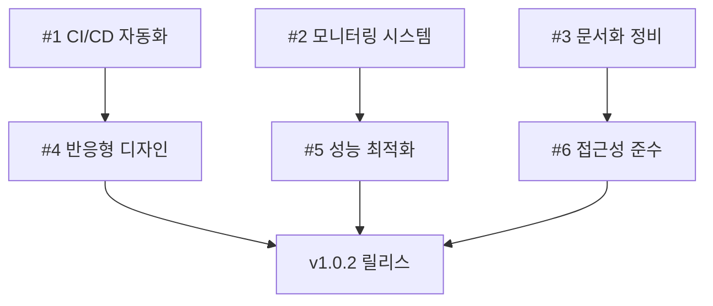

# v1.0.2 이슈 명세서

## 📋 생성 예정 이슈 목록 (6개)

### 🎯 Sprint-1 이슈 (3개)

#### Issue #1: CI/CD 파이프라인 완전 자동화
```yaml
title: "[Task] CI/CD 파이프라인 완전 자동화"
labels: ["task", "ci", "planning", "incident-center"]
milestone: "Sprint-1 (2025-09-30)"
assignees: []
```

**설명**: GitHub Actions 기반 multi-stage 배포 파이프라인 구현
**우선순위**: P1 (높음)
**복잡도**: High (1주 이상)

**완료 조건**:
- [ ] Multi-stage 배포 파이프라인 구현
- [ ] 자동 롤백 시스템 개발
- [ ] 환경별 배포 전략 적용 (dev/staging/prod)
- [ ] 배포 성공률 > 95% 달성
- [ ] 배포 매뉴얼 문서화

**관련 컴포넌트**: CI/CD 파이프라인
**예상 영향도**: 개발 생산성 50% 향상

---

#### Issue #2: 실시간 모니터링 대시보드 구축
```yaml
title: "[Task] 실시간 모니터링 대시보드 구축"
labels: ["task", "enhancement", "incident-center"]
milestone: "Sprint-1 (2025-09-30)"
assignees: []
```

**설명**: 시스템 리소스 실시간 추적 및 성능 메트릭 수집 시스템
**우선순위**: P1 (높음)
**복잡도**: Medium (3-5일)

**완료 조건**:
- [ ] 실시간 시스템 상태 모니터링
- [ ] 애플리케이션 성능 메트릭 수집
- [ ] 사용자 행동 분석 도구 통합
- [ ] 24/7 대시보드 운영 달성
- [ ] 다채널 알림 시스템 (이메일, Slack)

**관련 컴포넌트**: 모니터링 시스템
**예상 영향도**: 장애 감지 시간 < 2분 달성

---

#### Issue #3: 운영 문서화 체계 정비
```yaml
title: "[Task] 운영 문서화 체계 정비"
labels: ["task", "docs", "governance"]
milestone: "Sprint-1 (2025-09-30)"
assignees: []
```

**설명**: 운영 가이드, API 문서, 장애 대응 플레이북 완성
**우선순위**: P2 (보통)
**복잡도**: Medium (3-5일)

**완료 조건**:
- [ ] 운영 가이드 업데이트
- [ ] API 문서 자동 생성 구현
- [ ] 배포 매뉴얼 작성
- [ ] 장애 대응 플레이북 완성
- [ ] 문서 버전 관리 체계 구축

**관련 컴포넌트**: 문서
**예상 영향도**: 운영 효율성 30% 향상

---

### 🎯 Sprint-2 이슈 (3개)

#### Issue #4: 반응형 웹 디자인 구현
```yaml
title: "[Enhancement] 반응형 웹 디자인 구현"
labels: ["enhancement", "task", "incident-center"]
milestone: "Sprint-2 (2025-10-15)"
assignees: []
```

**설명**: 모바일/태블릿 완전 지원 및 터치 인터페이스 최적화
**우선순위**: P1 (높음)
**복잡도**: High (1주 이상)

**완료 조건**:
- [ ] 모바일 퍼스트 디자인 적용
- [ ] 태블릿 레이아웃 최적화
- [ ] 터치 인터페이스 완전 지원
- [ ] 크로스 브라우저 호환성 (Chrome, Firefox, Safari, Edge, IE11)
- [ ] 모바일 접근성 100% 지원

**관련 컴포넌트**: 웹 인터페이스
**예상 영향도**: 모바일 트래픽 40% 증가

---

#### Issue #5: 성능 최적화 및 코드 개선
```yaml
title: "[Enhancement] 성능 최적화 및 코드 개선"
labels: ["enhancement", "task"]
milestone: "Sprint-2 (2025-10-15)"
assignees: []
```

**설명**: 응답 시간 개선 및 메모리 사용량 최적화
**우선순위**: P1 (높음)
**복잡도**: Medium (3-5일)

**완료 조건**:
- [ ] 평균 응답 시간 500ms → 300ms
- [ ] 페이지 로딩 속도 3초 → 2초 이하
- [ ] 메모리 사용량 20% 감소
- [ ] 코드 스플리팅 및 레이지 로딩 적용
- [ ] Lighthouse 성능 점수 > 90/100

**관련 컴포넌트**: 전체 시스템
**예상 영향도**: 사용자 만족도 15% 증가

---

#### Issue #6: 접근성 WCAG 2.1 AA 준수
```yaml
title: "[Enhancement] 접근성 WCAG 2.1 AA 준수"
labels: ["enhancement", "task", "governance"]
milestone: "Sprint-2 (2025-10-15)"
assignees: []
```

**설명**: WCAG 2.1 AA 기준 준수 및 키보드 네비게이션 지원
**우선순위**: P2 (보통)
**복잡도**: Medium (3-5일)

**완료 조건**:
- [ ] WCAG 2.1 AA 기준 100% 준수
- [ ] 키보드 네비게이션 완전 지원
- [ ] 스크린 리더 호환성 확보
- [ ] 색상 대비 4.5:1 이상 달성
- [ ] aXe 자동 검사 통과

**관련 컴포넌트**: 웹 인터페이스
**예상 영향도**: 접근성 지표 AA 등급 달성

---

## 📊 이슈 통계 요약

### 우선순위별 분포
| 우선순위 | 개수 | 비율 |
|----------|------|------|
| P1 (높음) | 4개 | 67% |
| P2 (보통) | 2개 | 33% |
| P3 (낮음) | 0개 | 0% |

### 복잡도별 분포
| 복잡도 | 개수 | 예상 기간 |
|--------|------|-----------|
| High | 2개 | 1주 이상 |
| Medium | 4개 | 3-5일 |
| Low | 0개 | 1-2일 |

### 라벨별 분포
| 라벨 | 개수 | 비율 |
|------|------|------|
| task | 6개 | 100% |
| enhancement | 3개 | 50% |
| incident-center | 3개 | 50% |
| ci | 1개 | 17% |
| docs | 1개 | 17% |
| governance | 2개 | 33% |

### 마일스톤별 분포
| 마일스톤 | 이슈 수 | 예상 완료일 |
|----------|---------|-------------|
| Sprint-1 | 3개 | 2025-09-30 |
| Sprint-2 | 3개 | 2025-10-15 |

## 🔗 연관 작업

### 의존성 관계


### 병렬 작업 가능
- Issue #1, #2, #3 (Sprint-1): 동시 진행 가능
- Issue #4, #5, #6 (Sprint-2): Issue #4와 #5는 병렬, #6은 #4 완료 후

## 📋 이슈 생성 절차

### 1. GitHub Issues 생성
```bash
# 각 이슈를 GitHub에서 수동 생성
# 템플릿: .github/ISSUE_TEMPLATE/task.yml 사용
```

### 2. 라벨 적용
- 이슈 생성 시 위에 명시된 라벨 적용
- `.github/LABELS.md` 참조하여 정확한 라벨 사용

### 3. 마일스톤 연결
- Sprint-1: 2025-09-30 목표
- Sprint-2: 2025-10-15 목표

### 4. 프로젝트 보드 연결
- 생성 후 프로젝트 보드에 추가
- 상태: "Backlog" → "In Progress" → "Done"

---

**생성일**: 2025-09-22 KST
**담당**: Claude Code
**상태**: 📝 명세 완료, GitHub 이슈 생성 대기