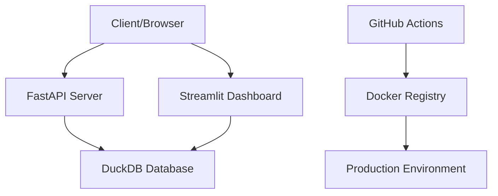

# Architecture Overview

MCP Map Company follows a modern, modular architecture designed for scalability and maintainability.

## System Components



## Core Modules

### 1. **Dashboard** (`dashboard/`)
- **Technology**: Streamlit
- **Purpose**: Real-time monitoring and analytics
- **Features**: Multi-page interface, interactive charts
- **Port**: 8098

### 2. **API Server** (`api/`)
- **Technology**: FastAPI
- **Purpose**: RESTful API endpoints
- **Features**: Auto-generated docs, async support
- **Port**: 8000

### 3. **Database** (`db/`)
- **Technology**: DuckDB
- **Purpose**: Analytics and data storage
- **Features**: Columnar storage, SQL support
- **File**: `data/mcp.duckdb`

### 4. **CI/CD** (`.github/workflows/`)
- **Technology**: GitHub Actions
- **Purpose**: Automated testing and deployment
- **Features**: Matrix testing, Docker builds

## Data Flow

1. **Ingestion**: Raw data → ETL scripts → DuckDB
2. **Processing**: SQL queries → Analytics → API responses
3. **Visualization**: Dashboard queries → Charts/Tables
4. **Monitoring**: Health checks → Alerts → Logs

## Directory Structure

```
mcp-map-company/
├── api/                 # FastAPI server
├── dashboard/           # Streamlit app
├── db/                  # Database schemas & scripts
├── data/               # Data files & DuckDB
├── tests/              # Test suites
├── .github/workflows/  # CI/CD pipelines
└── docs_site/          # Documentation
```

## Deployment Architecture

### Development
- Local containers
- File-based database
- Live reloading

### Production
- Container registry (GHCR)
- Cloud deployment (Render/Vercel)
- Automated pipelines

## Security & Best Practices

- **Environment Variables**: Secure credential management
- **Testing**: Comprehensive test coverage
- **Monitoring**: Health checks and logging
- **Documentation**: Auto-generated API docs

## Performance Considerations

- **Database**: Columnar storage for analytics
- **Caching**: Query result caching
- **Async**: Non-blocking API operations
- **Containerization**: Consistent deployments